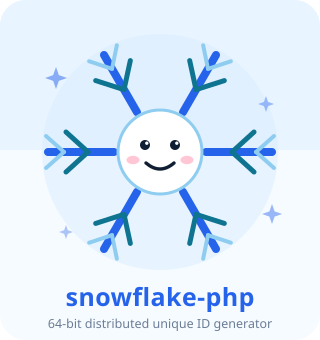
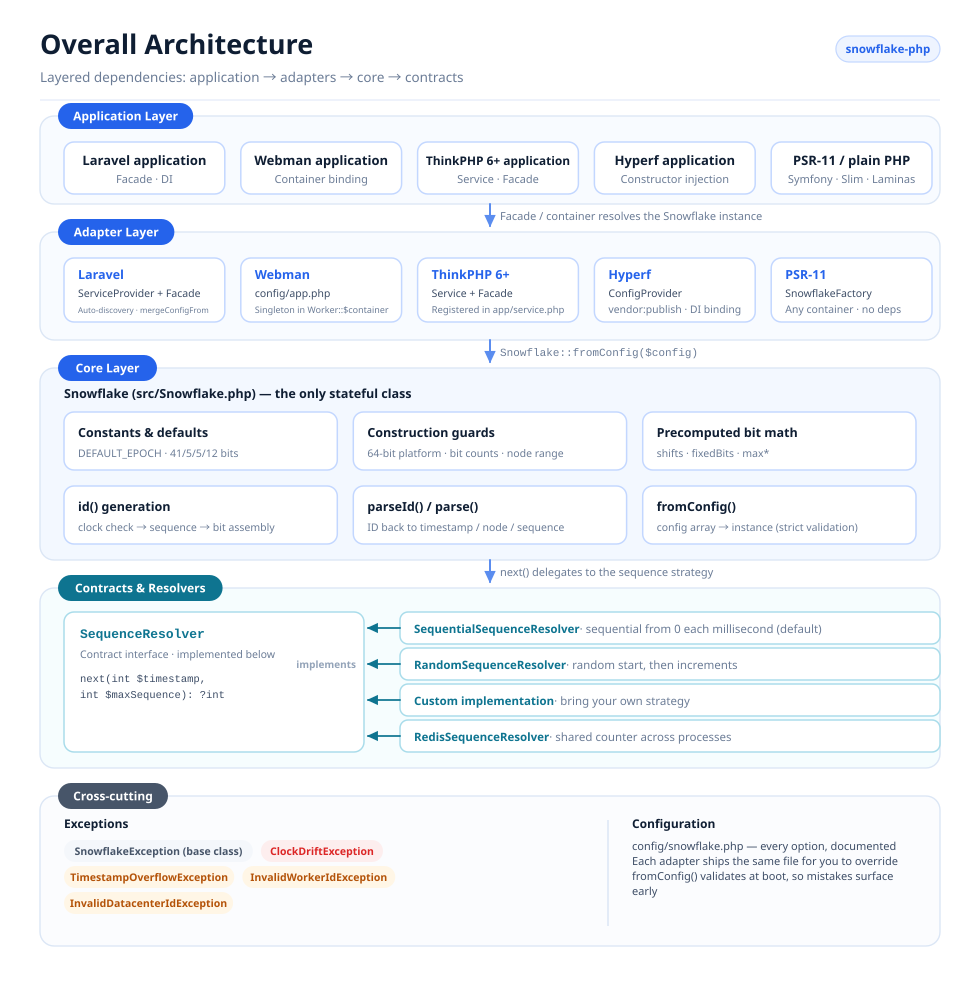
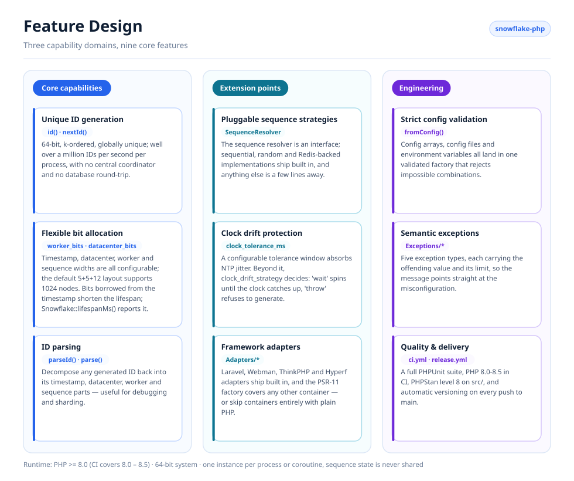
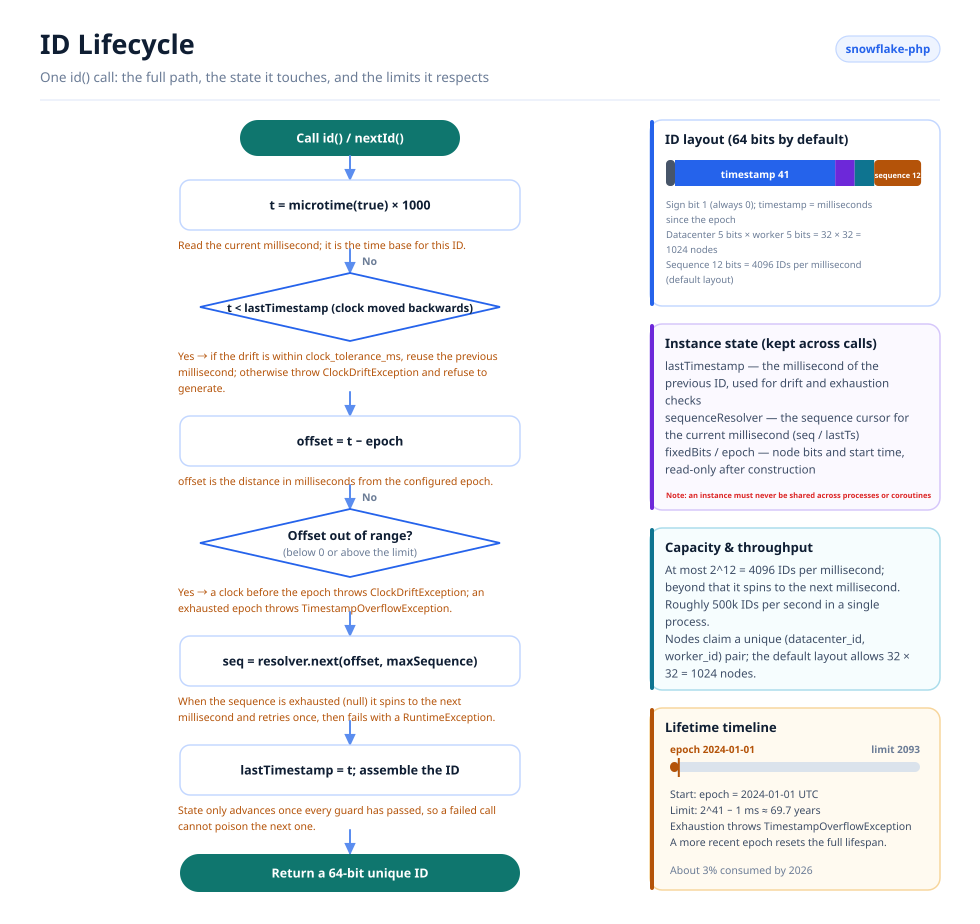

# Snowflake PHP

<p align="center">
  
  <br />
  <sub>The mascot ships with the code too — <code>echo Snowflake::MASCOT;</code> prints it in any terminal.</sub>
</p>

A distributed unique ID generator based on Twitter's Snowflake algorithm, compatible with Laravel, Webman, ThinkPHP, and Hyperf.

[English](./README.md) · [简体中文](./README.zh-CN.md) · [한국어](docs/i18n/ko/README.md) · [Русский](docs/i18n/ru/README.md) · [Deutsch](docs/i18n/de/README.md) · [Français](docs/i18n/fr/README.md) · [Español](docs/i18n/es/README.md) · [Português](docs/i18n/pt/README.md) · [हिन्दी](docs/i18n/hi/README.md) · [العربية](docs/i18n/ar/README.md) · [বাংলা](docs/i18n/bn/README.md) · [Bahasa Indonesia](docs/i18n/id/README.md) · [日本語](docs/i18n/ja/README.md)

## About

Snowflake PHP generates 64-bit, k-ordered, globally unique IDs without requiring a central coordinator. Each ID is composed of a timestamp, datacenter ID, worker ID, and sequence number — allowing well over a million IDs per second per node with no database round-trips.

Key features:

- **Pure PHP, zero dependencies** — no extensions or external services required
- **Pluggable sequence resolvers** — sequential, random and Redis-backed strategies ship built in, or bring your own
- **Flexible bit allocation** — adjust timestamp/worker/datacenter/sequence bits to fit your scale
- **Clock drift tolerance** — configurable tolerance window for NTP adjustments
- **Framework agnostic** — first-class adapters for Laravel, ThinkPHP, Webman, and Hyperf, or plain PHP with no container at all
- **ID parsing** — decompose generated IDs back into timestamp, node, and sequence components

## Project Structure

```text
snowflake-php/
├── src/
│   ├── Snowflake.php                       # Core: config, bit layout, id(), parseId()
│   ├── Contracts/
│   │   └── SequenceResolver.php            # Sequence strategy interface
│   ├── Resolvers/
│   │   ├── SequentialSequenceResolver.php  # Default: 0..max per millisecond
│   │   ├── RandomSequenceResolver.php      # Random start per millisecond
│   │   └── RedisSequenceResolver.php       # Shared counter for multi-process nodes
│   ├── Exceptions/
│   │   ├── SnowflakeException.php          # Base exception
│   │   ├── ClockDriftException.php
│   │   ├── TimestampOverflowException.php
│   │   ├── InvalidWorkerIdException.php
│   │   └── InvalidDatacenterIdException.php
│   └── Adapters/                           # Framework integrations
│       ├── Laravel/                        # ServiceProvider + Facade + config
│       ├── ThinkPHP/                       # Service + Facade + config
│       ├── Hyperf/                         # ConfigProvider + config
│       ├── Webman/                         # config/app.php
│       └── Psr11/SnowflakeFactory.php      # Any PSR-11 container, no interface dependency
├── config/snowflake.php                    # Reference configuration with comments
├── tests/
│   ├── bootstrap.php                       # Loads the autoloader, prints the mascot
│   └── *Test.php                           # PHPUnit test suite
├── docs/
│   ├── i18n/                               # Translated READMEs + localized diagrams
│   │   ├── README.md                       # Language index
│   │   ├── img/<lang>/                     # Generated SVGs (13 languages)
│   │   └── <lang>/README.md                # One translated README per language
│   ├── examples/plain-php.php              # Runnable no-framework example
│   └── *.png                               # Sponsor images
├── scripts/
│   ├── generate-diagrams.py                # Builds docs/i18n/img/<lang>/*.svg
│   ├── benchmark.php                       # Reproducible throughput benchmark
│   ├── phpstan/stubs/                      # Framework stubs for static analysis
│   └── i18n/labels.<lang>.json             # Diagram strings, one file per language
├── phpstan.neon.dist                       # Level 8 static analysis config
└── .github/workflows/                      # ci.yml (PHP 8.0–8.5), release.yml
```

## Architecture



Four layers, with dependencies pointing in one direction only:

- **Application layer** — your Laravel / Webman / ThinkPHP / Hyperf application, any PSR-11 container, or plain PHP; it only ever asks for a `Snowflake` instance.
- **Adapter layer** — one adapter per framework, plus a container-agnostic PSR-11 factory. Each registers a single shared instance and ships a publishable config file.
- **Core layer** — `Snowflake` is the only stateful class: it validates the configuration, precomputes the bit shifts and fixed node bits, generates IDs, and parses them back.
- **Contracts & resolvers** — `SequenceResolver` is the extension point. The core delegates every sequence allocation to it, so sequence strategy can be swapped without touching the generator.
- **Cross-cutting** — a semantic exception hierarchy plus a single commented configuration file shared by every adapter.

## Feature Design



Features group into three domains: **core** (generation, bit allocation, parsing), **extension** (pluggable resolvers, clock-drift handling, framework adapters), and **engineering** (strict config validation, semantic exceptions, tests and release automation).

## ID Lifecycle



Every `id()` call walks the same path:

1. Read the clock and check for backward drift — tolerated up to `clock_tolerance_ms`; beyond that `clock_drift_strategy` decides whether to wait for the clock to catch up (`'wait'`) or refuse to generate (`'throw'`).
2. Convert to an epoch offset and reject offsets that are negative or past the timestamp limit.
3. Ask the sequence resolver for the next slot in this millisecond; when all 4096 slots are used, spin to the next millisecond and retry once.
4. Assemble `(offset << timestampShift) | fixedBits | sequence`, advance `lastTimestamp`, and return the ID.

Instance state (`lastTimestamp` plus the resolver cursor) lives in memory and is never shared across processes or coroutines.

## Requirements

- PHP >= 8.0 (8.0 – 8.5 tested in CI, alongside PHPStan level 8 on `src/`)
- 64-bit system (required for native 64-bit integer operations)
- One instance per process/coroutine — a Snowflake instance keeps its sequence state in memory and must not be shared across processes or coroutines

## Installation

```bash
composer require erikwang2013/snowflake-php
```

## Quick Start

```php
use Erikwang2013\Snowflake\Snowflake;

$snowflake = new Snowflake();
$id = $snowflake->id();          // e.g. 508047278033704960
$id = $snowflake->nextId();      // alias for id()
```

With custom worker and datacenter IDs:

```php
$snowflake = new Snowflake(workerId: 5, datacenterId: 3);
$id = $snowflake->id();
```

## Configuration Reference

| Key | Type | Default | Description |
|-----|------|---------|-------------|
| `epoch` | int | `1704067200000` | Custom epoch in ms (default: 2024-01-01 UTC) |
| `worker_id` | int | `0` | Worker/node identifier |
| `datacenter_id` | int | `0` | Datacenter identifier |
| `worker_bits` | int | `5` | Bits for worker ID |
| `datacenter_bits` | int | `5` | Bits for datacenter ID |
| `sequence_bits` | int | `12` | Bits for sequence number |
| `sequence_resolver` | string | `SequentialSequenceResolver` | FQCN of SequenceResolver |
| `clock_tolerance_ms` | int | `0` | Max backward clock drift (0 = strict) |
| `clock_drift_strategy` | string | `'throw'` | `'throw'` refuses to generate when the clock moves backwards beyond the tolerance; `'wait'` spins until the wall clock catches up, giving up after `clock_drift_wait_ms` and then throwing `ClockDriftException` |
| `clock_drift_wait_ms` | int | `1000` | How long the `'wait'` strategy waits before giving up |

### Bit Layout

Default layout (63 data bits + 1 sign bit = 64 bits total):

```
| reserved(1) |  timestamp(41)   | datacenter(5) | worker(5) | sequence(12) |
```

Maximum lifespan with default epoch: ~69 years (until ~2093).

Every bit handed to the node id or the sequence is taken from the timestamp, so a wide sequence silently shortens the generator's life:

| worker + datacenter + sequence bits | timestamp bits | usable lifespan |
|---|---|---|
| 5 + 5 + 12 (default) | 41 | ~69.7 years |
| 7 + 7 + 10 | 39 | ~17.4 years |
| 5 + 5 + 16 | 37 | ~4.4 years |
| 5 + 5 + 20 | 33 | ~99 days |

Ask for the limit of any layout:

```php
Snowflake::lifespanMs();                                                     // default layout, ~69.7 years in ms
Snowflake::lifespanMs(workerBits: 7, datacenterBits: 7, sequenceBits: 10);   // ~17.4 years in ms
```

`Snowflake::lifespanMs(int $workerBits = 5, int $datacenterBits = 5, int $sequenceBits = 12): int` returns the maximum timestamp offset in milliseconds for a layout; the arguments default to the default layout. Once the offset reaches that limit the epoch is exhausted — a stale epoch whose window has already closed makes the very first `id()` call throw `TimestampOverflowException`.

### Using Configuration Array

```php
$snowflake = Snowflake::fromConfig([
    'worker_id' => 1,
    'datacenter_id' => 2,
    'epoch' => 1704067200000,
]);
$id = $snowflake->id();
```

## Framework Integration

### Laravel

The package supports Laravel auto-discovery. After installation:

1. Publish the config (optional):
```bash
php artisan vendor:publish --tag=snowflake-config
```

2. Configure environment variables in `.env`:
```env
SNOWFLAKE_WORKER_ID=1
SNOWFLAKE_DATACENTER_ID=1
```

3. Use the Facade or dependency injection:
```php
// Facade
use Snowflake;
$id = Snowflake::id();

// Dependency injection
use Erikwang2013\Snowflake\Snowflake;

class OrderController
{
    public function store(Snowflake $snowflake)
    {
        $orderId = $snowflake->id();
    }
}

// Container access
$id = app('snowflake')->id();
$id = app(Snowflake::class)->id();
```

### Webman

1. Copy the plugin config to your project:
```bash
cp vendor/erikwang2013/snowflake-php/src/Adapters/Webman/config/app.php \
   config/plugin/erikwang2013/snowflake-php/app.php
```

2. Register a singleton in `process.php` or bootstrap:
```php
use Erikwang2013\Snowflake\Snowflake;

Worker::$container->add(Snowflake::class, function () {
    return Snowflake::fromConfig(
        config('plugin.erikwang2013.snowflake-php.app.snowflake')
    );
});
```

3. Usage:
```php
$id = Worker::$container->get(Snowflake::class)->id();
```

### ThinkPHP 6+

1. Copy the config file to your project:
```bash
cp vendor/erikwang2013/snowflake-php/src/Adapters/ThinkPHP/config/snowflake.php \
   config/snowflake.php
```

2. Register the service in `app/service.php`:
```php
return [
    \Erikwang2013\Snowflake\Adapters\ThinkPHP\Service::class,
];
```

3. Usage:
```php
// Container
$id = app('snowflake')->id();

// Dependency injection
use Erikwang2013\Snowflake\Snowflake;

class IndexController
{
    public function index(Snowflake $snowflake)
    {
        $id = $snowflake->id();
    }
}

// Facade
use Erikwang2013\Snowflake\Adapters\ThinkPHP\Facade;
$id = Facade::id();
```

### Hyperf

1. Publish the config:
```bash
php bin/hyperf.php vendor:publish erikwang2013/snowflake-php
```

2. Register the DI binding in `config/autoload/dependencies.php`:
```php
use Erikwang2013\Snowflake\Snowflake;

return [
    Snowflake::class => function () {
        return Snowflake::fromConfig(config('snowflake'));
    },
];
```

3. Usage via constructor injection:
```php
use Erikwang2013\Snowflake\Snowflake;

class OrderService
{
    public function __construct(private Snowflake $snowflake) {}

    public function create(): int
    {
        return $this->snowflake->id();
    }
}
```

### PSR-11 containers

Symfony, Slim, Laminas and any other container: register the factory. It depends on nothing, so any container works — `psr/container` is not required:

```php
use Erikwang2013\Snowflake\Adapters\Psr11\SnowflakeFactory;

$container->set(\Erikwang2013\Snowflake\Snowflake::class, new SnowflakeFactory($config));
// or build the config from the environment:
$container->set(\Erikwang2013\Snowflake\Snowflake::class, SnowflakeFactory::fromEnvironment());
```

`SnowflakeFactory::fromEnvironment()` reads the same `SNOWFLAKE_*` variables the Laravel adapter uses. A PSR-11 container calls the factory object itself, so a Symfony service definition is one line:

```yaml
services:
  Erikwang2013\Snowflake\Snowflake:
    factory: ['@Erikwang2013\Snowflake\Adapters\Psr11\SnowflakeFactory', '__invoke']
```

## Native PHP (no framework)

Nothing in this package needs a framework — the adapters above only wire
`Snowflake` into a container for you. Without one, build it yourself:

```php
require __DIR__ . '/vendor/autoload.php';

use Erikwang2013\Snowflake\Snowflake;

// Same variable names the Laravel adapter uses, so one .env-style setup
// works whether or not a framework is present.
$snowflake = Snowflake::fromConfig([
    'worker_id'          => (int) (getenv('SNOWFLAKE_WORKER_ID') ?: 0),
    'datacenter_id'      => (int) (getenv('SNOWFLAKE_DATACENTER_ID') ?: 0),
    'clock_tolerance_ms' => 5,
]);

$id = $snowflake->id();
```

A runnable version of this — including a framework-free lazy singleton and the
invariants it checks — lives in [`docs/examples/plain-php.php`](docs/examples/plain-php.php):

```bash
php docs/examples/plain-php.php
```

### Choosing a lifetime

The instance keeps `lastTimestamp` and the sequence cursor in memory, so how
long it lives is the one thing to get right:

| Runtime | Build the instance |
|---------|--------------------|
| PHP-FPM, mod_php, CLI | Inline, per request or command — nothing is shared between them. |
| Swoole, ReactPHP, RoadRunner, FrankenPHP | Once per **worker process**, from the worker-start callback, with a unique `(datacenter_id, worker_id)` pair. |

Never share one instance between coroutines or threads: `id()` reads and writes
its own state, so two concurrent calls can interleave and hand out the same
sequence number. Create one instance per coroutine, or guard the shared one with
a mutex.

## ID Parsing

Decompose a Snowflake ID into its components:

```php
$id = $snowflake->id();

// Using the instance (respects custom bit layout)
$parsed = $snowflake->parseId($id);
// [
//     'timestamp_ms' => 1736380800123,
//     'datetime'     => '2025-01-09 00:00:00.123',
//     'worker_id'    => 5,
//     'datacenter_id' => 3,
//     'sequence'     => 42,
// ]

// Static method (uses default bit layout)
$parsed = Snowflake::parse($id, $epoch);
```

The `datetime` member is formatted with PHP's `date()` in the **server's default timezone**, so two hosts in different timezones render the same ID differently. `timestamp_ms` is the timezone-independent absolute value — compare that one when reconciling IDs across machines.

## Sequence Resolvers

Three built-in implementations:

### SequentialSequenceResolver (default)

Classic Snowflake behavior. Sequence starts at 0 each millisecond and increments sequentially. Guarantees monotonically increasing IDs within a single node.

```php
use Erikwang2013\Snowflake\Resolvers\SequentialSequenceResolver;

$snowflake = new Snowflake(
    sequenceResolver: new SequentialSequenceResolver()
);
```

### RandomSequenceResolver

Starts each millisecond at a random sequence number, then increments. Less predictable than sequential IDs while keeping IDs within a millisecond monotonic.

```php
use Erikwang2013\Snowflake\Resolvers\RandomSequenceResolver;

$snowflake = new Snowflake(
    sequenceResolver: new RandomSequenceResolver()
);
```

### Custom Resolver

Implement `Erikwang2013\Snowflake\Contracts\SequenceResolver`:

```php
use Erikwang2013\Snowflake\Contracts\SequenceResolver;

class SharedCounterSequenceResolver implements SequenceResolver
{
    public function next(int $timestamp, int $maxSequence): ?int
    {
        $key = "snowflake:seq:{$timestamp}";
        $seq = redis()->incr($key);
        redis()->expire($key, 1);

        if ($seq > $maxSequence) {
            return null;
        }

        return $seq - 1;
    }
}
```

### RedisSequenceResolver

The in-process resolvers keep the sequence in memory, so processes sharing a node id can hand out the same sequence number. `RedisSequenceResolver` keeps the counter in Redis instead — the one to use when several processes share a `(datacenter_id, worker_id)` pair:

```php
use Erikwang2013\Snowflake\Resolvers\RedisSequenceResolver;

// Any client exposing incr(string $key): int and expire(string $key, int $seconds): bool
$resolver = new RedisSequenceResolver($redis, 'snowflake:seq:', 1);
$snowflake = new Snowflake(sequenceResolver: $resolver);
```

`__construct(object $client, string $keyPrefix = 'snowflake:seq:', int $ttlSeconds = 1)` — the client is injected, so neither the `redis` extension nor Predis is required. A long TTL is safe: the counter then keeps growing inside the same millisecond, which correctly yields `null` until the next millisecond begins.

## Exception Handling

| Exception | When |
|-----------|------|
| `InvalidWorkerIdException` | Worker ID exceeds `2^worker_bits - 1` |
| `InvalidDatacenterIdException` | Datacenter ID exceeds `2^datacenter_bits - 1` |
| `ClockDriftException` | System clock moved backwards beyond tolerance |
| `TimestampOverflowException` | Epoch has been exhausted (lifespan ended) |
| `SnowflakeException` | Base exception for all package exceptions |

## Distributed Deployment

When running across multiple servers or processes, ensure each instance uses a unique `(datacenter_id, worker_id)` pair:

```php
// Read from environment, hostname hash, or service discovery
$workerId = (int) getenv('WORKER_ID');
$datacenterId = (int) getenv('DC_ID');

$snowflake = new Snowflake(
    workerId: $workerId,
    datacenterId: $datacenterId
);
```

With the default 5+5 bit layout, you can support up to 32 datacenters × 32 workers = 1024 unique nodes.

To support more workers, adjust bit allocation:

```php
// 10 worker bits = 1024 workers, 0 datacenter bits = single DC
$snowflake = new Snowflake(
    workerId: $workerId,
    workerBits: 10,
    datacenterBits: 0
);
```

## Performance

IDs are generated entirely in-process with no external dependencies, so throughput is bounded by PHP's own `microtime()` call plus a handful of integer operations.

Measured on one core of a developer machine (PHP 8.3.7, **Xdebug disabled**, 300k iterations, best of 5):

| Operation | Throughput | Per call |
|-----------|-----------:|---------:|
| `microtime(true)` alone — the floor | 10.3M/s | 97 ns |
| `id()` — default 5+5+12 layout | **1.6M/s** | 633 ns |
| `id()` + `parseId()` | 282k/s | 3.5 µs |
| `Snowflake::fromConfig()` | 167k/s | 6.0 µs |

Generation costs about six times a bare clock call, and a node's sequence ceiling (4096 IDs/ms = 4.1M/s) stays well above what one PHP process can consume. Parsing and construction are diagnostic operations, not hot paths — build the instance once per process and keep `parseId()` out of tight loops.

Reproduce it on your own machine:

```bash
php scripts/benchmark.php
```

It prints ops/sec and ns/op against a bare `microtime()` baseline, best-of-N with the spread. Two things decide whether the absolute numbers mean anything: **Xdebug** (it can cost an order of magnitude — the header reports when it is loaded) and a busy or virtualised host, whose own clock call can dominate the measurement. Compare against the baseline rather than reading any single number as a promise.

## Support Welcome

| WeChat Pay | Alipay |
|:---:|:---:|
|  |  |

> If this project helps you, feel free to show your support~

---

## License

MIT — Copyright (c) 2026 erik <erik@erik.xyz> — https://erik.xyz
