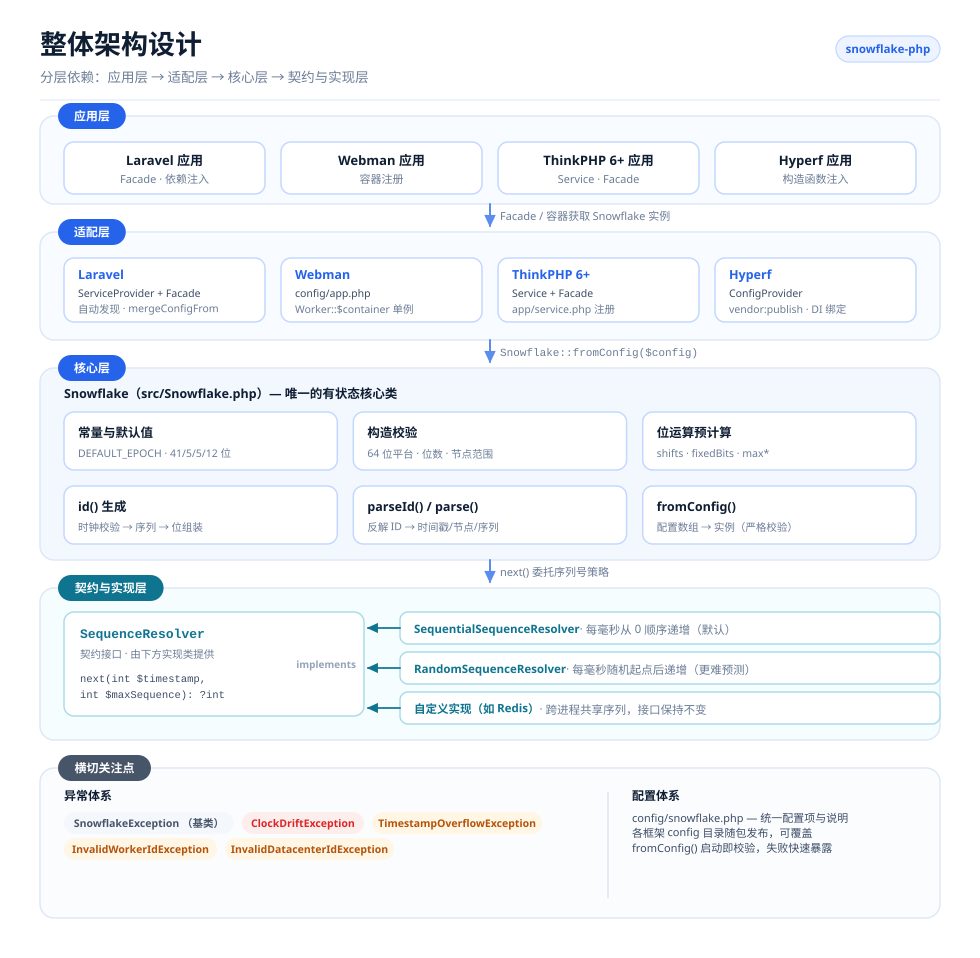
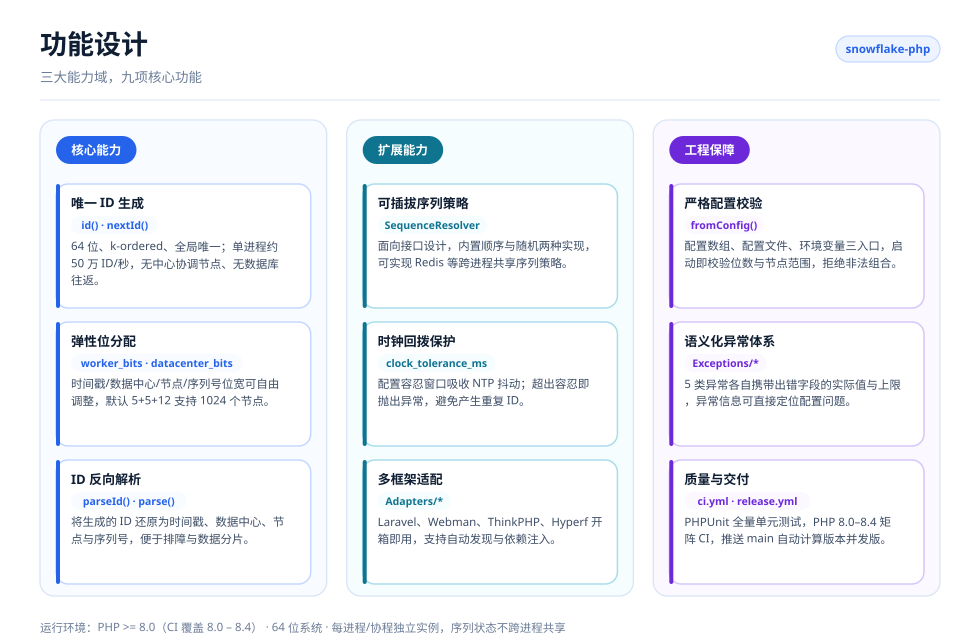
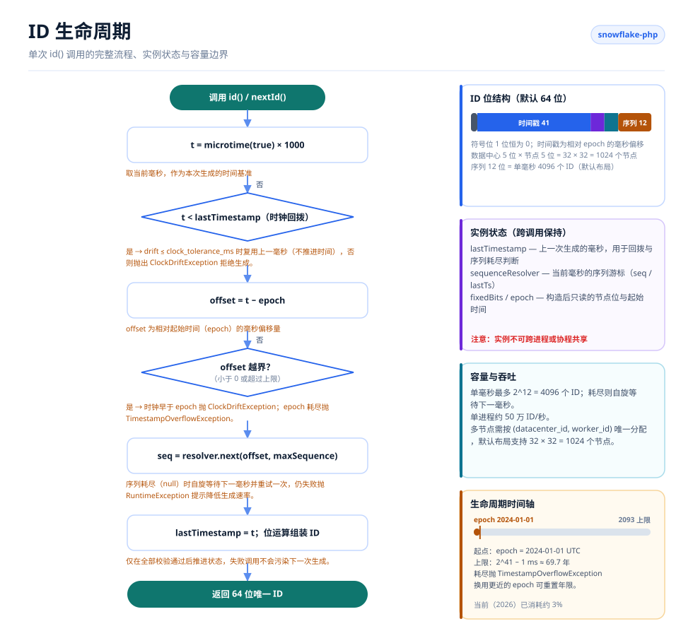

# Snowflake PHP

[English](./README.md) · [简体中文](./README.zh-CN.md) · [한국어](docs/i18n/ko/README.md) · [Русский](docs/i18n/ru/README.md) · [Deutsch](docs/i18n/de/README.md) · [Français](docs/i18n/fr/README.md) · [Español](docs/i18n/es/README.md) · [Português](docs/i18n/pt/README.md) · [हिन्दी](docs/i18n/hi/README.md) · [العربية](docs/i18n/ar/README.md) · [বাংলা](docs/i18n/bn/README.md) · [Bahasa Indonesia](docs/i18n/id/README.md) · [日本語](docs/i18n/ja/README.md)

<p align="center">
  
  <br />
  <sub>宠物也已随代码发布——<code>echo Snowflake::MASCOT;</code> 即可在终端打印它。</sub>
</p>

基于 Twitter Snowflake 算法的分布式唯一 ID 生成器，兼容 Laravel、Webman、ThinkPHP、Hyperf 框架。

## 项目说明

Snowflake PHP 无需中心协调节点即可生成 64 位、k-ordered、全局唯一的 ID。每个 ID 由时间戳、数据中心 ID、工作节点 ID 和序列号组合而成——单节点每秒可生成数十万个 ID，无需数据库往返。

核心特性：

- **纯 PHP，零依赖** — 无需扩展或外部服务
- **可插拔序列号策略** — 内置顺序递增和随机两种策略，支持自定义
- **灵活的位分配** — 可调整时间戳/节点/数据中心/序列号的位数以适应业务规模
- **时钟回拨容忍** — 可配置的 NTP 校时容忍窗口
- **框架无关** — 提供 Laravel、ThinkPHP、Webman、Hyperf 的一流适配器，也可完全不依赖容器直接用原生 PHP
- **ID 解析** — 可将生成的 ID 反向分解为时间戳、节点、序列号等成分

## 项目结构

```text
snowflake-php/
├── src/
│   ├── Snowflake.php                       # 核心：配置、位分配、id()、parseId()
│   ├── Contracts/
│   │   └── SequenceResolver.php            # 序列号策略契约接口
│   ├── Resolvers/
│   │   ├── SequentialSequenceResolver.php  # 默认：每毫秒从 0 顺序递增
│   │   └── RandomSequenceResolver.php      # 每毫秒随机起点后递增
│   ├── Exceptions/
│   │   ├── SnowflakeException.php          # 异常基类
│   │   ├── ClockDriftException.php
│   │   ├── TimestampOverflowException.php
│   │   ├── InvalidWorkerIdException.php
│   │   └── InvalidDatacenterIdException.php
│   └── Adapters/                           # 各框架适配器
│       ├── Laravel/                        # ServiceProvider + Facade + 配置
│       ├── ThinkPHP/                       # Service + Facade + 配置
│       ├── Hyperf/                         # ConfigProvider + 配置
│       └── Webman/                         # config/app.php
├── config/snowflake.php                    # 带注释的参考配置文件
├── tests/
│   ├── bootstrap.php                       # 载入自动加载器并打印项目宠物
│   └── *Test.php                           # PHPUnit 测试套件
├── docs/
│   ├── i18n/                               # 多语言 README 与本地化设计图
│   │   ├── README.md                       # 语言索引
│   │   ├── img/<lang>/                     # 生成的 SVG（13 种语言）
│   │   └── <lang>/README.md                # 各语言翻译文档
│   ├── examples/plain-php.php              # 可直接运行的原生 PHP 示例
│   └── *.png                               # 赞助码
├── scripts/
│   ├── generate-diagrams.py                # 生成 docs/i18n/img/<lang>/*.svg
│   └── i18n/labels.<lang>.json             # 各语言的图内文案
└── .github/workflows/                      # ci.yml（PHP 8.0–8.4）、release.yml
```

## 架构设计



四层结构，依赖方向单向向下：

- **应用层** — 你的 Laravel / Webman / ThinkPHP / Hyperf 应用，只需从容器中获取 `Snowflake` 实例。
- **适配层** — 每个框架一个适配器，各自向容器注册共享单例，并随包发布可覆盖的配置文件。
- **核心层** — `Snowflake` 是唯一的有状态类：负责配置校验、位运算预计算、ID 生成与反解。
- **契约与实现层** — `SequenceResolver` 是扩展点，核心将序列号分配全部委托给它，因此更换策略无需改动生成器。
- **横切关注点** — 语义化异常体系，以及各个适配器共用的同一份带注释配置文件。

## 功能设计



功能划分为三个能力域：**核心能力**（ID 生成、弹性位分配、反向解析）、**扩展能力**（可插拔序列策略、时钟回拨保护、多框架适配）、**工程保障**（严格配置校验、语义化异常、测试与发版自动化）。

## 生命周期



每次 `id()` 调用都遵循同一条路径：

1. 读取当前毫秒并检查时钟回拨——在 `clock_tolerance_ms` 内可容忍，超出即拒绝生成。
2. 换算为相对 epoch 的偏移量，并拒绝小于 0 或超出时间戳上限的偏移。
3. 向序列号策略申请当前毫秒的下一个序列号；4096 个序列全部用尽时自旋等待下一毫秒并重试一次。
4. 组装 `(offset << timestampShift) | fixedBits | sequence`，推进 `lastTimestamp` 后返回 ID。

实例状态（`lastTimestamp` 与序列游标）保存在内存中，不跨进程或协程共享。

## 环境要求

- PHP >= 8.0（CI 已验证 8.0 – 8.4）
- 64 位系统（64 位整数运算所必需）
- 每进程/协程独立实例 — 实例在内存中维护序列状态，不可跨进程或协程共享

## 安装

```bash
composer require erikwang2013/snowflake-php
```

## 快速开始

```php
use Erikwang2013\Snowflake\Snowflake;

$snowflake = new Snowflake();
$id = $snowflake->id();          // 例如 508047278033704960
$id = $snowflake->nextId();      // id() 的别名
```

指定 worker ID 和 datacenter ID：

```php
$snowflake = new Snowflake(workerId: 5, datacenterId: 3);
$id = $snowflake->id();
```

## 配置说明

| 配置项 | 类型 | 默认值 | 说明 |
|--------|------|--------|------|
| `epoch` | int | `1704067200000` | 自定义起始时间戳（毫秒），默认 2024-01-01 UTC |
| `worker_id` | int | `0` | 工作节点标识 |
| `datacenter_id` | int | `0` | 数据中心标识 |
| `worker_bits` | int | `5` | Worker ID 占用的位数 |
| `datacenter_bits` | int | `5` | Datacenter ID 占用的位数 |
| `sequence_bits` | int | `12` | 序列号占用的位数 |
| `sequence_resolver` | string | `SequentialSequenceResolver` | 序列号策略的完整类名 |
| `clock_tolerance_ms` | int | `0` | 允许的时钟回拨最大值（毫秒），0 为严格模式 |

### 位分配

默认布局（63 数据位 + 1 符号位 = 64 位）：

```
| 保留(1) |     时间戳(41)     | 数据中心(5) | 工作节点(5) | 序列号(12) |
```

默认起始时间下的最大可用年限：约 69 年（至 2093 年）。

### 通过配置数组创建

```php
$snowflake = Snowflake::fromConfig([
    'worker_id' => 1,
    'datacenter_id' => 2,
    'epoch' => 1704067200000,
]);
$id = $snowflake->id();
```

## 框架集成

### Laravel

包已支持 Laravel 自动发现。安装后：

1. 发布配置文件（可选）：
```bash
php artisan vendor:publish --tag=snowflake-config
```

2. 在 `.env` 中配置环境变量：
```env
SNOWFLAKE_WORKER_ID=1
SNOWFLAKE_DATACENTER_ID=1
```

3. 使用 Facade 或依赖注入：
```php
// Facade
use Snowflake;
$id = Snowflake::id();

// 依赖注入
use Erikwang2013\Snowflake\Snowflake;

class OrderController
{
    public function store(Snowflake $snowflake)
    {
        $orderId = $snowflake->id();
    }
}

// 容器访问
$id = app('snowflake')->id();
$id = app(Snowflake::class)->id();
```

### Webman

1. 将插件配置复制到项目中：
```bash
cp vendor/erikwang2013/snowflake-php/src/Adapters/Webman/config/app.php \
   config/plugin/erikwang2013/snowflake-php/app.php
```

2. 在 `process.php` 或启动文件中注册单例：
```php
use Erikwang2013\Snowflake\Snowflake;

Worker::$container->add(Snowflake::class, function () {
    return Snowflake::fromConfig(
        config('plugin.erikwang2013.snowflake-php.app.snowflake')
    );
});
```

3. 使用：
```php
$id = Worker::$container->get(Snowflake::class)->id();
```

### ThinkPHP 6+

1. 复制配置文件到项目：
```bash
cp vendor/erikwang2013/snowflake-php/src/Adapters/ThinkPHP/config/snowflake.php \
   config/snowflake.php
```

2. 在 `app/service.php` 中注册服务：
```php
return [
    \Erikwang2013\Snowflake\Adapters\ThinkPHP\Service::class,
];
```

3. 使用：
```php
// 容器
$id = app('snowflake')->id();

// 依赖注入
use Erikwang2013\Snowflake\Snowflake;

class IndexController
{
    public function index(Snowflake $snowflake)
    {
        $id = $snowflake->id();
    }
}

// Facade
use Erikwang2013\Snowflake\Adapters\ThinkPHP\Facade;
$id = Facade::id();
```

### Hyperf

1. 发布配置：
```bash
php bin/hyperf.php vendor:publish erikwang2013/snowflake-php
```

2. 在 `config/autoload/dependencies.php` 中注册 DI 绑定：
```php
use Erikwang2013\Snowflake\Snowflake;

return [
    Snowflake::class => function () {
        return Snowflake::fromConfig(config('snowflake'));
    },
];
```

3. 通过构造函数注入使用：
```php
use Erikwang2013\Snowflake\Snowflake;

class OrderService
{
    public function __construct(private Snowflake $snowflake) {}

    public function create(): int
    {
        return $this->snowflake->id();
    }
}
```

## 原生 PHP（无框架）

包本身不依赖任何框架——上面四个适配器只是帮你把 `Snowflake` 接进各自容器。没有框架时自己装配即可：

```php
require __DIR__ . '/vendor/autoload.php';

use Erikwang2013\Snowflake\Snowflake;

// 与 Laravel 适配器同名，因此同一套 .env 配置在有无框架时都能用
$snowflake = Snowflake::fromConfig([
    'worker_id'          => (int) (getenv('SNOWFLAKE_WORKER_ID') ?: 0),
    'datacenter_id'      => (int) (getenv('SNOWFLAKE_DATACENTER_ID') ?: 0),
    'clock_tolerance_ms' => 5,
]);

$id = $snowflake->id();
```

可直接运行的完整版本（含无框架单例写法与自检）见 [`docs/examples/plain-php.php`](docs/examples/plain-php.php)：

```bash
php docs/examples/plain-php.php
```

### 实例生命周期怎么选

实例在内存中保存 `lastTimestamp` 与序列游标，因此**存活多久**是唯一要拿捏的点：

| 运行环境 | 实例创建时机 |
|---------|-------------|
| PHP-FPM、mod_php、CLI | 每次请求/命令内联创建——进程间不共享，无残留。 |
| Swoole、ReactPHP、RoadRunner、FrankenPHP | 每个 **worker 进程**创建一次（在 worker 启动回调里），并分配唯一的 `(datacenter_id, worker_id)`。 |

**不要**在协程或线程之间共享同一个实例：`id()` 会读写自身状态，两个并发调用交错执行可能发出相同的序列号。请按协程各建一个实例，或对共享实例加锁。

## ID 解析

将 Snowflake ID 分解为各个组成部分：

```php
$id = $snowflake->id();

// 实例方法（使用当前实例的位分配）
$parsed = $snowflake->parseId($id);
// [
//     'timestamp_ms' => 1736380800123,
//     'datetime'     => '2025-01-09 00:00:00.123',
//     'worker_id'    => 5,
//     'datacenter_id' => 3,
//     'sequence'     => 42,
// ]

// 静态方法（使用默认位分配）
$parsed = Snowflake::parse($id, $epoch);
```

## 序列号策略

内置两种实现：

### SequentialSequenceResolver（默认）

经典的 Snowflake 行为。每个毫秒序列号从 0 开始顺序递增，保证单节点内 ID 严格单调递增。

```php
use Erikwang2013\Snowflake\Resolvers\SequentialSequenceResolver;

$snowflake = new Snowflake(
    sequenceResolver: new SequentialSequenceResolver()
);
```

### RandomSequenceResolver

每个毫秒从随机位置开始，随后自增。比顺序策略更难预测，同时同一毫秒内的 ID 保持单调递增。

```php
use Erikwang2013\Snowflake\Resolvers\RandomSequenceResolver;

$snowflake = new Snowflake(
    sequenceResolver: new RandomSequenceResolver()
);
```

### 自定义策略

实现 `Erikwang2013\Snowflake\Contracts\SequenceResolver` 接口：

```php
use Erikwang2013\Snowflake\Contracts\SequenceResolver;

class RedisSequenceResolver implements SequenceResolver
{
    public function next(int $timestamp, int $maxSequence): ?int
    {
        $key = "snowflake:seq:{$timestamp}";
        $seq = redis()->incr($key);
        redis()->expire($key, 1);

        if ($seq > $maxSequence) {
            return null;
        }

        return $seq - 1;
    }
}
```

## 异常处理

| 异常类 | 触发条件 |
|--------|----------|
| `InvalidWorkerIdException` | Worker ID 超出 `2^worker_bits - 1` |
| `InvalidDatacenterIdException` | Datacenter ID 超出 `2^datacenter_bits - 1` |
| `ClockDriftException` | 系统时钟回拨超过容忍值 |
| `TimestampOverflowException` | 时间戳偏移超过最大值（epoch 已耗尽） |
| `SnowflakeException` | 所有包异常的基类 |

## 分布式部署

在多服务器或进程部署时，确保每个实例使用唯一的 `(datacenter_id, worker_id)` 组合：

```php
// 从环境变量、主机名哈希或服务发现中获取
$workerId = (int) getenv('WORKER_ID');
$datacenterId = (int) getenv('DC_ID');

$snowflake = new Snowflake(
    workerId: $workerId,
    datacenterId: $datacenterId
);
```

默认 5+5 位分配可支持 32 个数据中心 × 32 个工作节点 = 1024 个独立节点。

如需更多节点，调整位分配：

```php
// 10 worker 位 = 1024 个节点，0 datacenter 位 = 单数据中心
$snowflake = new Snowflake(
    workerId: $workerId,
    workerBits: 10,
    datacenterBits: 0
);
```

## 性能

现代硬件典型吞吐量：**~50 万 ID/秒**（单进程）。

ID 生成完全在进程内完成，无需外部依赖。主要开销来自 PHP 的 `microtime()` 调用和整数位运算，均为 O(1)。

## 开源不易，欢迎支持

| 微信 | 支付宝 |
|:---:|:---:|
|  |  |

> 如果这个项目对你有帮助，欢迎扫码支持一下~

---

## License

MIT — Copyright (c) 2026 erik <erik@erik.xyz> — https://erik.xyz
