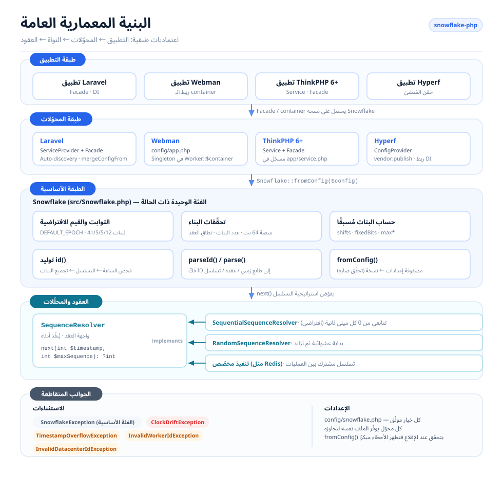
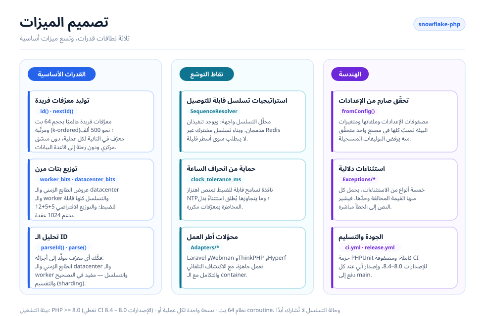
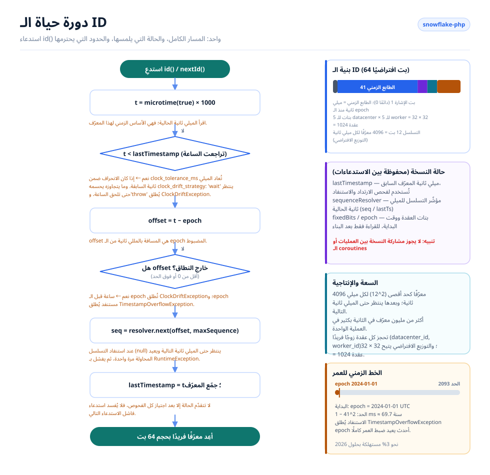

# Snowflake PHP

[English](../../../README.md) · [简体中文](../../../README.zh-CN.md) · [한국어](../ko/README.md) · [Русский](../ru/README.md) · [Deutsch](../de/README.md) · [Français](../fr/README.md) · [Español](../es/README.md) · [Português](../pt/README.md) · [हिन्दी](../hi/README.md) · [العربية](../ar/README.md) · [বাংলা](../bn/README.md) · [Bahasa Indonesia](../id/README.md) · [日本語](../ja/README.md)

<p align="center">
  
  <br />
  <sub>التميمة تُشحن مع الكود أيضًا — <code>echo Snowflake::MASCOT;</code> يطبعها في أي طرفية.</sub>
</p>

مولّد معرّفات فريدة موزّعة مبني على خوارزمية Snowflake من Twitter، متوافق مع Laravel وWebman وThinkPHP وHyperf.

## نبذة عامة

يولّد Snowflake PHP معرّفات فريدة عالميًا بحجم 64 بت ومرتّبة (k-ordered) دون الحاجة إلى منسّق مركزي. يتكوّن كل ID من طابع زمني ومعرّف datacenter ومعرّف worker ورقم تسلسلي — ما يتيح مئات الآلاف من المعرّفات في الثانية لكل عقدة دون أي رحلة ذهاب وعودة إلى قاعدة البيانات.

أبرز الميزات:

- **PHP خالص بلا أي اعتماديات** — لا حاجة إلى إضافات (extensions) أو خدمات خارجية
- **محلّلات تسلسل قابلة للتوصيل** — استراتيجيتان مدمجتان (متتابعة وعشوائية)، أو استخدم استراتيجيتك الخاصة
- **توزيع مرن للبتات** — عدّل بتات الطابع الزمني/الـ worker/الـ datacenter/التسلسل بما يناسب حجمك
- **تحمّل انحراف الساعة** — نافذة تسامح قابلة للضبط لتعديلات NTP
- **مستقلّ عن أطر العمل** مع محوّلات من الدرجة الأولى لـ Laravel وThinkPHP وWebman وHyperf
- **تحليل الـ ID** — فكّك المعرّفات المولّدة إلى مكوّناتها: الطابع الزمني والعقدة والتسلسل

## بنية المشروع

```text
snowflake-php/
├── src/
│   ├── Snowflake.php                       # Core: config, bit layout, id(), parseId()
│   ├── Contracts/
│   │   └── SequenceResolver.php            # Sequence strategy interface
│   ├── Resolvers/
│   │   ├── SequentialSequenceResolver.php  # Default: 0..max per millisecond
│   │   └── RandomSequenceResolver.php      # Random start per millisecond
│   ├── Exceptions/
│   │   ├── SnowflakeException.php          # Base exception
│   │   ├── ClockDriftException.php
│   │   ├── TimestampOverflowException.php
│   │   ├── InvalidWorkerIdException.php
│   │   └── InvalidDatacenterIdException.php
│   └── Adapters/                           # Framework integrations
│       ├── Laravel/                        # ServiceProvider + Facade + config
│       ├── ThinkPHP/                       # Service + Facade + config
│       ├── Hyperf/                         # ConfigProvider + config
│       └── Webman/                         # config/app.php
├── config/snowflake.php                    # Reference configuration with comments
├── tests/
│   ├── bootstrap.php                       # Loads the autoloader, prints the mascot
│   └── *Test.php                           # PHPUnit test suite
├── docs/                                   # Design diagrams and sponsor images
└── .github/workflows/                      # ci.yml (PHP 8.0–8.4), release.yml
```

## البنية المعمارية



أربع طبقات، والاعتماديات تتجه في اتجاه واحد فقط:

- **طبقة التطبيق** — تطبيقك المبني على Laravel / Webman / ThinkPHP / Hyperf؛ لا يطلب سوى نسخة `Snowflake` من الـ container.
- **طبقة المحوّلات** — محوّل واحد لكل إطار عمل. يسجّل كل منها نسخة مشتركة واحدة في container الإطار، ويرفق معه ملف إعدادات قابلًا للنشر.
- **الطبقة الأساسية** — `Snowflake` هي الفئة الوحيدة ذات الحالة: تتحقق من الإعدادات، وتحسب مسبقًا إزاحات البتات وبتات العقدة الثابتة، وتولّد المعرّفات ثم تعيد تحليلها.
- **العقود والمحلّلات** — `SequenceResolver` هو نقطة التوسّع. تفوّض النواة إليه كل تخصيص للتسلسل، لذا يمكن تبديل استراتيجية التسلسل دون المساس بالمولّد.
- **الجوانب المتقاطعة** — تسلسل هرمي دلالي للاستثناءات، بالإضافة إلى ملف إعدادات واحد مشروح بالمعلّقات تشترك فيه كل المحوّلات.

## تصميم الميزات



تتوزّع الميزات على ثلاثة نطاقات: **النواة** (التوليد، توزيع البتات، التحليل)، و**التوسّع** (محلّلات قابلة للتوصيل، معالجة انحراف الساعة، محوّلات أطر العمل)، و**الهندسة** (تحقّق صارم من الإعدادات، استثناءات دلالية، اختبارات وأتمتة الإصدارات).

## دورة حياة الـ ID



كل استدعاء لـ `id()` يمرّ بالمسار نفسه:

1. اقرأ الساعة وتحقق من الارتداد إلى الخلف — يُتسامح معه حتى `clock_tolerance_ms`، ويُرفض فيما يتجاوزه.
2. حوّله إلى إزاحة عن الـ epoch وارفض الإزاحات السالبة أو التي تجاوزت حدّ الطابع الزمني.
3. اطلب من محلّل التسلسل الخانة التالية في هذه الميلي ثانية؛ وعند استهلاك الخانات الـ 4096 كلها، انتظر (spin) حتى الميلي ثانية التالية وأعد المحاولة مرة واحدة.
4. جمّع `(offset << timestampShift) | fixedBits | sequence`، ثم قدّم `lastTimestamp`، وأعد الـ ID.

حالة النسخة (`lastTimestamp` مع مؤشّر المحلّل) تبقى في الذاكرة ولا تُشارك أبدًا بين العمليات أو الـ coroutines.

## المتطلبات

- PHP >= 8.0 (الإصدارات 8.0 – 8.4 مُتحقَّق منها في CI)
- نظام 64 بت (مطلوب لعمليات الأعداد الصحيحة الأصلية بحجم 64 بت)
- نسخة واحدة لكل عملية/coroutine — تحتفظ نسخة Snowflake بحالة التسلسل في الذاكرة، ولا يجوز مشاركتها بين العمليات أو الـ coroutines

## التثبيت

```bash
composer require erikwang2013/snowflake-php
```

## بداية سريعة

```php
use Erikwang2013\Snowflake\Snowflake;

$snowflake = new Snowflake();
$id = $snowflake->id();          // e.g. 508047278033704960
$id = $snowflake->nextId();      // alias for id()
```

مع تحديد worker وdatacenter مخصّصين:

```php
$snowflake = new Snowflake(workerId: 5, datacenterId: 3);
$id = $snowflake->id();
```

## مرجع الإعدادات

| المفتاح | النوع | الافتراضي | الوصف |
|-----|------|---------|-------------|
| `epoch` | int | `1704067200000` | epoch مخصّص بالمللي ثانية (الافتراضي: 2024-01-01 UTC) |
| `worker_id` | int | `0` | معرّف الـ worker/العقدة |
| `datacenter_id` | int | `0` | معرّف الـ datacenter |
| `worker_bits` | int | `5` | عدد بتات معرّف الـ worker |
| `datacenter_bits` | int | `5` | عدد بتات معرّف الـ datacenter |
| `sequence_bits` | int | `12` | عدد بتات الرقم التسلسلي |
| `sequence_resolver` | string | `SequentialSequenceResolver` | الاسم الكامل (FQCN) لـ SequenceResolver |
| `clock_tolerance_ms` | int | `0` | أقصى انحراف للساعة إلى الخلف (0 = صارم) |

### توزيع البتات

التوزيع الافتراضي (63 بتًا للبيانات + 1 بت للإشارة = 64 بتًا إجمالًا):

```
| reserved(1) |  timestamp(41)   | datacenter(5) | worker(5) | sequence(12) |
```

أقصى عمر مع الـ epoch الافتراضي: نحو 69 سنة (حتى عام 2093 تقريبًا).

### استخدام مصفوفة الإعدادات

```php
$snowflake = Snowflake::fromConfig([
    'worker_id' => 1,
    'datacenter_id' => 2,
    'epoch' => 1704067200000,
]);
$id = $snowflake->id();
```

## التكامل مع أطر العمل

### Laravel

تدعم الحزمة الاكتشاف التلقائي (auto-discovery) في Laravel. بعد التثبيت:

1. انشر ملف الإعدادات (اختياري):
```bash
php artisan vendor:publish --tag=snowflake-config
```

2. اضبط متغيرات البيئة في `.env`:
```env
SNOWFLAKE_WORKER_ID=1
SNOWFLAKE_DATACENTER_ID=1
```

3. استخدم الـ Facade أو حقن الاعتماديات:
```php
// Facade
use Snowflake;
$id = Snowflake::id();

// Dependency injection
use Erikwang2013\Snowflake\Snowflake;

class OrderController
{
    public function store(Snowflake $snowflake)
    {
        $orderId = $snowflake->id();
    }
}

// Container access
$id = app('snowflake')->id();
$id = app(Snowflake::class)->id();
```

### Webman

1. انسخ إعدادات الإضافة إلى مشروعك:
```bash
cp vendor/erikwang2013/snowflake-php/src/Adapters/Webman/config/app.php \
   config/plugin/erikwang2013/snowflake-php/app.php
```

2. سجّل نسخة وحيدة (singleton) في `process.php` أو في التمهيد (bootstrap):
```php
use Erikwang2013\Snowflake\Snowflake;

Worker::$container->add(Snowflake::class, function () {
    return Snowflake::fromConfig(
        config('plugin.erikwang2013.snowflake-php.app.snowflake')
    );
});
```

3. الاستخدام:
```php
$id = Worker::$container->get(Snowflake::class)->id();
```

### ThinkPHP 6+

1. انسخ ملف الإعدادات إلى مشروعك:
```bash
cp vendor/erikwang2013/snowflake-php/src/Adapters/ThinkPHP/config/snowflake.php \
   config/snowflake.php
```

2. سجّل الخدمة في `app/service.php`:
```php
return [
    \Erikwang2013\Snowflake\Adapters\ThinkPHP\Service::class,
];
```

3. الاستخدام:
```php
// Container
$id = app('snowflake')->id();

// Dependency injection
use Erikwang2013\Snowflake\Snowflake;

class IndexController
{
    public function index(Snowflake $snowflake)
    {
        $id = $snowflake->id();
    }
}

// Facade
use Erikwang2013\Snowflake\Adapters\ThinkPHP\Facade;
$id = Facade::id();
```

### Hyperf

1. انشر ملف الإعدادات:
```bash
php bin/hyperf.php vendor:publish erikwang2013/snowflake-php
```

2. سجّل ربط الـ DI في `config/autoload/dependencies.php`:
```php
use Erikwang2013\Snowflake\Snowflake;

return [
    Snowflake::class => function () {
        return Snowflake::fromConfig(config('snowflake'));
    },
];
```

3. الاستخدام عبر حقن المُنشئ (constructor injection):
```php
use Erikwang2013\Snowflake\Snowflake;

class OrderService
{
    public function __construct(private Snowflake $snowflake) {}

    public function create(): int
    {
        return $this->snowflake->id();
    }
}
```

## تحليل الـ ID

فكّك ID من Snowflake إلى مكوّناته:

```php
$id = $snowflake->id();

// Using the instance (respects custom bit layout)
$parsed = $snowflake->parseId($id);
// [
//     'timestamp_ms' => 1736380800123,
//     'datetime'     => '2025-01-09 00:00:00.123',
//     'worker_id'    => 5,
//     'datacenter_id' => 3,
//     'sequence'     => 42,
// ]

// Static method (uses default bit layout)
$parsed = Snowflake::parse($id, $epoch);
```

## محلّلات التسلسل

تنفيذان مدمجان:

### SequentialSequenceResolver (الافتراضي)

سلوك Snowflake الكلاسيكي. يبدأ التسلسل من 0 في كل ميلي ثانية ويزيد بالتتابع. يضمن تصاعد المعرّفات بشكل رتيب (monotonic) داخل العقدة الواحدة.

```php
use Erikwang2013\Snowflake\Resolvers\SequentialSequenceResolver;

$snowflake = new Snowflake(
    sequenceResolver: new SequentialSequenceResolver()
);
```

### RandomSequenceResolver

يبدأ كل ميلي ثانية من رقم تسلسلي عشوائي ثم يزيد. أقل قابلية للتنبؤ من التسلسل المتتابع، مع الحفاظ على تصاعد المعرّفات داخل الميلي ثانية نفسها.

```php
use Erikwang2013\Snowflake\Resolvers\RandomSequenceResolver;

$snowflake = new Snowflake(
    sequenceResolver: new RandomSequenceResolver()
);
```

### محلّل مخصّص

نفّذ واجهة `Erikwang2013\Snowflake\Contracts\SequenceResolver`:

```php
use Erikwang2013\Snowflake\Contracts\SequenceResolver;

class RedisSequenceResolver implements SequenceResolver
{
    public function next(int $timestamp, int $maxSequence): ?int
    {
        $key = "snowflake:seq:{$timestamp}";
        $seq = redis()->incr($key);
        redis()->expire($key, 1);

        if ($seq > $maxSequence) {
            return null;
        }

        return $seq - 1;
    }
}
```

## معالجة الاستثناءات

| الاستثناء | متى يُرمى |
|-----------|------|
| `InvalidWorkerIdException` | معرّف الـ worker يتجاوز `2^worker_bits - 1` |
| `InvalidDatacenterIdException` | معرّف الـ datacenter يتجاوز `2^datacenter_bits - 1` |
| `ClockDriftException` | تراجعت ساعة النظام إلى الخلف بما يتجاوز حدّ التسامح |
| `TimestampOverflowException` | استُنفد الـ epoch (انتهى عمر التوليد) |
| `SnowflakeException` | الاستثناء الأساسي لجميع استثناءات الحزمة |

## النشر الموزّع

عند التشغيل عبر عدة خوادم أو عمليات، تأكد من أن كل نسخة تستخدم زوجًا فريدًا `(datacenter_id, worker_id)`:

```php
// Read from environment, hostname hash, or service discovery
$workerId = (int) getenv('WORKER_ID');
$datacenterId = (int) getenv('DC_ID');

$snowflake = new Snowflake(
    workerId: $workerId,
    datacenterId: $datacenterId
);
```

مع التوزيع الافتراضي 5+5 بت، يمكنك دعم حتى 32 مركز بيانات × 32 worker = 1024 عقدة فريدة.

لدعم عدد أكبر من الـ workers، عدّل توزيع البتات:

```php
// 10 worker bits = 1024 workers, 0 datacenter bits = single DC
$snowflake = new Snowflake(
    workerId: $workerId,
    workerBits: 10,
    datacenterBits: 0
);
```

## الأداء

الإنتاجية المعتادة على عتاد حديث: **نحو 500,000 معرّف في الثانية** (عملية واحدة).

تولّد المعرّفات بالكامل داخل العملية دون أي اعتماديات خارجية. عنق الزجاجة الأساسي هو استدعاء `microtime()` في PHP وعمليات البتات على الأعداد الصحيحة، وكلاهما بترتيب O(1).

## نرحّب بدعمكم

| WeChat Pay | Alipay |
|:---:|:---:|
|  |  |

> إذا أفادك هذا المشروع، فلا تتردد في إبداء دعمك~

---

## الترخيص

MIT — Copyright (c) 2026 erik <erik@erik.xyz> — https://erik.xyz
