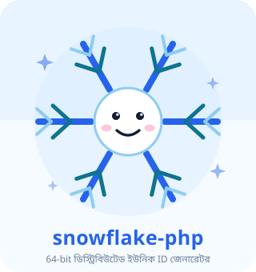
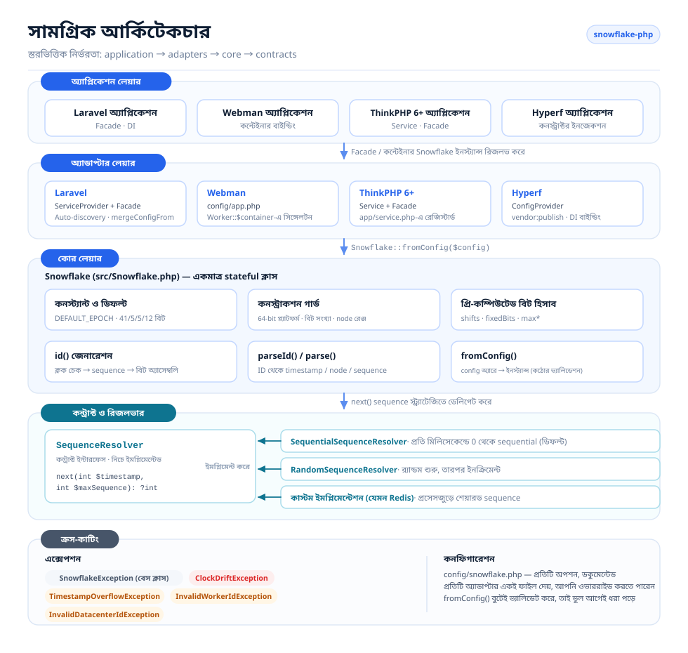
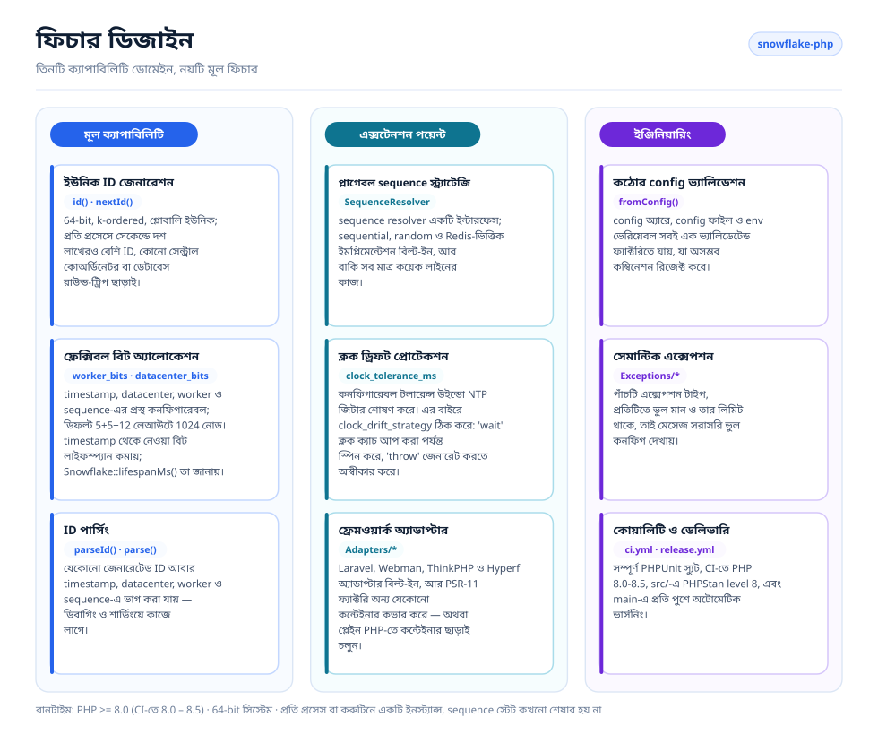
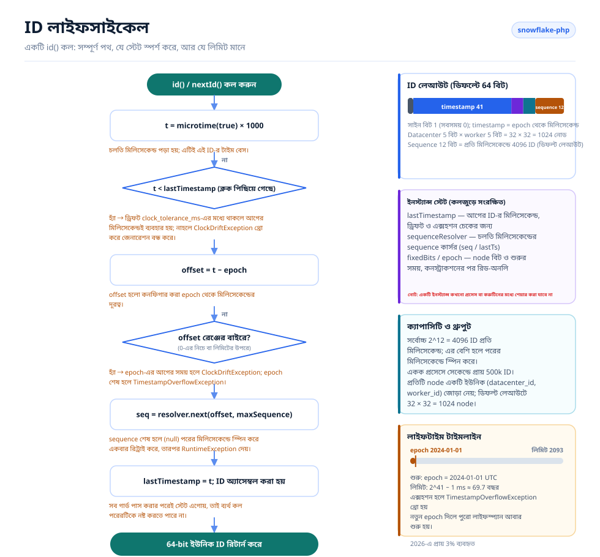

# Snowflake PHP

[English](../../../README.md) · [简体中文](../../../README.zh-CN.md) · [한국어](../ko/README.md) · [Русский](../ru/README.md) · [Deutsch](../de/README.md) · [Français](../fr/README.md) · [Español](../es/README.md) · [Português](../pt/README.md) · [हिन्दी](../hi/README.md) · [العربية](../ar/README.md) · [বাংলা](../bn/README.md) · [Bahasa Indonesia](../id/README.md) · [日本語](../ja/README.md)

<p align="center">
  
  <br />
  <sub>মাসকটটি কোডের সাথেও আসে — <code>echo Snowflake::MASCOT;</code> যেকোনো টার্মিনালে এটি প্রিন্ট করে।</sub>
</p>

Twitter-এর Snowflake অ্যালগরিদমের উপর ভিত্তি করে তৈরি একটি ডিস্ট্রিবিউটেড ইউনিক ID জেনারেটর, যা Laravel, Webman, ThinkPHP ও Hyperf-এর সাথে কম্প্যাটিবল।

## পরিচিতি

Snowflake PHP কোনো সেন্ট্রাল কোঅর্ডিনেটর ছাড়াই 64-bit, k-ordered, গ্লোবালি ইউনিক ID জেনারেট করে। প্রতিটি ID একটি timestamp, datacenter ID, worker ID ও sequence নম্বর দিয়ে গঠিত — ফলে প্রতি নোডে সেকেন্ডে দশ লাখেরও বেশি ID তৈরি হয়, কোনো ডেটাবেস রাউন্ড-ট্রিপ ছাড়াই।

মূল ফিচার:

- **পিওর PHP, শূন্য ডিপেন্ডেন্সি** — কোনো এক্সটেনশন বা এক্সটার্নাল সার্ভিস লাগে না
- **প্লাগেবল sequence রিজলভার** — বিল্ট-ইন sequential, random ও Redis-ভিত্তিক স্ট্র্যাটেজি, অথবা নিজেরটি আনুন
- **ফ্লেক্সিবল বিট অ্যালোকেশন** — আপনার স্কেল অনুযায়ী timestamp/worker/datacenter/sequence বিট সাজিয়ে নিন
- **ক্লক ড্রিফট টলারেন্স** — NTP অ্যাডজাস্টমেন্টের জন্য কনফিগারেবল টলারেন্স উইন্ডো
- **ফ্রেমওয়ার্ক অ্যাগনস্টিক** — Laravel, ThinkPHP, Webman ও Hyperf-এর জন্য ফার্স্ট-ক্লাস অ্যাডাপ্টার, অথবা কন্টেইনার ছাড়া প্লেইন PHP
- **ID পার্সিং** — জেনারেট করা ID আবার timestamp, node ও sequence কম্পোনেন্টে ভেঙে দেখা যায়

## প্রজেক্ট স্ট্রাকচার

```text
snowflake-php/
├── src/
│   ├── Snowflake.php                       # Core: config, bit layout, id(), parseId()
│   ├── Contracts/
│   │   └── SequenceResolver.php            # Sequence strategy interface
│   ├── Resolvers/
│   │   ├── SequentialSequenceResolver.php  # Default: 0..max per millisecond
│   │   ├── RandomSequenceResolver.php      # Random start per millisecond
│   │   └── RedisSequenceResolver.php       # Shared counter for multi-process nodes
│   ├── Exceptions/
│   │   ├── SnowflakeException.php          # Base exception
│   │   ├── ClockDriftException.php
│   │   ├── TimestampOverflowException.php
│   │   ├── InvalidWorkerIdException.php
│   │   └── InvalidDatacenterIdException.php
│   └── Adapters/                           # Framework integrations
│       ├── Laravel/                        # ServiceProvider + Facade + config
│       ├── ThinkPHP/                       # Service + Facade + config
│       ├── Hyperf/                         # ConfigProvider + config
│       ├── Webman/                         # config/app.php
│       └── Psr11/SnowflakeFactory.php      # Any PSR-11 container, no interface dependency
├── config/snowflake.php                    # Reference configuration with comments
├── tests/
│   ├── bootstrap.php                       # Loads the autoloader, prints the mascot
│   └── *Test.php                           # PHPUnit test suite
├── docs/
│   ├── i18n/                               # Translated READMEs + localized diagrams
│   │   ├── README.md                       # Language index
│   │   ├── img/<lang>/                     # Generated SVGs (13 languages)
│   │   └── <lang>/README.md                # One translated README per language
│   ├── examples/plain-php.php              # Runnable no-framework example
│   └── *.png                               # Sponsor images
├── scripts/
│   ├── generate-diagrams.py                # Builds docs/i18n/img/<lang>/*.svg
│   ├── benchmark.php                       # Reproducible throughput benchmark
│   ├── phpstan/stubs/                      # Framework stubs for static analysis
│   └── i18n/labels.<lang>.json             # Diagram strings, one file per language
├── phpstan.neon.dist                       # Level 8 static analysis config
└── .github/workflows/                      # ci.yml (PHP 8.0–8.5), release.yml
```

## আর্কিটেকচার



চারটি লেয়ার, নির্ভরতা শুধু এক দিকেই:

- **অ্যাপ্লিকেশন লেয়ার** — আপনার Laravel / Webman / ThinkPHP / Hyperf অ্যাপ্লিকেশন, যেকোনো PSR-11 কন্টেইনার, বা প্লেইন PHP; এটি কন্টেইনারের কাছে শুধু একটি `Snowflake` ইনস্ট্যান্স চায়।
- **অ্যাডাপ্টার লেয়ার** — প্রতি ফ্রেমওয়ার্কে একটি অ্যাডাপ্টার, সাথে কন্টেইনার-নিরপেক্ষ একটি PSR-11 ফ্যাক্টরি। প্রতিটি একটি শেয়ারড ইনস্ট্যান্স রেজিস্টার করে এবং একটি পাবলিশযোগ্য config ফাইল দেয়।
- **কোর লেয়ার** — `Snowflake`-ই একমাত্র stateful ক্লাস: এটি কনফিগারেশন ভ্যালিডেট করে, বিট শিফট ও ফিক্সড নোড বিট আগেই হিসাব করে রাখে, ID জেনারেট করে এবং আবার পার্স করে।
- **কন্ট্রাক্ট ও রিজলভার** — `SequenceResolver` হলো এক্সটেনশন পয়েন্ট। কোর প্রতিটি sequence অ্যালোকেশন এর কাছে ডেলিগেট করে, তাই জেনারেটর ছুঁয়ে না-ই sequence স্ট্র্যাটেজি বদলানো যায়।
- **ক্রস-কাটিং** — একটি সেমান্টিক এক্সেপশন হায়ারার্কি, সাথে সব অ্যাডাপ্টারের শেয়ার করা একটি কমেন্টেড কনফিগারেশন ফাইল।

## ফিচার ডিজাইন



ফিচারগুলো তিনটি ডোমেইনে বিভক্ত: **কোর** (জেনারেশন, বিট অ্যালোকেশন, পার্সিং), **এক্সটেনশন** (প্লাগেবল রিজলভার, ক্লক-ড্রিফট হ্যান্ডলিং, ফ্রেমওয়ার্ক অ্যাডাপ্টার) এবং **ইঞ্জিনিয়ারিং** (কঠোর config ভ্যালিডেশন, সেমান্টিক এক্সেপশন, টেস্ট ও রিলিজ অটোমেশন)।

## ID লাইফসাইকেল



প্রতিটি `id()` কল একই পথ পাড়ি দেয়:

1. ঘড়ি পড়া হয় এবং পিছিয়ে যাওয়া ড্রিফট চেক করা হয় — `clock_tolerance_ms` পর্যন্ত টলারেট করা হয়; এর বেশি হলে `clock_drift_strategy` ঠিক করে ক্লক ক্যাচ আপ করা পর্যন্ত অপেক্ষা করবে (`'wait'`) নাকি জেনারেট করতে অস্বীকার করবে (`'throw'`)।
2. epoch অফসেটে রূপান্তর করা হয় এবং নেগেটিভ বা timestamp লিমিট পেরোনো অফসেট রিজেক্ট করা হয়।
3. এই মিলিসেকেন্ডের পরের স্লটের জন্য sequence রিজলভারকে জিজ্ঞেস করা হয়; 4096টি স্লট শেষ হলে পরের মিলিসেকেন্ডে স্পিন করে একবার রিট্রাই করা হয়।
4. `(offset << timestampShift) | fixedBits | sequence` অ্যাসেম্বল করা হয়, `lastTimestamp` এগিয়ে দেওয়া হয়, এবং ID রিটার্ন করা হয়।

ইনস্ট্যান্স স্টেট (`lastTimestamp` এবং রিজলভার কার্সর) মেমোরিতে থাকে এবং কখনো প্রসেস বা করুটিনের মধ্যে শেয়ার হয় না।

## প্রয়োজনীয়তা

- PHP >= 8.0 (CI-তে 8.0 – 8.5 টেস্টেড, সাথে `src/`-এ PHPStan level 8)
- 64-bit সিস্টেম (নেটিভ 64-bit ইন্টিজার অপারেশনের জন্য আবশ্যক)
- প্রতি প্রসেস/করুটিনে একটি ইনস্ট্যান্স — Snowflake ইনস্ট্যান্স তার sequence স্টেট মেমোরিতে রাখে, তাই প্রসেস বা করুটিনের মধ্যে শেয়ার করা যাবে না

## ইনস্টলেশন

```bash
composer require erikwang2013/snowflake-php
```

## কুইক স্টার্ট

```php
use Erikwang2013\Snowflake\Snowflake;

$snowflake = new Snowflake();
$id = $snowflake->id();          // e.g. 508047278033704960
$id = $snowflake->nextId();      // alias for id()
```

কাস্টম worker ও datacenter ID সহ:

```php
$snowflake = new Snowflake(workerId: 5, datacenterId: 3);
$id = $snowflake->id();
```

## কনফিগারেশন রেফারেন্স

| কী | টাইপ | ডিফল্ট | বিবরণ |
|-----|------|---------|-------------|
| `epoch` | int | `1704067200000` | কাস্টম epoch (ms), ডিফল্ট: 2024-01-01 UTC |
| `worker_id` | int | `0` | Worker/নোড আইডেন্টিফায়ার |
| `datacenter_id` | int | `0` | Datacenter আইডেন্টিফায়ার |
| `worker_bits` | int | `5` | worker ID-র জন্য বিট |
| `datacenter_bits` | int | `5` | datacenter ID-র জন্য বিট |
| `sequence_bits` | int | `12` | sequence নম্বরের জন্য বিট |
| `sequence_resolver` | string | `SequentialSequenceResolver` | SequenceResolver-এর FQCN |
| `clock_tolerance_ms` | int | `0` | সর্বোচ্চ পিছিয়ে যাওয়া ক্লক ড্রিফট (0 = কঠোর) |
| `clock_drift_strategy` | string | `'throw'` | `'throw'` টলারেন্সের বাইরে ক্লক পিছিয়ে গেলে জেনারেট করতে অস্বীকার করে; `'wait'` ওয়াল ক্লক ক্যাচ আপ করা পর্যন্ত স্পিন করে, `clock_drift_wait_ms` পরে হাল ছেড়ে `ClockDriftException` থ্রো করে |
| `clock_drift_wait_ms` | int | `1000` | `'wait'` স্ট্র্যাটেজি হাল ছাড়ার আগে কতক্ষণ অপেক্ষা করে |

### বিট লেআউট

ডিফল্ট লেআউট (63 ডেটা বিট + 1 সাইন বিট = মোট 64 বিট):

```
| reserved(1) |  timestamp(41)   | datacenter(5) | worker(5) | sequence(12) |
```

ডিফল্ট epoch-এ সর্বোচ্চ লাইফস্প্যান: ~69 বছর (প্রায় 2093 পর্যন্ত)।

node id বা sequence-কে দেওয়া প্রতিটি বিট timestamp থেকে নেওয়া হয়, তাই চওড়া sequence চুপচাপ জেনারেটরের আয়ু কমিয়ে দেয়:

| worker + datacenter + sequence বিট | timestamp বিট | ব্যবহারযোগ্য লাইফস্প্যান |
|---|---|---|
| 5 + 5 + 12 (ডিফল্ট) | 41 | ~69.7 বছর |
| 7 + 7 + 10 | 39 | ~17.4 বছর |
| 5 + 5 + 16 | 37 | ~4.4 বছর |
| 5 + 5 + 20 | 33 | ~99 দিন |

যেকোনো লেআউটের লিমিট জেনে নিন:

```php
Snowflake::lifespanMs();                                                     // default layout, ~69.7 years in ms
Snowflake::lifespanMs(workerBits: 7, datacenterBits: 7, sequenceBits: 10);   // ~17.4 years in ms
```

`Snowflake::lifespanMs(int $workerBits = 5, int $datacenterBits = 5, int $sequenceBits = 12): int` একটি লেআউটের সর্বোচ্চ timestamp অফসেট মিলিসেকেন্ডে রিটার্ন করে; আর্গুমেন্টগুলোর ডিফল্ট মান ডিফল্ট লেআউট। অফসেট এই লিমিটে পৌঁছালেই epoch শেষ — যে epoch-এর উইন্ডো ইতিমধ্যেই বন্ধ হয়ে গেছে, সেখানে একেবারে প্রথম `id()` কলই `TimestampOverflowException` থ্রো করে।

### কনফিগারেশন অ্যারে ব্যবহার

```php
$snowflake = Snowflake::fromConfig([
    'worker_id' => 1,
    'datacenter_id' => 2,
    'epoch' => 1704067200000,
]);
$id = $snowflake->id();
```

## ফ্রেমওয়ার্ক ইন্টিগ্রেশন

### Laravel

প্যাকেজটি Laravel auto-discovery সাপোর্ট করে। ইনস্টল করার পর:

1. config পাবলিশ করুন (অপশনাল):
```bash
php artisan vendor:publish --tag=snowflake-config
```

2. `.env`-এ এনভায়রনমেন্ট ভেরিয়েবল সেট করুন:
```env
SNOWFLAKE_WORKER_ID=1
SNOWFLAKE_DATACENTER_ID=1
```

3. Facade বা dependency injection ব্যবহার করুন:
```php
// Facade
use Snowflake;
$id = Snowflake::id();

// Dependency injection
use Erikwang2013\Snowflake\Snowflake;

class OrderController
{
    public function store(Snowflake $snowflake)
    {
        $orderId = $snowflake->id();
    }
}

// Container access
$id = app('snowflake')->id();
$id = app(Snowflake::class)->id();
```

### Webman

1. প্লাগিন config আপনার প্রজেক্টে কপি করুন:
```bash
cp vendor/erikwang2013/snowflake-php/src/Adapters/Webman/config/app.php \
   config/plugin/erikwang2013/snowflake-php/app.php
```

2. `process.php` বা bootstrap-এ একটি সিঙ্গেলটন রেজিস্টার করুন:
```php
use Erikwang2013\Snowflake\Snowflake;

Worker::$container->add(Snowflake::class, function () {
    return Snowflake::fromConfig(
        config('plugin.erikwang2013.snowflake-php.app.snowflake')
    );
});
```

3. ব্যবহার:
```php
$id = Worker::$container->get(Snowflake::class)->id();
```

### ThinkPHP 6+

1. config ফাইলটি আপনার প্রজেক্টে কপি করুন:
```bash
cp vendor/erikwang2013/snowflake-php/src/Adapters/ThinkPHP/config/snowflake.php \
   config/snowflake.php
```

2. `app/service.php`-এ সার্ভিস রেজিস্টার করুন:
```php
return [
    \Erikwang2013\Snowflake\Adapters\ThinkPHP\Service::class,
];
```

3. ব্যবহার:
```php
// Container
$id = app('snowflake')->id();

// Dependency injection
use Erikwang2013\Snowflake\Snowflake;

class IndexController
{
    public function index(Snowflake $snowflake)
    {
        $id = $snowflake->id();
    }
}

// Facade
use Erikwang2013\Snowflake\Adapters\ThinkPHP\Facade;
$id = Facade::id();
```

### Hyperf

1. config পাবলিশ করুন:
```bash
php bin/hyperf.php vendor:publish erikwang2013/snowflake-php
```

2. `config/autoload/dependencies.php`-এ DI বাইন্ডিং রেজিস্টার করুন:
```php
use Erikwang2013\Snowflake\Snowflake;

return [
    Snowflake::class => function () {
        return Snowflake::fromConfig(config('snowflake'));
    },
];
```

3. কনস্ট্রাক্টর ইনজেকশনের মাধ্যমে ব্যবহার:
```php
use Erikwang2013\Snowflake\Snowflake;

class OrderService
{
    public function __construct(private Snowflake $snowflake) {}

    public function create(): int
    {
        return $this->snowflake->id();
    }
}
```

### PSR-11 কন্টেইনার

Symfony, Slim, Laminas বা অন্য যেকোনো কন্টেইনার: ফ্যাক্টরিটি রেজিস্টার করুন। এটি কোনো কিছুতে নির্ভর করে না, তাই যেকোনো কন্টেইনারই চলবে — `psr/container` লাগে না:

```php
use Erikwang2013\Snowflake\Adapters\Psr11\SnowflakeFactory;

$container->set(\Erikwang2013\Snowflake\Snowflake::class, new SnowflakeFactory($config));
// or build the config from the environment:
$container->set(\Erikwang2013\Snowflake\Snowflake::class, SnowflakeFactory::fromEnvironment());
```

`SnowflakeFactory::fromEnvironment()` Laravel অ্যাডাপ্টারের মতো একই `SNOWFLAKE_*` ভেরিয়েবল পড়ে। PSR-11 কন্টেইনার ফ্যাক্টরি অবজেক্টটিকেই কল করে, তাই Symfony সার্ভিস ডেফিনিশন এক লাইনের:

```yaml
services:
  Erikwang2013\Snowflake\Snowflake:
    factory: ['@Erikwang2013\Snowflake\Adapters\Psr11\SnowflakeFactory', '__invoke']
```

## নেটিভ PHP (কোনো ফ্রেমওয়ার্ক ছাড়া)

এই প্যাকেজের কোনো কিছুই ফ্রেমওয়ার্ক চায় না — উপরের চারটি অ্যাডাপ্টার শুধু আপনার জন্য `Snowflake`-কে কন্টেইনারে যুক্ত করে দেয়। কন্টেইনার ছাড়া নিজেই বানিয়ে নিন:

```php
require __DIR__ . '/vendor/autoload.php';

use Erikwang2013\Snowflake\Snowflake;

// Same variable names the Laravel adapter uses, so one .env-style setup
// works whether or not a framework is present.
$snowflake = Snowflake::fromConfig([
    'worker_id'          => (int) (getenv('SNOWFLAKE_WORKER_ID') ?: 0),
    'datacenter_id'      => (int) (getenv('SNOWFLAKE_DATACENTER_ID') ?: 0),
    'clock_tolerance_ms' => 5,
]);

$id = $snowflake->id();
```

এর একটি রানযোগ্য রূপ — ফ্রেমওয়ার্ক-মুক্ত লেজি সিঙ্গেলটন এবং এটি যে ইনভেরিয়েন্টগুলো চেক করে, সবসহ — আছে [`docs/examples/plain-php.php`](../../examples/plain-php.php)-এ:

```bash
php docs/examples/plain-php.php
```

### লাইফটাইম বেছে নেওয়া

ইনস্ট্যান্সটি `lastTimestamp` ও sequence কার্সর মেমোরিতে রাখে, তাই এটি কত দিন বাঁচবে — এটিই একমাত্র বিষয় যা ঠিকভাবে পাওয়া জরুরি:

| রানটাইম | ইনস্ট্যান্স তৈরি করুন |
|---------|--------------------|
| PHP-FPM, mod_php, CLI | ইনলাইন, প্রতি রিকোয়েস্ট বা কমান্ডে — এদের মধ্যে কিছুই শেয়ার হয় না। |
| Swoole, ReactPHP, RoadRunner, FrankenPHP | প্রতি **worker প্রসেসে** একবার, worker-start কলব্যাক থেকে, ইউনিক `(datacenter_id, worker_id)` জোড়া দিয়ে। |

একটি ইনস্ট্যান্স কখনো করুটিন বা থ্রেডের মধ্যে শেয়ার করবেন না: `id()` নিজের স্টেট পড়ে ও লেখে, তাই দুটি সমান্তরাল কল ইন্টারলিভ হয়ে একই sequence নম্বর দিয়ে দিতে পারে। প্রতি করুটিনে একটি ইনস্ট্যান্স তৈরি করুন, বা শেয়ার করা ইনস্ট্যান্সটি mutex দিয়ে গার্ড করুন।

## ID পার্সিং

একটি Snowflake ID-কে তার কম্পোনেন্টে ভাগ করুন:

```php
$id = $snowflake->id();

// Using the instance (respects custom bit layout)
$parsed = $snowflake->parseId($id);
// [
//     'timestamp_ms' => 1736380800123,
//     'datetime'     => '2025-01-09 00:00:00.123',
//     'worker_id'    => 5,
//     'datacenter_id' => 3,
//     'sequence'     => 42,
// ]

// Static method (uses default bit layout)
$parsed = Snowflake::parse($id, $epoch);
```

`datetime` মেম্বারটি PHP-র `date()` দিয়ে **সার্ভারের ডিফল্ট টাইমজোনে** ফরম্যাট করা, তাই আলাদা টাইমজোনের দুটি হোস্ট একই ID ভিন্নভাবে দেখায়। `timestamp_ms` হলো টাইমজোন-নিরপেক্ষ পরম মান — একাধিক মেশিনের ID মেলানোর সময় এটিই মিলিয়ে দেখুন।

## sequence রিজলভার

তিনটি বিল্ট-ইন ইমপ্লিমেন্টেশন:

### SequentialSequenceResolver (ডিফল্ট)

ক্লাসিক Snowflake আচরণ। প্রতি মিলিসেকেন্ডে sequence 0 থেকে শুরু হয়ে ক্রমান্বয়ে বাড়ে। একক নোডের ভেতরে ID ক্রমবর্ধমান থাকার গ্যারান্টি দেয়।

```php
use Erikwang2013\Snowflake\Resolvers\SequentialSequenceResolver;

$snowflake = new Snowflake(
    sequenceResolver: new SequentialSequenceResolver()
);
```

### RandomSequenceResolver

প্রতি মিলিসেকেন্ডে একটি র্যান্ডম sequence নম্বর থেকে শুরু করে, তারপর বাড়ায়। sequential ID-র চেয়ে কম অনুমানযোগ্য, তবে এক মিলিসেকেন্ডের ভেতরে ID ক্রমবর্ধমান থাকে।

```php
use Erikwang2013\Snowflake\Resolvers\RandomSequenceResolver;

$snowflake = new Snowflake(
    sequenceResolver: new RandomSequenceResolver()
);
```

### কাস্টম রিজলভার

`Erikwang2013\Snowflake\Contracts\SequenceResolver` ইমপ্লিমেন্ট করুন:

```php
use Erikwang2013\Snowflake\Contracts\SequenceResolver;

class SharedCounterSequenceResolver implements SequenceResolver
{
    public function next(int $timestamp, int $maxSequence): ?int
    {
        $key = "snowflake:seq:{$timestamp}";
        $seq = redis()->incr($key);
        redis()->expire($key, 1);

        if ($seq > $maxSequence) {
            return null;
        }

        return $seq - 1;
    }
}
```

### RedisSequenceResolver

ইন-প্রসেস রিজলভারগুলো sequence মেমোরিতে রাখে, তাই একই node id শেয়ার করা প্রসেসগুলো একই sequence নম্বর দিয়ে দিতে পারে। `RedisSequenceResolver` বদলে কাউন্টারটি Redis-এ রাখে — একাধিক প্রসেস যখন একই `(datacenter_id, worker_id)` জোড়া শেয়ার করে, তখন এটিই ব্যবহার করুন:

```php
use Erikwang2013\Snowflake\Resolvers\RedisSequenceResolver;

// Any client exposing incr(string $key): int and expire(string $key, int $seconds): bool
$resolver = new RedisSequenceResolver($redis, 'snowflake:seq:', 1);
$snowflake = new Snowflake(sequenceResolver: $resolver);
```

`__construct(object $client, string $keyPrefix = 'snowflake:seq:', int $ttlSeconds = 1)` — ক্লায়েন্টটি ইনজেক্ট করা হয়, তাই `redis` এক্সটেনশন বা Predis কোনোটিই লাগে না। লম্বা TTL নিরাপদ: তখন কাউন্টার একই মিলিসেকেন্ডের ভেতরেই বাড়তেই থাকে, ফলে পরের মিলিসেকেন্ড শুরু না হওয়া পর্যন্ত সঠিকভাবেই `null` দেয়।

## এক্সেপশন হ্যান্ডলিং

| এক্সেপশন | কখন |
|-----------|------|
| `InvalidWorkerIdException` | Worker ID `2^worker_bits - 1` ছাড়িয়ে গেলে |
| `InvalidDatacenterIdException` | Datacenter ID `2^datacenter_bits - 1` ছাড়িয়ে গেলে |
| `ClockDriftException` | সিস্টেম ক্লক টলারেন্সের বাইরে পিছিয়ে গেলে |
| `TimestampOverflowException` | epoch শেষ হয়ে গেলে (লাইফস্প্যান শেষ) |
| `SnowflakeException` | প্যাকেজের সব এক্সেপশনের বেস এক্সেপশন |

## ডিস্ট্রিবিউটেড ডিপ্লয়মেন্ট

একাধিক সার্ভার বা প্রসেসে চালালে নিশ্চিত করুন প্রতিটি ইনস্ট্যান্স আলাদা `(datacenter_id, worker_id)` জোড়া ব্যবহার করছে:

```php
// Read from environment, hostname hash, or service discovery
$workerId = (int) getenv('WORKER_ID');
$datacenterId = (int) getenv('DC_ID');

$snowflake = new Snowflake(
    workerId: $workerId,
    datacenterId: $datacenterId
);
```

ডিফল্ট 5+5 বিট লেআউটে সর্বোচ্চ 32 datacenter × 32 worker = 1024টি ইউনিক নোড সাপোর্ট করা যায়।

আরও worker দরকার হলে বিট অ্যালোকেশন বদলান:

```php
// 10 worker bits = 1024 workers, 0 datacenter bits = single DC
$snowflake = new Snowflake(
    workerId: $workerId,
    workerBits: 10,
    datacenterBits: 0
);
```

## পারফরম্যান্স

ID সম্পূর্ণভাবে ইন-প্রসেসে তৈরি হয়, কোনো এক্সটার্নাল ডিপেন্ডেন্সি নেই, তাই থ্রুপুট সীমিত হয় PHP-র নিজের `microtime()` কল আর কয়েকটি ইন্টিজার অপারেশন দিয়ে।

একটি ডেভেলপার মেশিনের এক কোরে মাপা (PHP 8.3.7, **Xdebug বন্ধ**, 300k ইটারেশন, 5-এর মধ্যে সেরা):

| অপারেশন | থ্রুপুট | প্রতি কল |
|-----------|-----------:|---------:|
| শুধু `microtime(true)` — ফ্লোর | 10.3M/s | 97 ns |
| `id()` — ডিফল্ট 5+5+12 লেআউট | **1.6M/s** | 633 ns |
| `id()` + `parseId()` | 282k/s | 3.5 µs |
| `Snowflake::fromConfig()` | 167k/s | 6.0 µs |

জেনারেশনে একটি নগদ ক্লক কলের প্রায় ছয় গুণ খরচ হয়, আর একটি নোডের sequence সিলিং (4096 ID/ms = 4.1M/s) একটি PHP প্রসেস যা কনজিউম করতে পারে তার অনেক উপরে থাকে। পার্সিং ও কনস্ট্রাকশন ডায়াগনস্টিক অপারেশন, হট পাথ নয় — প্রতি প্রসেসে একবার ইনস্ট্যান্স বানান আর `parseId()`-কে টাইট লুপের বাইরে রাখুন।

নিজের মেশিনে এটি রিপ্রোডিউস করুন:

```bash
php scripts/benchmark.php
```

এটি একটি নগদ `microtime()` বেসলাইনের বিপরীতে ops/sec ও ns/op প্রিন্ট করে, best-of-N সাথে স্প্রেড। পরম সংখ্যাগুলোর কোনো মানে আছে কি না তা দুটি জিনিস ঠিক করে: **Xdebug** (এটি এক অর্ডার অফ ম্যাগনিচিউড খরচ করতে পারে — লোড থাকলে হেডার তা জানায়) এবং ব্যস্ত বা ভার্চুয়ালাইজড হোস্ট, যার নিজের ক্লক কলই মাপজোখকে ছাপিয়ে যেতে পারে। কোনো একক সংখ্যাকে প্রতিশ্রুতি ভেবে না পড়ে বেসলাইনের সাথে তুলনা করুন।

## সাপোর্ট স্বাগতম

| WeChat Pay | Alipay |
|:---:|:---:|
|  |  |

> এই প্রজেক্টটি আপনার কাজে লাগলে, নিঃসংকোচে সাপোর্ট জানাতে পারেন~

---

## লাইসেন্স

MIT — Copyright (c) 2026 erik <erik@erik.xyz> — https://erik.xyz
