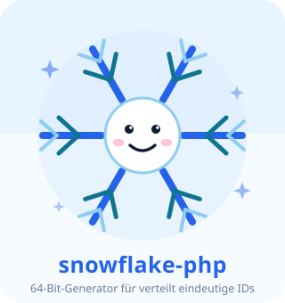
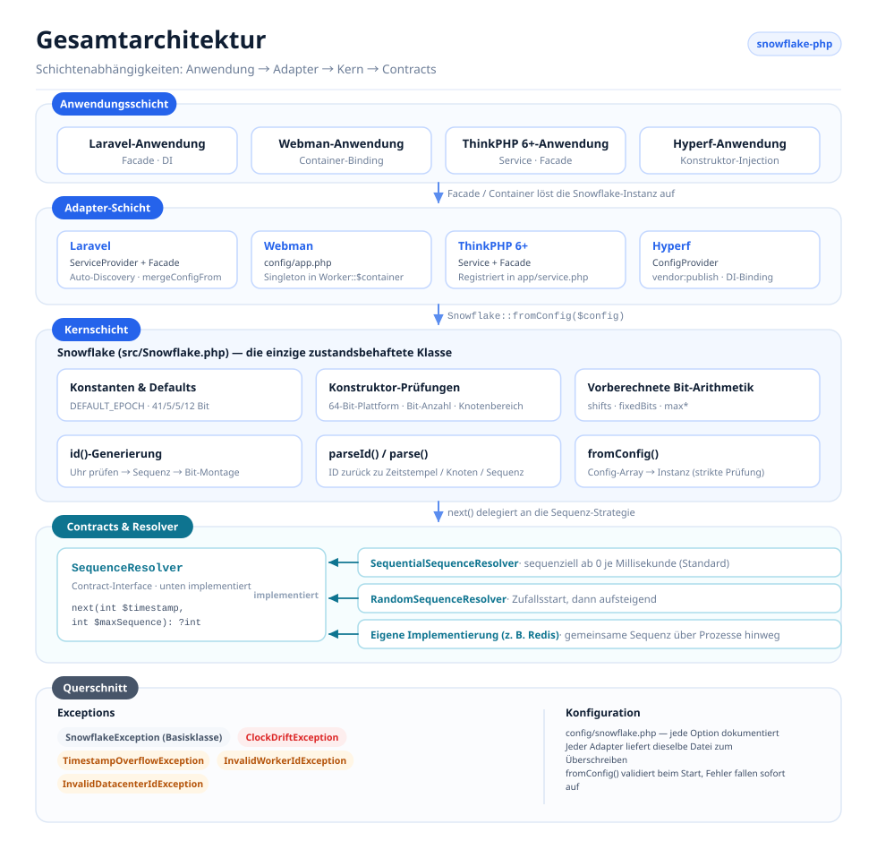
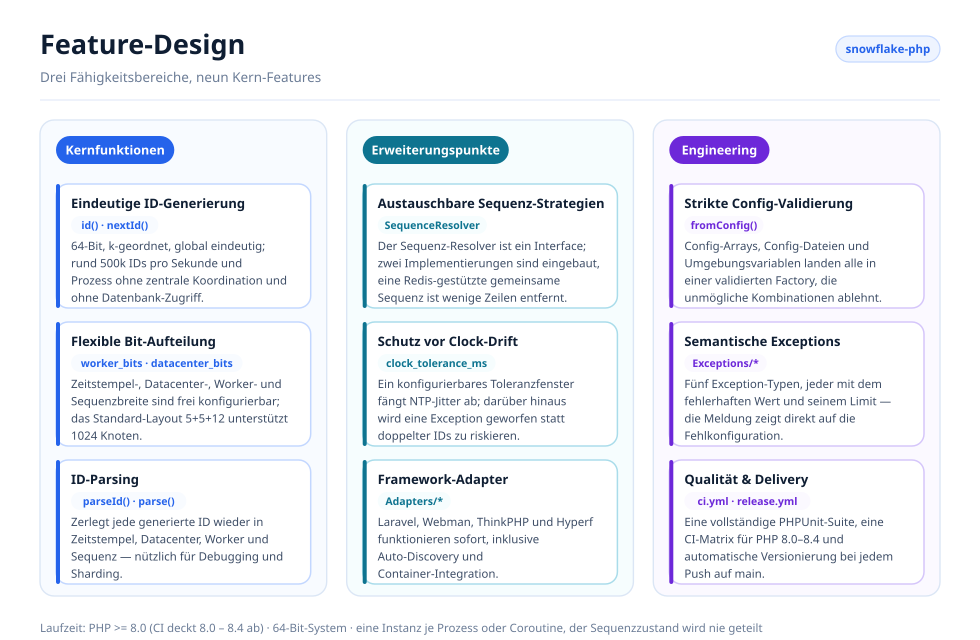
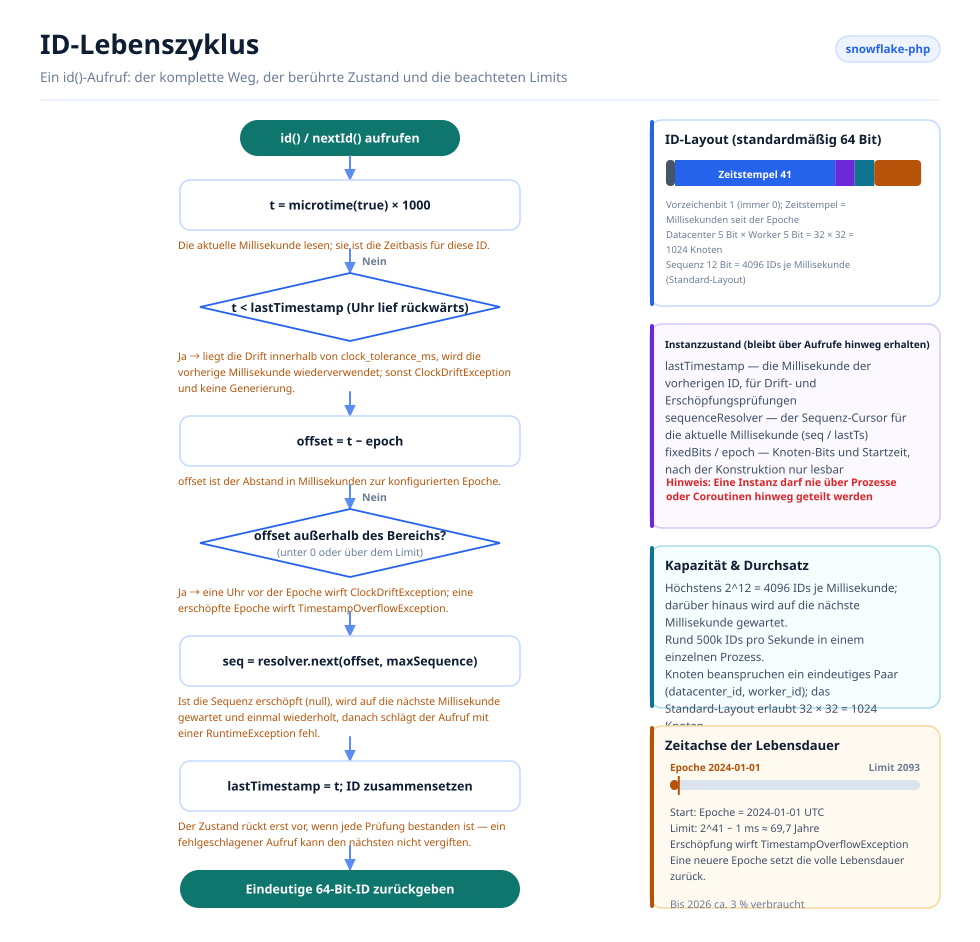

# Snowflake PHP

[English](../../../README.md) · [简体中文](../../../README.zh-CN.md) · [한국어](../ko/README.md) · [Русский](../ru/README.md) · [Deutsch](../de/README.md) · [Français](../fr/README.md) · [Español](../es/README.md) · [Português](../pt/README.md) · [हिन्दी](../hi/README.md) · [العربية](../ar/README.md) · [বাংলা](../bn/README.md) · [Bahasa Indonesia](../id/README.md) · [日本語](../ja/README.md)

<p align="center">
  
  <br />
  <sub>Das Maskottchen ist auch im Code enthalten — <code>echo Snowflake::MASCOT;</code> gibt es in jedem Terminal aus.</sub>
</p>

Ein verteilter Generator für eindeutige IDs nach dem Snowflake-Algorithmus von Twitter, kompatibel mit Laravel, Webman, ThinkPHP und Hyperf.

## Über das Projekt

Snowflake PHP erzeugt 64-Bit-, k-geordnete, global eindeutige IDs, ganz ohne zentrale Koordination. Jede ID setzt sich aus Zeitstempel, Datacenter-ID, Worker-ID und Sequenznummer zusammen — damit sind deutlich über eine Million IDs pro Sekunde und Knoten möglich, ohne einen einzigen Datenbank-Zugriff.

Wichtigste Features:

- **Reines PHP, keine Abhängigkeiten** — keine Extensions oder externen Dienste erforderlich
- **Austauschbare Sequenz-Resolver** — sequenzielle, zufällige und Redis-gestützte Strategien sind eingebaut, oder bringen Sie Ihre eigene mit
- **Flexible Bit-Aufteilung** — Zeitstempel-/Worker-/Datacenter-/Sequenz-Bits an die eigene Skalierung anpassen
- **Toleranz für Clock-Drift** — konfigurierbares Toleranzfenster für NTP-Anpassungen
- **Framework-unabhängig** — erstklassige Adapter für Laravel, ThinkPHP, Webman und Hyperf oder reines PHP ganz ohne Container
- **ID-Parsing** — generierte IDs wieder in Zeitstempel, Knoten und Sequenz zerlegen

## Projektstruktur

```text
snowflake-php/
├── src/
│   ├── Snowflake.php                       # Core: config, bit layout, id(), parseId()
│   ├── Contracts/
│   │   └── SequenceResolver.php            # Sequence strategy interface
│   ├── Resolvers/
│   │   ├── SequentialSequenceResolver.php  # Default: 0..max per millisecond
│   │   ├── RandomSequenceResolver.php      # Random start per millisecond
│   │   └── RedisSequenceResolver.php       # Shared counter for multi-process nodes
│   ├── Exceptions/
│   │   ├── SnowflakeException.php          # Base exception
│   │   ├── ClockDriftException.php
│   │   ├── TimestampOverflowException.php
│   │   ├── InvalidWorkerIdException.php
│   │   └── InvalidDatacenterIdException.php
│   └── Adapters/                           # Framework integrations
│       ├── Laravel/                        # ServiceProvider + Facade + config
│       ├── ThinkPHP/                       # Service + Facade + config
│       ├── Hyperf/                         # ConfigProvider + config
│       ├── Webman/                         # config/app.php
│       └── Psr11/SnowflakeFactory.php      # Any PSR-11 container, no interface dependency
├── config/snowflake.php                    # Reference configuration with comments
├── tests/
│   ├── bootstrap.php                       # Loads the autoloader, prints the mascot
│   └── *Test.php                           # PHPUnit test suite
├── docs/
│   ├── i18n/                               # Translated READMEs + localized diagrams
│   │   ├── README.md                       # Language index
│   │   ├── img/<lang>/                     # Generated SVGs (13 languages)
│   │   └── <lang>/README.md                # One translated README per language
│   ├── examples/plain-php.php              # Runnable no-framework example
│   └── *.png                               # Sponsor images
├── scripts/
│   ├── generate-diagrams.py                # Builds docs/i18n/img/<lang>/*.svg
│   ├── benchmark.php                       # Reproducible throughput benchmark
│   ├── phpstan/stubs/                      # Framework stubs for static analysis
│   └── i18n/labels.<lang>.json             # Diagram strings, one file per language
├── phpstan.neon.dist                       # Level 8 static analysis config
└── .github/workflows/                      # ci.yml (PHP 8.0–8.5), release.yml
```

## Architektur



Vier Schichten, deren Abhängigkeiten nur in eine Richtung zeigen:

- **Anwendungsschicht** — Ihre Laravel-/Webman-/ThinkPHP-/Hyperf-Anwendung, jeder PSR-11-Container oder reines PHP; sie verlangt nie mehr als eine `Snowflake`-Instanz.
- **Adapter-Schicht** — ein Adapter pro Framework plus eine container-unabhängige PSR-11-Factory. Jeder registriert eine einzelne gemeinsame Instanz und liefert eine veröffentlichbare Konfigurationsdatei mit.
- **Kernschicht** — `Snowflake` ist die einzige zustandsbehaftete Klasse: Sie validiert die Konfiguration, berechnet Bit-Verschiebungen und feste Knoten-Bits vorab, generiert IDs und zerlegt sie wieder.
- **Contracts & Resolver** — `SequenceResolver` ist der Erweiterungspunkt. Der Kern delegiert jede Sequenzvergabe dorthin, sodass die Sequenzstrategie ausgetauscht werden kann, ohne den Generator anzufassen.
- **Querschnitt** — eine semantische Exception-Hierarchie plus eine einzige kommentierte Konfigurationsdatei, die alle Adapter gemeinsam nutzen.

## Feature-Design



Die Features gliedern sich in drei Bereiche: **Kern** (Generierung, Bit-Aufteilung, Parsing), **Erweiterung** (austauschbare Resolver, Clock-Drift-Behandlung, Framework-Adapter) und **Engineering** (strikte Config-Validierung, semantische Exceptions, Tests und Release-Automatisierung).

## ID-Lebenszyklus



Jeder `id()`-Aufruf durchläuft denselben Pfad:

1. Die Uhr auslesen und auf Rückwärtsdrift prüfen — bis `clock_tolerance_ms` toleriert; darüber entscheidet `clock_drift_strategy`, ob auf die aufgeholte Uhr gewartet (`'wait'`) oder die Generierung verweigert wird (`'throw'`).
2. In einen Epochen-Offset umrechnen und Offsets verwerfen, die negativ sind oder das Zeitstempel-Limit überschreiten.
3. Den Sequenz-Resolver nach dem nächsten Slot in dieser Millisekunde fragen; sind alle 4096 Slots belegt, auf die nächste Millisekunde warten und einmal wiederholen.
4. `(offset << timestampShift) | fixedBits | sequence` zusammensetzen, `lastTimestamp` vorrücken und die ID zurückgeben.

Der Instanzzustand (`lastTimestamp` plus der Resolver-Cursor) liegt im Speicher und wird nie über Prozesse oder Coroutinen hinweg geteilt.

## Voraussetzungen

- PHP >= 8.0 (8.0 – 8.5 in der CI getestet, dazu PHPStan Level 8 auf `src/`)
- 64-Bit-System (erforderlich für native 64-Bit-Integer-Operationen)
- Eine Instanz pro Prozess/Coroutine — eine Snowflake-Instanz hält ihren Sequenzzustand im Speicher und darf nicht über Prozesse oder Coroutinen hinweg geteilt werden

## Installation

```bash
composer require erikwang2013/snowflake-php
```

## Schnellstart

```php
use Erikwang2013\Snowflake\Snowflake;

$snowflake = new Snowflake();
$id = $snowflake->id();          // e.g. 508047278033704960
$id = $snowflake->nextId();      // alias for id()
```

Mit eigenen Worker- und Datacenter-IDs:

```php
$snowflake = new Snowflake(workerId: 5, datacenterId: 3);
$id = $snowflake->id();
```

## Konfigurationsreferenz

| Schlüssel | Typ | Standard | Beschreibung |
|-----|------|---------|-------------|
| `epoch` | int | `1704067200000` | Benutzerdefinierte Epoche in ms (Standard: 2024-01-01 UTC) |
| `worker_id` | int | `0` | Worker-/Knoten-Bezeichner |
| `datacenter_id` | int | `0` | Datacenter-Bezeichner |
| `worker_bits` | int | `5` | Bits für die Worker-ID |
| `datacenter_bits` | int | `5` | Bits für die Datacenter-ID |
| `sequence_bits` | int | `12` | Bits für die Sequenznummer |
| `sequence_resolver` | string | `SequentialSequenceResolver` | FQCN des SequenceResolver |
| `clock_tolerance_ms` | int | `0` | Max. Rückwärtsdrift der Uhr (0 = strikt) |
| `clock_drift_strategy` | string | `'throw'` | `'throw'` verweigert die Generierung, wenn die Uhr über die Toleranz hinaus rückwärts läuft; `'wait'` wartet, bis die Systemuhr aufgeholt hat, gibt nach `clock_drift_wait_ms` auf und wirft dann `ClockDriftException` |
| `clock_drift_wait_ms` | int | `1000` | Wie lange die `'wait'`-Strategie wartet, bevor sie aufgibt |

### Bit-Layout

Standard-Layout (63 Datenbits + 1 Vorzeichenbit = insgesamt 64 Bit):

```
| reserved(1) |  timestamp(41)   | datacenter(5) | worker(5) | sequence(12) |
```

Maximale Lebensdauer mit Standard-Epoche: ca. 69 Jahre (bis ca. 2093).

Jedes Bit, das an die Knoten-ID oder die Sequenz geht, wird dem Zeitstempel entnommen — eine breite Sequenz verkürzt damit still und leise die Lebensdauer des Generators:

| Worker- + Datacenter- + Sequenz-Bits | Zeitstempel-Bits | nutzbare Lebensdauer |
|---|---|---|
| 5 + 5 + 12 (Standard) | 41 | ~69,7 Jahre |
| 7 + 7 + 10 | 39 | ~17,4 Jahre |
| 5 + 5 + 16 | 37 | ~4,4 Jahre |
| 5 + 5 + 20 | 33 | ~99 Tage |

Das Limit eines beliebigen Layouts abfragen:

```php
Snowflake::lifespanMs();                                                     // default layout, ~69.7 years in ms
Snowflake::lifespanMs(workerBits: 7, datacenterBits: 7, sequenceBits: 10);   // ~17.4 years in ms
```

`Snowflake::lifespanMs(int $workerBits = 5, int $datacenterBits = 5, int $sequenceBits = 12): int` gibt den maximalen Zeitstempel-Offset in Millisekunden für ein Layout zurück; die Argumente entsprechen standardmäßig dem Standard-Layout. Sobald der Offset dieses Limit erreicht, ist die Epoche erschöpft — bei einer veralteten Epoche, deren Fenster bereits geschlossen ist, wirft schon der allererste `id()`-Aufruf eine `TimestampOverflowException`.

### Konfigurations-Array verwenden

```php
$snowflake = Snowflake::fromConfig([
    'worker_id' => 1,
    'datacenter_id' => 2,
    'epoch' => 1704067200000,
]);
$id = $snowflake->id();
```

## Framework-Integration

### Laravel

Das Paket unterstützt Laravels Auto-Discovery. Nach der Installation:

1. Die Konfiguration veröffentlichen (optional):
```bash
php artisan vendor:publish --tag=snowflake-config
```

2. Umgebungsvariablen in `.env` setzen:
```env
SNOWFLAKE_WORKER_ID=1
SNOWFLAKE_DATACENTER_ID=1
```

3. Facade oder Dependency Injection verwenden:
```php
// Facade
use Snowflake;
$id = Snowflake::id();

// Dependency injection
use Erikwang2013\Snowflake\Snowflake;

class OrderController
{
    public function store(Snowflake $snowflake)
    {
        $orderId = $snowflake->id();
    }
}

// Container access
$id = app('snowflake')->id();
$id = app(Snowflake::class)->id();
```

### Webman

1. Die Plugin-Konfiguration in Ihr Projekt kopieren:
```bash
cp vendor/erikwang2013/snowflake-php/src/Adapters/Webman/config/app.php \
   config/plugin/erikwang2013/snowflake-php/app.php
```

2. Ein Singleton in `process.php` oder im Bootstrap registrieren:
```php
use Erikwang2013\Snowflake\Snowflake;

Worker::$container->add(Snowflake::class, function () {
    return Snowflake::fromConfig(
        config('plugin.erikwang2013.snowflake-php.app.snowflake')
    );
});
```

3. Verwendung:
```php
$id = Worker::$container->get(Snowflake::class)->id();
```

### ThinkPHP 6+

1. Die Konfigurationsdatei in Ihr Projekt kopieren:
```bash
cp vendor/erikwang2013/snowflake-php/src/Adapters/ThinkPHP/config/snowflake.php \
   config/snowflake.php
```

2. Den Service in `app/service.php` registrieren:
```php
return [
    \Erikwang2013\Snowflake\Adapters\ThinkPHP\Service::class,
];
```

3. Verwendung:
```php
// Container
$id = app('snowflake')->id();

// Dependency injection
use Erikwang2013\Snowflake\Snowflake;

class IndexController
{
    public function index(Snowflake $snowflake)
    {
        $id = $snowflake->id();
    }
}

// Facade
use Erikwang2013\Snowflake\Adapters\ThinkPHP\Facade;
$id = Facade::id();
```

### Hyperf

1. Die Konfiguration veröffentlichen:
```bash
php bin/hyperf.php vendor:publish erikwang2013/snowflake-php
```

2. Das DI-Binding in `config/autoload/dependencies.php` registrieren:
```php
use Erikwang2013\Snowflake\Snowflake;

return [
    Snowflake::class => function () {
        return Snowflake::fromConfig(config('snowflake'));
    },
];
```

3. Verwendung per Konstruktor-Injection:
```php
use Erikwang2013\Snowflake\Snowflake;

class OrderService
{
    public function __construct(private Snowflake $snowflake) {}

    public function create(): int
    {
        return $this->snowflake->id();
    }
}
```

### PSR-11-Container

Symfony, Slim, Laminas und jeder andere Container: Registrieren Sie die Factory. Sie hängt von nichts ab, also funktioniert jeder Container — `psr/container` ist nicht erforderlich:

```php
use Erikwang2013\Snowflake\Adapters\Psr11\SnowflakeFactory;

$container->set(\Erikwang2013\Snowflake\Snowflake::class, new SnowflakeFactory($config));
// or build the config from the environment:
$container->set(\Erikwang2013\Snowflake\Snowflake::class, SnowflakeFactory::fromEnvironment());
```

`SnowflakeFactory::fromEnvironment()` liest dieselben `SNOWFLAKE_*`-Variablen wie der Laravel-Adapter. Ein PSR-11-Container ruft das Factory-Objekt selbst auf, eine Symfony-Service-Definition ist daher eine Zeile:

```yaml
services:
  Erikwang2013\Snowflake\Snowflake:
    factory: ['@Erikwang2013\Snowflake\Adapters\Psr11\SnowflakeFactory', '__invoke']
```

## Reines PHP (ohne Framework)

Nichts in diesem Paket benötigt ein Framework — die vier Adapter oben verdrahten `Snowflake` nur für Sie mit einem Container. Ohne Container bauen Sie die Instanz selbst:

```php
require __DIR__ . '/vendor/autoload.php';

use Erikwang2013\Snowflake\Snowflake;

// Same variable names the Laravel adapter uses, so one .env-style setup
// works whether or not a framework is present.
$snowflake = Snowflake::fromConfig([
    'worker_id'          => (int) (getenv('SNOWFLAKE_WORKER_ID') ?: 0),
    'datacenter_id'      => (int) (getenv('SNOWFLAKE_DATACENTER_ID') ?: 0),
    'clock_tolerance_ms' => 5,
]);

$id = $snowflake->id();
```

Eine ausführbare Version davon — inklusive framework-freiem Lazy-Singleton und der geprüften Invarianten — liegt in [`docs/examples/plain-php.php`](../../../docs/examples/plain-php.php):

```bash
php docs/examples/plain-php.php
```

### Wahl der Lebensdauer

Die Instanz hält `lastTimestamp` und den Sequenz-Cursor im Speicher — wie lange sie lebt, ist daher der entscheidende Punkt:

| Laufzeitumgebung | Instanz erzeugen |
|---------|--------------------|
| PHP-FPM, mod_php, CLI | Inline, pro Request oder Kommando — zwischen ihnen wird nichts geteilt. |
| Swoole, ReactPHP, RoadRunner, FrankenPHP | Einmal pro **Worker-Prozess**, aus dem Worker-Start-Callback, mit einem eindeutigen Paar `(datacenter_id, worker_id)`. |

Teilen Sie eine Instanz nie zwischen Coroutinen oder Threads: `id()` liest und schreibt den eigenen Zustand, zwei nebenläufige Aufrufe können sich daher verschränken und dieselbe Sequenznummer ausgeben. Erzeugen Sie eine Instanz pro Coroutine, oder schützen Sie die gemeinsame Instanz mit einem Mutex.

## ID-Parsing

Eine Snowflake-ID in ihre Bestandteile zerlegen:

```php
$id = $snowflake->id();

// Using the instance (respects custom bit layout)
$parsed = $snowflake->parseId($id);
// [
//     'timestamp_ms' => 1736380800123,
//     'datetime'     => '2025-01-09 00:00:00.123',
//     'worker_id'    => 5,
//     'datacenter_id' => 3,
//     'sequence'     => 42,
// ]

// Static method (uses default bit layout)
$parsed = Snowflake::parse($id, $epoch);
```

Das Feld `datetime` formatiert PHPs `date()` in der **Standard-Zeitzone des Servers** — zwei Hosts in unterschiedlichen Zeitzonen stellen dieselbe ID daher unterschiedlich dar. `timestamp_ms` ist der zeitzonenunabhängige, absolute Wert; vergleichen Sie diesen, wenn Sie IDs über mehrere Maschinen hinweg abgleichen.

## Sequenz-Resolver

Drei eingebaute Implementierungen:

### SequentialSequenceResolver (Standard)

Klassisches Snowflake-Verhalten. Die Sequenz startet jede Millisekunde bei 0 und zählt sequenziell hoch. Garantiert monoton steigende IDs innerhalb eines einzelnen Knotens.

```php
use Erikwang2013\Snowflake\Resolvers\SequentialSequenceResolver;

$snowflake = new Snowflake(
    sequenceResolver: new SequentialSequenceResolver()
);
```

### RandomSequenceResolver

Startet jede Millisekunde bei einer zufälligen Sequenznummer und zählt dann hoch. Weniger vorhersagbar als sequenzielle IDs, wobei IDs innerhalb einer Millisekunde monoton bleiben.

```php
use Erikwang2013\Snowflake\Resolvers\RandomSequenceResolver;

$snowflake = new Snowflake(
    sequenceResolver: new RandomSequenceResolver()
);
```

### Eigener Resolver

Implementieren Sie `Erikwang2013\Snowflake\Contracts\SequenceResolver`:

```php
use Erikwang2013\Snowflake\Contracts\SequenceResolver;

class SharedCounterSequenceResolver implements SequenceResolver
{
    public function next(int $timestamp, int $maxSequence): ?int
    {
        $key = "snowflake:seq:{$timestamp}";
        $seq = redis()->incr($key);
        redis()->expire($key, 1);

        if ($seq > $maxSequence) {
            return null;
        }

        return $seq - 1;
    }
}
```

### RedisSequenceResolver

Die In-Process-Resolver halten die Sequenz im Speicher — Prozesse, die sich eine Knoten-ID teilen, können daher dieselbe Sequenznummer ausgeben. `RedisSequenceResolver` hält den Zähler stattdessen in Redis; er ist die erste Wahl, wenn mehrere Prozesse ein Paar `(datacenter_id, worker_id)` teilen:

```php
use Erikwang2013\Snowflake\Resolvers\RedisSequenceResolver;

// Any client exposing incr(string $key): int and expire(string $key, int $seconds): bool
$resolver = new RedisSequenceResolver($redis, 'snowflake:seq:', 1);
$snowflake = new Snowflake(sequenceResolver: $resolver);
```

`__construct(object $client, string $keyPrefix = 'snowflake:seq:', int $ttlSeconds = 1)` — der Client wird injiziert, weder die `redis`-Extension noch Predis sind also erforderlich. Ein langes TTL ist unbedenklich: Der Zähler wächst dann innerhalb derselben Millisekunde weiter und liefert korrekt `null`, bis die nächste Millisekunde beginnt.

## Exception-Behandlung

| Exception | Wann |
|-----------|------|
| `InvalidWorkerIdException` | Worker-ID überschreitet `2^worker_bits - 1` |
| `InvalidDatacenterIdException` | Datacenter-ID überschreitet `2^datacenter_bits - 1` |
| `ClockDriftException` | Die Systemuhr lief über die Toleranz hinaus rückwärts |
| `TimestampOverflowException` | Die Epoche ist erschöpft (Lebensdauer beendet) |
| `SnowflakeException` | Basis-Exception für alle Exceptions des Pakets |

## Verteilter Betrieb

Beim Betrieb über mehrere Server oder Prozesse hinweg sollte jede Instanz ein eindeutiges Paar `(datacenter_id, worker_id)` verwenden:

```php
// Read from environment, hostname hash, or service discovery
$workerId = (int) getenv('WORKER_ID');
$datacenterId = (int) getenv('DC_ID');

$snowflake = new Snowflake(
    workerId: $workerId,
    datacenterId: $datacenterId
);
```

Mit dem Standard-Layout von 5+5 Bit lassen sich bis zu 32 Datacenter × 32 Worker = 1024 eindeutige Knoten betreiben.

Um mehr Worker zu unterstützen, die Bit-Aufteilung anpassen:

```php
// 10 worker bits = 1024 workers, 0 datacenter bits = single DC
$snowflake = new Snowflake(
    workerId: $workerId,
    workerBits: 10,
    datacenterBits: 0
);
```

## Performance

IDs werden vollständig im Prozess und ohne externe Abhängigkeiten erzeugt; der Durchsatz wird daher von PHPs eigenem `microtime()`-Aufruf plus einer Handvoll Integer-Operationen begrenzt.

Gemessen auf einem Kern einer Entwicklermaschine (PHP 8.3.7, **Xdebug deaktiviert**, 300.000 Iterationen, bester von 5 Läufen):

| Operation | Durchsatz | Pro Aufruf |
|-----------|-----------:|---------:|
| `microtime(true)` allein — die Untergrenze | 10,3 M/s | 97 ns |
| `id()` — Standard-Layout 5+5+12 | **1,6 M/s** | 633 ns |
| `id()` + `parseId()` | 282k/s | 3,5 µs |
| `Snowflake::fromConfig()` | 167k/s | 6,0 µs |

Die Generierung kostet rund das Sechsfache eines reinen Uhr-Aufrufs, und die Sequenz-Obergrenze eines Knotens (4096 IDs/ms = 4,1 M/s) liegt weiterhin deutlich über dem, was ein einzelner PHP-Prozess verbrauchen kann. Parsing und Konstruktion sind Diagnose-Operationen, keine Hot Paths — bauen Sie die Instanz einmal pro Prozess und halten Sie `parseId()` aus engen Schleifen heraus.

Auf der eigenen Maschine nachvollziehen:

```bash
php scripts/benchmark.php
```

Es gibt ops/sec und ns/op gegenüber einer reinen `microtime()`-Basislinie aus, bester von N Läufen samt Streuung. Zwei Dinge entscheiden, ob die absoluten Zahlen überhaupt etwas bedeuten: **Xdebug** (es kann eine Größenordnung kosten — die Kopfzeile meldet, wenn es geladen ist) und ein ausgelasteter oder virtualisierter Host, dessen eigener Uhr-Aufruf die Messung dominieren kann. Vergleichen Sie mit der Basislinie, statt eine einzelne Zahl als Versprechen zu lesen.

## Unterstützung willkommen

| WeChat Pay | Alipay |
|:---:|:---:|
|  |  |

> Wenn Ihnen dieses Projekt hilft, freuen wir uns über Ihre Unterstützung~

---

## Lizenz

MIT — Copyright (c) 2026 erik <erik@erik.xyz> — https://erik.xyz
