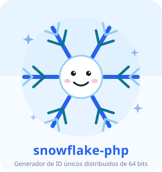
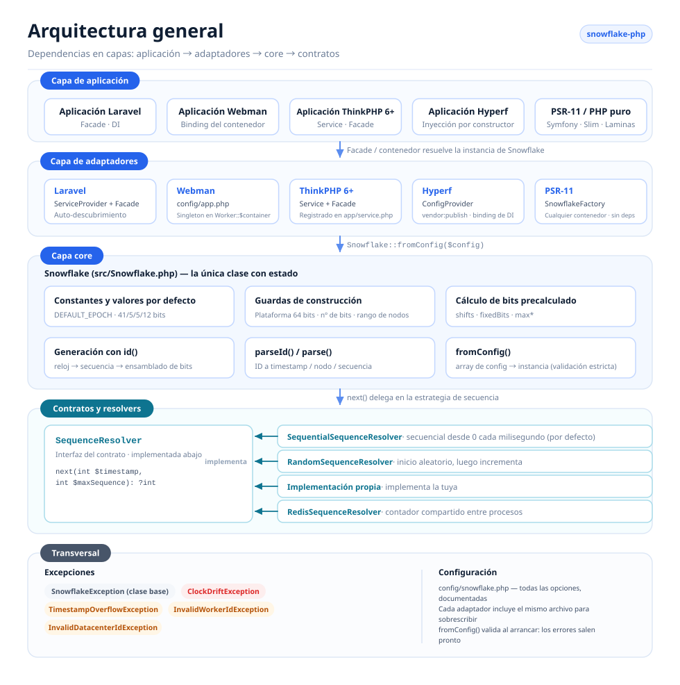
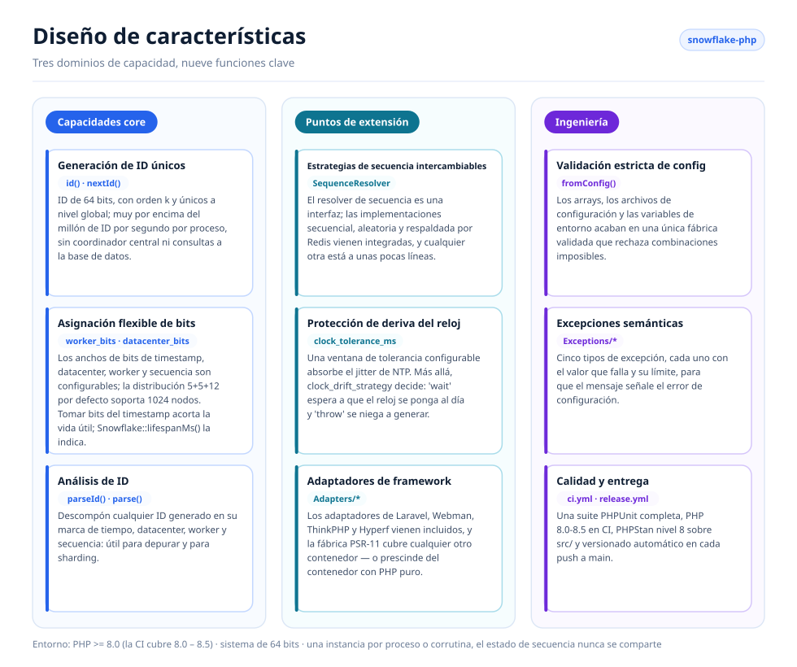
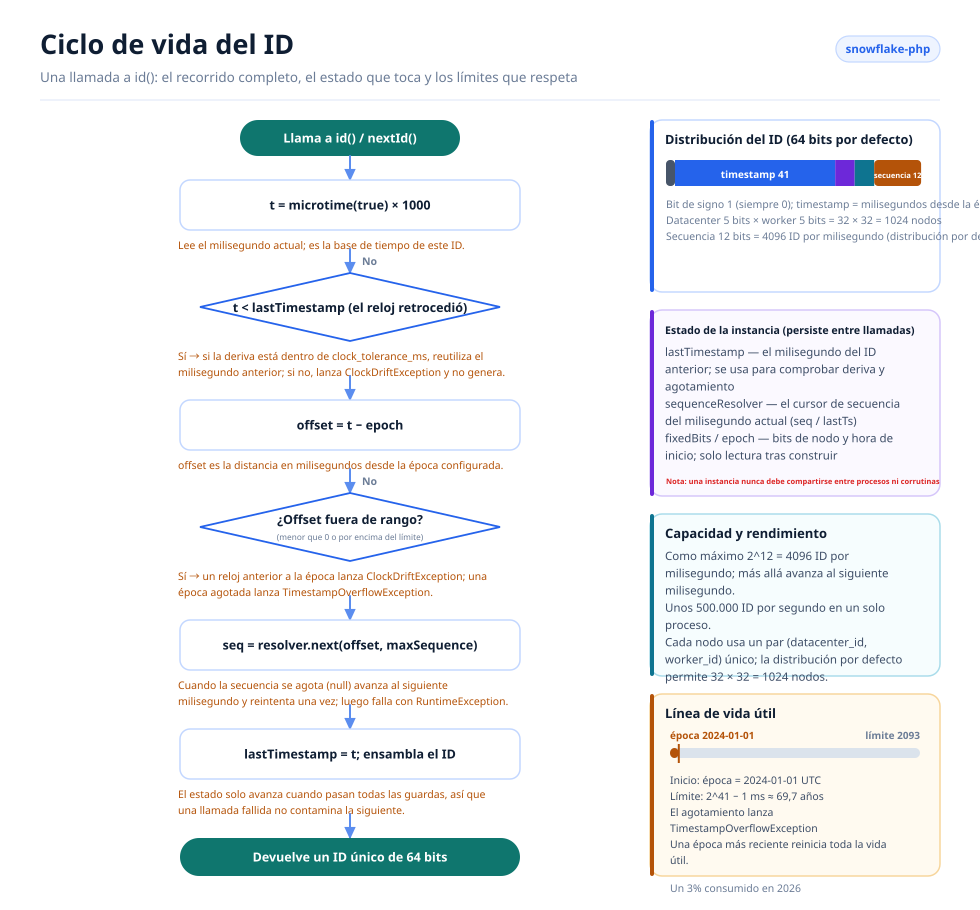

# Snowflake PHP

[English](../../../README.md) · [简体中文](../../../README.zh-CN.md) · [한국어](../ko/README.md) · [Русский](../ru/README.md) · [Deutsch](../de/README.md) · [Français](../fr/README.md) · [Español](../es/README.md) · [Português](../pt/README.md) · [हिन्दी](../hi/README.md) · [العربية](../ar/README.md) · [বাংলা](../bn/README.md) · [Bahasa Indonesia](../id/README.md) · [日本語](../ja/README.md)

<p align="center">
  
  <br />
  <sub>La mascota también viene con el código — <code>echo Snowflake::MASCOT;</code> la imprime en cualquier terminal.</sub>
</p>

Generador de ID únicos distribuidos basado en el algoritmo Snowflake de Twitter, compatible con Laravel, Webman, ThinkPHP y Hyperf.

## Acerca de

Snowflake PHP genera ID de 64 bits, únicos a nivel global y ordenados por k, sin necesidad de un coordinador central. Cada ID se compone de una marca de tiempo, un ID de datacenter, un ID de worker y un número de secuencia, lo que permite generar muy por encima de un millón de ID por segundo y por nodo sin consultas a la base de datos.

Características principales:

- **PHP puro, cero dependencias** — no requiere extensiones ni servicios externos
- **Resolvers de secuencia intercambiables** — estrategias secuencial, aleatoria y respaldada por Redis integradas, o implementa la tuya
- **Asignación flexible de bits** — ajusta los bits de timestamp/worker/datacenter/secuencia según tu escala
- **Tolerancia a la deriva del reloj** — ventana de tolerancia configurable para los ajustes de NTP
- **Independiente del framework** — adaptadores de primera clase para Laravel, ThinkPHP, Webman y Hyperf, o PHP puro sin contenedor alguno
- **Análisis de ID** — descompone los ID generados en sus componentes de timestamp, nodo y secuencia

## Estructura del proyecto

```text
snowflake-php/
├── src/
│   ├── Snowflake.php                       # Core: config, bit layout, id(), parseId()
│   ├── Contracts/
│   │   └── SequenceResolver.php            # Sequence strategy interface
│   ├── Resolvers/
│   │   ├── SequentialSequenceResolver.php  # Default: 0..max per millisecond
│   │   ├── RandomSequenceResolver.php      # Random start per millisecond
│   │   └── RedisSequenceResolver.php       # Shared counter for multi-process nodes
│   ├── Exceptions/
│   │   ├── SnowflakeException.php          # Base exception
│   │   ├── ClockDriftException.php
│   │   ├── TimestampOverflowException.php
│   │   ├── InvalidWorkerIdException.php
│   │   └── InvalidDatacenterIdException.php
│   └── Adapters/                           # Framework integrations
│       ├── Laravel/                        # ServiceProvider + Facade + config
│       ├── ThinkPHP/                       # Service + Facade + config
│       ├── Hyperf/                         # ConfigProvider + config
│       ├── Webman/                         # config/app.php
│       └── Psr11/SnowflakeFactory.php      # Any PSR-11 container, no interface dependency
├── config/snowflake.php                    # Reference configuration with comments
├── tests/
│   ├── bootstrap.php                       # Loads the autoloader, prints the mascot
│   └── *Test.php                           # PHPUnit test suite
├── docs/
│   ├── i18n/                               # Translated READMEs + localized diagrams
│   │   ├── README.md                       # Language index
│   │   ├── img/<lang>/                     # Generated SVGs (13 languages)
│   │   └── <lang>/README.md                # One translated README per language
│   ├── examples/plain-php.php              # Runnable no-framework example
│   └── *.png                               # Sponsor images
├── scripts/
│   ├── generate-diagrams.py                # Builds docs/i18n/img/<lang>/*.svg
│   ├── benchmark.php                       # Reproducible throughput benchmark
│   ├── phpstan/stubs/                      # Framework stubs for static analysis
│   └── i18n/labels.<lang>.json             # Diagram strings, one file per language
├── phpstan.neon.dist                       # Level 8 static analysis config
└── .github/workflows/                      # ci.yml (PHP 8.0–8.5), release.yml
```

## Arquitectura



Cuatro capas, con dependencias que apuntan en una sola dirección:

- **Capa de aplicación** — tu aplicación Laravel / Webman / ThinkPHP / Hyperf, cualquier contenedor PSR-11 o PHP puro; solo pide una instancia de `Snowflake`.
- **Capa de adaptadores** — un adaptador por framework, más una fábrica PSR-11 independiente del contenedor. Cada uno registra una única instancia compartida e incluye un archivo de configuración publicable.
- **Capa core** — `Snowflake` es la única clase con estado: valida la configuración, precalcula los desplazamientos de bits y los bits fijos del nodo, genera ID y los vuelve a analizar.
- **Contratos y resolvers** — `SequenceResolver` es el punto de extensión. El core le delega toda la asignación de secuencias, de modo que la estrategia de secuencia se puede cambiar sin tocar el generador.
- **Transversal** — una jerarquía de excepciones semánticas más un único archivo de configuración comentado que comparten todos los adaptadores.

## Diseño de características



Las características se agrupan en tres dominios: **core** (generación, asignación de bits, análisis), **extensión** (resolvers intercambiables, manejo de la deriva del reloj, adaptadores de framework) e **ingeniería** (validación estricta de la configuración, excepciones semánticas, pruebas y automatización de releases).

## Ciclo de vida de un ID



Cada llamada a `id()` recorre el mismo camino:

1. Lee el reloj y comprueba si hay deriva hacia atrás: se tolera hasta `clock_tolerance_ms`; más allá, `clock_drift_strategy` decide si esperar a que el reloj se ponga al día (`'wait'`) o negarse a generar (`'throw'`).
2. Convierte a un offset respecto a la época y rechaza los offsets negativos o que superen el límite de timestamp.
3. Pide al resolver de secuencia el siguiente slot de este milisegundo; cuando se usan los 4096 slots, avanza al siguiente milisegundo y reintenta una vez.
4. Ensambla `(offset << timestampShift) | fixedBits | sequence`, avanza `lastTimestamp` y devuelve el ID.

El estado de la instancia (`lastTimestamp` más el cursor del resolver) vive en memoria y nunca se comparte entre procesos ni corrutinas.

## Requisitos

- PHP >= 8.0 (8.0 – 8.5 verificado en CI, junto con PHPStan nivel 8 sobre `src/`)
- Sistema de 64 bits (necesario para las operaciones nativas con enteros de 64 bits)
- Una instancia por proceso/corrutina — una instancia de Snowflake mantiene su estado de secuencia en memoria y no debe compartirse entre procesos ni corrutinas

## Instalación

```bash
composer require erikwang2013/snowflake-php
```

## Inicio rápido

```php
use Erikwang2013\Snowflake\Snowflake;

$snowflake = new Snowflake();
$id = $snowflake->id();          // e.g. 508047278033704960
$id = $snowflake->nextId();      // alias for id()
```

Con ID de worker y datacenter personalizados:

```php
$snowflake = new Snowflake(workerId: 5, datacenterId: 3);
$id = $snowflake->id();
```

## Referencia de configuración

| Clave | Tipo | Valor por defecto | Descripción |
|-----|------|---------|-------------|
| `epoch` | int | `1704067200000` | Época personalizada en ms (por defecto: 2024-01-01 UTC) |
| `worker_id` | int | `0` | Identificador de worker/nodo |
| `datacenter_id` | int | `0` | Identificador de datacenter |
| `worker_bits` | int | `5` | Bits para el ID de worker |
| `datacenter_bits` | int | `5` | Bits para el ID de datacenter |
| `sequence_bits` | int | `12` | Bits para el número de secuencia |
| `sequence_resolver` | string | `SequentialSequenceResolver` | FQCN del SequenceResolver |
| `clock_tolerance_ms` | int | `0` | Deriva máxima del reloj hacia atrás (0 = estricto) |
| `clock_drift_strategy` | string | `'throw'` | `'throw'` se niega a generar cuando el reloj retrocede más allá de la tolerancia; `'wait'` espera hasta que el reloj de pared se ponga al día, se rinde tras `clock_drift_wait_ms` y entonces lanza `ClockDriftException` |
| `clock_drift_wait_ms` | int | `1000` | Cuánto espera la estrategia `'wait'` antes de rendirse |

### Distribución de bits

Distribución por defecto (63 bits de datos + 1 bit de signo = 64 bits en total):

```
| reserved(1) |  timestamp(41)   | datacenter(5) | worker(5) | sequence(12) |
```

Vida útil máxima con la época por defecto: ~69 años (hasta ~2093).

Cada bit que se cede al id de nodo o a la secuencia se toma de la marca de tiempo, así que una secuencia ancha acorta en silencio la vida del generador:

| bits de worker + datacenter + secuencia | bits de timestamp | vida útil |
|---|---|---|
| 5 + 5 + 12 (por defecto) | 41 | ~69,7 años |
| 7 + 7 + 10 | 39 | ~17,4 años |
| 5 + 5 + 16 | 37 | ~4,4 años |
| 5 + 5 + 20 | 33 | ~99 días |

Consulta el límite de cualquier distribución:

```php
Snowflake::lifespanMs();                                                     // default layout, ~69.7 years in ms
Snowflake::lifespanMs(workerBits: 7, datacenterBits: 7, sequenceBits: 10);   // ~17.4 years in ms
```

`Snowflake::lifespanMs(int $workerBits = 5, int $datacenterBits = 5, int $sequenceBits = 12): int` devuelve el offset máximo de timestamp en milisegundos de una distribución; los argumentos toman los valores de la distribución por defecto. Cuando el offset alcanza ese límite, la época se agota: una época obsoleta cuya ventana ya se cerró hace que la primera llamada a `id()` lance `TimestampOverflowException`.

### Uso de un array de configuración

```php
$snowflake = Snowflake::fromConfig([
    'worker_id' => 1,
    'datacenter_id' => 2,
    'epoch' => 1704067200000,
]);
$id = $snowflake->id();
```

## Integración con frameworks

### Laravel

El paquete es compatible con el auto-descubrimiento de Laravel. Después de la instalación:

1. Publica la configuración (opcional):
```bash
php artisan vendor:publish --tag=snowflake-config
```

2. Configura las variables de entorno en `.env`:
```env
SNOWFLAKE_WORKER_ID=1
SNOWFLAKE_DATACENTER_ID=1
```

3. Usa la Facade o la inyección de dependencias:
```php
// Facade
use Snowflake;
$id = Snowflake::id();

// Dependency injection
use Erikwang2013\Snowflake\Snowflake;

class OrderController
{
    public function store(Snowflake $snowflake)
    {
        $orderId = $snowflake->id();
    }
}

// Container access
$id = app('snowflake')->id();
$id = app(Snowflake::class)->id();
```

### Webman

1. Copia la configuración del plugin a tu proyecto:
```bash
cp vendor/erikwang2013/snowflake-php/src/Adapters/Webman/config/app.php \
   config/plugin/erikwang2013/snowflake-php/app.php
```

2. Registra un singleton en `process.php` o en el bootstrap:
```php
use Erikwang2013\Snowflake\Snowflake;

Worker::$container->add(Snowflake::class, function () {
    return Snowflake::fromConfig(
        config('plugin.erikwang2013.snowflake-php.app.snowflake')
    );
});
```

3. Uso:
```php
$id = Worker::$container->get(Snowflake::class)->id();
```

### ThinkPHP 6+

1. Copia el archivo de configuración a tu proyecto:
```bash
cp vendor/erikwang2013/snowflake-php/src/Adapters/ThinkPHP/config/snowflake.php \
   config/snowflake.php
```

2. Registra el servicio en `app/service.php`:
```php
return [
    \Erikwang2013\Snowflake\Adapters\ThinkPHP\Service::class,
];
```

3. Uso:
```php
// Container
$id = app('snowflake')->id();

// Dependency injection
use Erikwang2013\Snowflake\Snowflake;

class IndexController
{
    public function index(Snowflake $snowflake)
    {
        $id = $snowflake->id();
    }
}

// Facade
use Erikwang2013\Snowflake\Adapters\ThinkPHP\Facade;
$id = Facade::id();
```

### Hyperf

1. Publica la configuración:
```bash
php bin/hyperf.php vendor:publish erikwang2013/snowflake-php
```

2. Registra el binding de DI en `config/autoload/dependencies.php`:
```php
use Erikwang2013\Snowflake\Snowflake;

return [
    Snowflake::class => function () {
        return Snowflake::fromConfig(config('snowflake'));
    },
];
```

3. Uso mediante inyección por constructor:
```php
use Erikwang2013\Snowflake\Snowflake;

class OrderService
{
    public function __construct(private Snowflake $snowflake) {}

    public function create(): int
    {
        return $this->snowflake->id();
    }
}
```

### Contenedores PSR-11

Symfony, Slim, Laminas y cualquier otro contenedor: registra la fábrica. No depende de nada, así que sirve cualquier contenedor — no se requiere `psr/container`:

```php
use Erikwang2013\Snowflake\Adapters\Psr11\SnowflakeFactory;

$container->set(\Erikwang2013\Snowflake\Snowflake::class, new SnowflakeFactory($config));
// or build the config from the environment:
$container->set(\Erikwang2013\Snowflake\Snowflake::class, SnowflakeFactory::fromEnvironment());
```

`SnowflakeFactory::fromEnvironment()` lee las mismas variables `SNOWFLAKE_*` que usa el adaptador de Laravel. Un contenedor PSR-11 invoca el propio objeto fábrica, así que una definición de servicio de Symfony es una sola línea:

```yaml
services:
  Erikwang2013\Snowflake\Snowflake:
    factory: ['@Erikwang2013\Snowflake\Adapters\Psr11\SnowflakeFactory', '__invoke']
```

## PHP nativo (sin framework)

Nada de este paquete necesita un framework: los cuatro adaptadores de arriba solo te registran `Snowflake` en un contenedor. Sin ninguno, constrúyelo tú mismo:

```php
require __DIR__ . '/vendor/autoload.php';

use Erikwang2013\Snowflake\Snowflake;

// Same variable names the Laravel adapter uses, so one .env-style setup
// works whether or not a framework is present.
$snowflake = Snowflake::fromConfig([
    'worker_id'          => (int) (getenv('SNOWFLAKE_WORKER_ID') ?: 0),
    'datacenter_id'      => (int) (getenv('SNOWFLAKE_DATACENTER_ID') ?: 0),
    'clock_tolerance_ms' => 5,
]);

$id = $snowflake->id();
```

Una versión ejecutable de esto — con un singleton perezoso sin framework y las invariantes que comprueba — está en [`docs/examples/plain-php.php`](../../examples/plain-php.php):

```bash
php docs/examples/plain-php.php
```

### Elegir una vida útil

La instancia guarda `lastTimestamp` y el cursor de secuencia en memoria, así que cuánto vive es lo único que hay que acertar:

| Entorno | Crea la instancia |
|---------|--------------------|
| PHP-FPM, mod_php, CLI | En línea, por petición o comando — no se comparte nada entre ellos. |
| Swoole, ReactPHP, RoadRunner, FrankenPHP | Una vez por **proceso worker**, desde el callback de arranque del worker y con un par `(datacenter_id, worker_id)` único. |

Nunca compartas una instancia entre corrutinas o hilos: `id()` lee y escribe su propio estado, así que dos llamadas concurrentes pueden intercalarse y repartir el mismo número de secuencia. Crea una instancia por corrutina o protege la compartida con un mutex.

## Análisis de ID

Descompón un ID Snowflake en sus componentes:

```php
$id = $snowflake->id();

// Using the instance (respects custom bit layout)
$parsed = $snowflake->parseId($id);
// [
//     'timestamp_ms' => 1736380800123,
//     'datetime'     => '2025-01-09 00:00:00.123',
//     'worker_id'    => 5,
//     'datacenter_id' => 3,
//     'sequence'     => 42,
// ]

// Static method (uses default bit layout)
$parsed = Snowflake::parse($id, $epoch);
```

El miembro `datetime` se formatea con `date()` de PHP en la **zona horaria por defecto del servidor**, así que dos hosts en zonas horarias distintas representan el mismo ID de forma diferente. `timestamp_ms` es el valor absoluto independiente de la zona horaria: compara ese cuando concilies ID entre máquinas.

## Resolvers de secuencia

Tres implementaciones integradas:

### SequentialSequenceResolver (por defecto)

Comportamiento clásico de Snowflake. La secuencia empieza en 0 en cada milisegundo y se incrementa de forma secuencial. Garantiza ID monótonamente crecientes dentro de un mismo nodo.

```php
use Erikwang2013\Snowflake\Resolvers\SequentialSequenceResolver;

$snowflake = new Snowflake(
    sequenceResolver: new SequentialSequenceResolver()
);
```

### RandomSequenceResolver

Empieza cada milisegundo en un número de secuencia aleatorio y después incrementa. Es menos predecible que los ID secuenciales, pero mantiene monótonos los ID de un mismo milisegundo.

```php
use Erikwang2013\Snowflake\Resolvers\RandomSequenceResolver;

$snowflake = new Snowflake(
    sequenceResolver: new RandomSequenceResolver()
);
```

### Resolver personalizado

Implementa `Erikwang2013\Snowflake\Contracts\SequenceResolver`:

```php
use Erikwang2013\Snowflake\Contracts\SequenceResolver;

class SharedCounterSequenceResolver implements SequenceResolver
{
    public function next(int $timestamp, int $maxSequence): ?int
    {
        $key = "snowflake:seq:{$timestamp}";
        $seq = redis()->incr($key);
        redis()->expire($key, 1);

        if ($seq > $maxSequence) {
            return null;
        }

        return $seq - 1;
    }
}
```

### RedisSequenceResolver

Los resolvers en proceso guardan la secuencia en memoria, así que varios procesos que compartan un id de nodo pueden repartir el mismo número de secuencia. `RedisSequenceResolver` mantiene el contador en Redis: es el que hay que usar cuando varios procesos comparten un par `(datacenter_id, worker_id)`:

```php
use Erikwang2013\Snowflake\Resolvers\RedisSequenceResolver;

// Any client exposing incr(string $key): int and expire(string $key, int $seconds): bool
$resolver = new RedisSequenceResolver($redis, 'snowflake:seq:', 1);
$snowflake = new Snowflake(sequenceResolver: $resolver);
```

`__construct(object $client, string $keyPrefix = 'snowflake:seq:', int $ttlSeconds = 1)` — el cliente se inyecta, así que no se requiere ni la extensión `redis` ni Predis. Un TTL largo es seguro: el contador sigue creciendo dentro del mismo milisegundo, lo que devuelve `null` correctamente hasta que empieza el siguiente milisegundo.

## Manejo de excepciones

| Excepción | Cuándo |
|-----------|------|
| `InvalidWorkerIdException` | El ID de worker supera `2^worker_bits - 1` |
| `InvalidDatacenterIdException` | El ID de datacenter supera `2^datacenter_bits - 1` |
| `ClockDriftException` | El reloj del sistema retrocedió más allá de la tolerancia |
| `TimestampOverflowException` | La época se ha agotado (fin de la vida útil) |
| `SnowflakeException` | Excepción base para todas las excepciones del paquete |

## Despliegue distribuido

Cuando ejecutes en varios servidores o procesos, asegúrate de que cada instancia use un par `(datacenter_id, worker_id)` único:

```php
// Read from environment, hostname hash, or service discovery
$workerId = (int) getenv('WORKER_ID');
$datacenterId = (int) getenv('DC_ID');

$snowflake = new Snowflake(
    workerId: $workerId,
    datacenterId: $datacenterId
);
```

Con la distribución por defecto de 5+5 bits, puedes soportar hasta 32 datacenters × 32 workers = 1024 nodos únicos.

Para soportar más workers, ajusta la asignación de bits:

```php
// 10 worker bits = 1024 workers, 0 datacenter bits = single DC
$snowflake = new Snowflake(
    workerId: $workerId,
    workerBits: 10,
    datacenterBits: 0
);
```

## Rendimiento

Los ID se generan totalmente dentro del proceso, sin dependencias externas, así que el rendimiento está acotado por la propia llamada a `microtime()` de PHP más un puñado de operaciones con enteros.

Medido en un núcleo de una máquina de desarrollo (PHP 8.3.7, **Xdebug desactivado**, 300k iteraciones, mejor de 5):

| Operación | Rendimiento | Por llamada |
|-----------|-----------:|---------:|
| `microtime(true)` sola — el suelo | 10.3M/s | 97 ns |
| `id()` — distribución por defecto 5+5+12 | **1.6M/s** | 633 ns |
| `id()` + `parseId()` | 282k/s | 3.5 µs |
| `Snowflake::fromConfig()` | 167k/s | 6.0 µs |

Generar cuesta unas seis veces una llamada al reloj en crudo, y el techo de secuencia de un nodo (4096 ID/ms = 4.1M/s) sigue muy por encima de lo que puede consumir un proceso PHP. Analizar y construir son operaciones de diagnóstico, no rutas calientes: construye la instancia una vez por proceso y mantén `parseId()` fuera de los bucles ajustados.

Reprodúcelo en tu propia máquina:

```bash
php scripts/benchmark.php
```

Imprime ops/s y ns/op frente a una línea base de `microtime()` en crudo, mejor de N con su dispersión. Dos cosas deciden si los números absolutos significan algo: **Xdebug** (puede costar un orden de magnitud — la cabecera informa cuando está cargado) y un host ocupado o virtualizado, cuyo propio reloj puede dominar la medición. Compara con la línea base en vez de leer cualquier número suelto como una promesa.

## Se agradece tu apoyo

| WeChat Pay | Alipay |
|:---:|:---:|
|  |  |

> Si este proyecto te ayuda, siéntete libre de mostrar tu apoyo~

---

## Licencia

MIT — Copyright (c) 2026 erik <erik@erik.xyz> — https://erik.xyz
