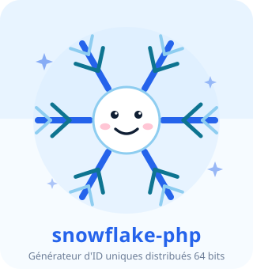
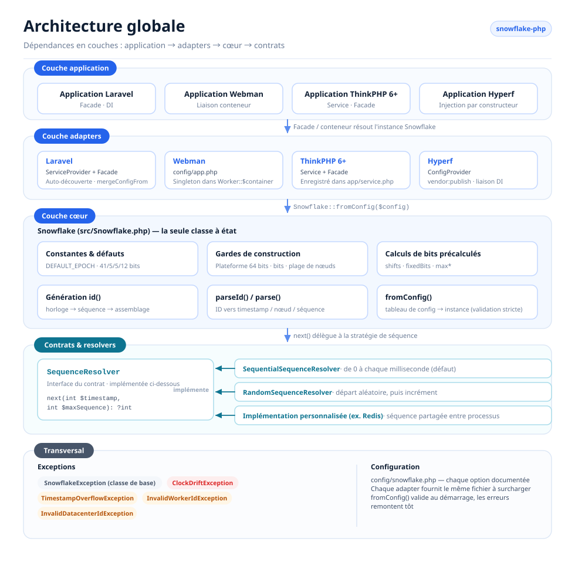
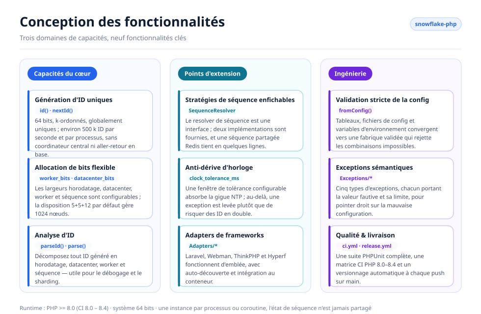
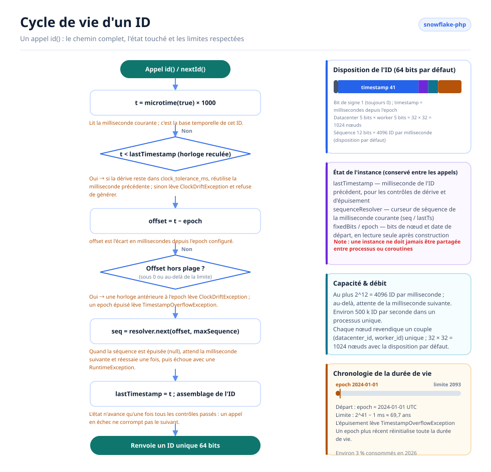

# Snowflake PHP

[English](../../../README.md) · [简体中文](../../../README.zh-CN.md) · [한국어](../ko/README.md) · [Русский](../ru/README.md) · [Deutsch](../de/README.md) · [Français](../fr/README.md) · [Español](../es/README.md) · [Português](../pt/README.md) · [हिन्दी](../hi/README.md) · [العربية](../ar/README.md) · [বাংলা](../bn/README.md) · [Bahasa Indonesia](../id/README.md) · [日本語](../ja/README.md)

<p align="center">
  
  <br />
  <sub>La mascotte est livrée avec le code — <code>echo Snowflake::MASCOT;</code> l'affiche dans n'importe quel terminal.</sub>
</p>

Un générateur d'identifiants uniques distribués basé sur l'algorithme Snowflake de Twitter, compatible avec Laravel, Webman, ThinkPHP et Hyperf.

## À propos

Snowflake PHP génère des identifiants 64 bits, k-ordonnés et globalement uniques, sans nécessiter de coordinateur central. Chaque identifiant se compose d'un horodatage, d'un identifiant de datacenter, d'un identifiant de worker et d'un numéro de séquence — de quoi produire des centaines de milliers d'identifiants par seconde et par nœud, sans le moindre aller-retour vers une base de données.

Fonctionnalités clés :

- **PHP pur, zéro dépendance** — aucune extension ni service externe requis
- **Resolvers de séquence enfichables** — stratégies séquentielle et aléatoire intégrées, ou la vôtre
- **Allocation de bits flexible** — ajustez les bits d'horodatage, de worker, de datacenter et de séquence selon votre échelle
- **Tolérance à la dérive d'horloge** — fenêtre de tolérance configurable pour les ajustements NTP
- **Indépendant du framework**, avec des adapters de premier ordre pour Laravel, ThinkPHP, Webman et Hyperf
- **Analyse d'identifiants** — décomposez un identifiant généré en horodatage, nœud et séquence

## Structure du projet

```text
snowflake-php/
├── src/
│   ├── Snowflake.php                       # Core: config, bit layout, id(), parseId()
│   ├── Contracts/
│   │   └── SequenceResolver.php            # Sequence strategy interface
│   ├── Resolvers/
│   │   ├── SequentialSequenceResolver.php  # Default: 0..max per millisecond
│   │   └── RandomSequenceResolver.php      # Random start per millisecond
│   ├── Exceptions/
│   │   ├── SnowflakeException.php          # Base exception
│   │   ├── ClockDriftException.php
│   │   ├── TimestampOverflowException.php
│   │   ├── InvalidWorkerIdException.php
│   │   └── InvalidDatacenterIdException.php
│   └── Adapters/                           # Framework integrations
│       ├── Laravel/                        # ServiceProvider + Facade + config
│       ├── ThinkPHP/                       # Service + Facade + config
│       ├── Hyperf/                         # ConfigProvider + config
│       └── Webman/                         # config/app.php
├── config/snowflake.php                    # Reference configuration with comments
├── tests/
│   ├── bootstrap.php                       # Loads the autoloader, prints the mascot
│   └── *Test.php                           # PHPUnit test suite
├── docs/                                   # Design diagrams and sponsor images
└── .github/workflows/                      # ci.yml (PHP 8.0–8.4), release.yml
```

## Architecture



Quatre couches, dont les dépendances ne pointent que dans une seule direction :

- **Couche application** — votre application Laravel / Webman / ThinkPHP / Hyperf ; elle ne demande jamais au conteneur qu'une instance `Snowflake`.
- **Couche adapters** — un adapter par framework. Chacun enregistre une instance unique et partagée dans le conteneur du framework et fournit un fichier de configuration publiable.
- **Couche cœur** — `Snowflake` est la seule classe à état : elle valide la configuration, précalcule les décalages de bits et les bits fixes du nœud, génère les identifiants et les reconstitue.
- **Contrats & resolvers** — `SequenceResolver` est le point d'extension. Le cœur lui délègue chaque allocation de séquence, ce qui permet de changer de stratégie sans toucher au générateur.
- **Transversal** — une hiérarchie d'exceptions sémantiques et un unique fichier de configuration commenté, partagé par tous les adapters.

## Conception des fonctionnalités



Les fonctionnalités se répartissent en trois domaines : **cœur** (génération, allocation de bits, analyse), **extension** (resolvers enfichables, gestion de la dérive d'horloge, adapters de frameworks) et **ingénierie** (validation stricte de la configuration, exceptions sémantiques, tests et automatisation des releases).

## Cycle de vie d'un identifiant



Chaque appel à `id()` suit le même chemin :

1. Lire l'horloge et détecter toute dérive vers l'arrière — tolérée jusqu'à `clock_tolerance_ms`, rejetée au-delà.
2. Convertir en décalage depuis l'epoch et rejeter les décalages négatifs ou dépassant la limite d'horodatage.
3. Demander au resolver de séquence le prochain emplacement de cette milliseconde ; lorsque les 4096 emplacements sont épuisés, attendre la milliseconde suivante et réessayer une fois.
4. Assembler `(offset << timestampShift) | fixedBits | sequence`, avancer `lastTimestamp` et renvoyer l'identifiant.

L'état de l'instance (`lastTimestamp` et le curseur du resolver) vit en mémoire et n'est jamais partagé entre processus ou coroutines.

## Prérequis

- PHP >= 8.0 (8.0 – 8.4 vérifiés en CI)
- Système 64 bits (requis pour les opérations natives sur entiers 64 bits)
- Une instance par processus/coroutine — une instance Snowflake conserve son état de séquence en mémoire et ne doit pas être partagée entre processus ou coroutines

## Installation

```bash
composer require erikwang2013/snowflake-php
```

## Démarrage rapide

```php
use Erikwang2013\Snowflake\Snowflake;

$snowflake = new Snowflake();
$id = $snowflake->id();          // e.g. 508047278033704960
$id = $snowflake->nextId();      // alias for id()
```

Avec des identifiants de worker et de datacenter personnalisés :

```php
$snowflake = new Snowflake(workerId: 5, datacenterId: 3);
$id = $snowflake->id();
```

## Référence de configuration

| Clé | Type | Défaut | Description |
|-----|------|---------|-------------|
| `epoch` | int | `1704067200000` | Epoch personnalisé en ms (défaut : 2024-01-01 UTC) |
| `worker_id` | int | `0` | Identifiant de worker/nœud |
| `datacenter_id` | int | `0` | Identifiant de datacenter |
| `worker_bits` | int | `5` | Bits pour l'identifiant de worker |
| `datacenter_bits` | int | `5` | Bits pour l'identifiant de datacenter |
| `sequence_bits` | int | `12` | Bits pour le numéro de séquence |
| `sequence_resolver` | string | `SequentialSequenceResolver` | FQCN de SequenceResolver |
| `clock_tolerance_ms` | int | `0` | Dérive d'horloge arrière maximale (0 = strict) |

### Disposition des bits

Disposition par défaut (63 bits de données + 1 bit de signe = 64 bits au total) :

```
| reserved(1) |  timestamp(41)   | datacenter(5) | worker(5) | sequence(12) |
```

Durée de vie maximale avec l'epoch par défaut : ~69 ans (jusqu'en ~2093).

### Utiliser un tableau de configuration

```php
$snowflake = Snowflake::fromConfig([
    'worker_id' => 1,
    'datacenter_id' => 2,
    'epoch' => 1704067200000,
]);
$id = $snowflake->id();
```

## Intégration aux frameworks

### Laravel

Le package prend en charge l'auto-découverte de Laravel. Après l'installation :

1. Publiez la configuration (facultatif) :
```bash
php artisan vendor:publish --tag=snowflake-config
```

2. Renseignez les variables d'environnement dans `.env` :
```env
SNOWFLAKE_WORKER_ID=1
SNOWFLAKE_DATACENTER_ID=1
```

3. Utilisez la Facade ou l'injection de dépendances :
```php
// Facade
use Snowflake;
$id = Snowflake::id();

// Dependency injection
use Erikwang2013\Snowflake\Snowflake;

class OrderController
{
    public function store(Snowflake $snowflake)
    {
        $orderId = $snowflake->id();
    }
}

// Container access
$id = app('snowflake')->id();
$id = app(Snowflake::class)->id();
```

### Webman

1. Copiez la configuration du plugin dans votre projet :
```bash
cp vendor/erikwang2013/snowflake-php/src/Adapters/Webman/config/app.php \
   config/plugin/erikwang2013/snowflake-php/app.php
```

2. Enregistrez un singleton dans `process.php` ou au bootstrap :
```php
use Erikwang2013\Snowflake\Snowflake;

Worker::$container->add(Snowflake::class, function () {
    return Snowflake::fromConfig(
        config('plugin.erikwang2013.snowflake-php.app.snowflake')
    );
});
```

3. Utilisation :
```php
$id = Worker::$container->get(Snowflake::class)->id();
```

### ThinkPHP 6+

1. Copiez le fichier de configuration dans votre projet :
```bash
cp vendor/erikwang2013/snowflake-php/src/Adapters/ThinkPHP/config/snowflake.php \
   config/snowflake.php
```

2. Enregistrez le service dans `app/service.php` :
```php
return [
    \Erikwang2013\Snowflake\Adapters\ThinkPHP\Service::class,
];
```

3. Utilisation :
```php
// Container
$id = app('snowflake')->id();

// Dependency injection
use Erikwang2013\Snowflake\Snowflake;

class IndexController
{
    public function index(Snowflake $snowflake)
    {
        $id = $snowflake->id();
    }
}

// Facade
use Erikwang2013\Snowflake\Adapters\ThinkPHP\Facade;
$id = Facade::id();
```

### Hyperf

1. Publiez la configuration :
```bash
php bin/hyperf.php vendor:publish erikwang2013/snowflake-php
```

2. Enregistrez la liaison DI dans `config/autoload/dependencies.php` :
```php
use Erikwang2013\Snowflake\Snowflake;

return [
    Snowflake::class => function () {
        return Snowflake::fromConfig(config('snowflake'));
    },
];
```

3. Utilisation par injection dans le constructeur :
```php
use Erikwang2013\Snowflake\Snowflake;

class OrderService
{
    public function __construct(private Snowflake $snowflake) {}

    public function create(): int
    {
        return $this->snowflake->id();
    }
}
```

## Analyse d'identifiants

Décomposez un identifiant Snowflake en ses composants :

```php
$id = $snowflake->id();

// Using the instance (respects custom bit layout)
$parsed = $snowflake->parseId($id);
// [
//     'timestamp_ms' => 1736380800123,
//     'datetime'     => '2025-01-09 00:00:00.123',
//     'worker_id'    => 5,
//     'datacenter_id' => 3,
//     'sequence'     => 42,
// ]

// Static method (uses default bit layout)
$parsed = Snowflake::parse($id, $epoch);
```

## Resolvers de séquence

Deux implémentations intégrées :

### SequentialSequenceResolver (défaut)

Comportement Snowflake classique. La séquence repart de 0 à chaque milliseconde et s'incrémente de façon séquentielle. Garantit des identifiants strictement croissants au sein d'un même nœud.

```php
use Erikwang2013\Snowflake\Resolvers\SequentialSequenceResolver;

$snowflake = new Snowflake(
    sequenceResolver: new SequentialSequenceResolver()
);
```

### RandomSequenceResolver

Démarre chaque milliseconde sur un numéro de séquence aléatoire, puis s'incrémente. Moins prévisible que des identifiants séquentiels, tout en gardant les identifiants d'une même milliseconde croissants.

```php
use Erikwang2013\Snowflake\Resolvers\RandomSequenceResolver;

$snowflake = new Snowflake(
    sequenceResolver: new RandomSequenceResolver()
);
```

### Resolver personnalisé

Implémentez `Erikwang2013\Snowflake\Contracts\SequenceResolver` :

```php
use Erikwang2013\Snowflake\Contracts\SequenceResolver;

class RedisSequenceResolver implements SequenceResolver
{
    public function next(int $timestamp, int $maxSequence): ?int
    {
        $key = "snowflake:seq:{$timestamp}";
        $seq = redis()->incr($key);
        redis()->expire($key, 1);

        if ($seq > $maxSequence) {
            return null;
        }

        return $seq - 1;
    }
}
```

## Gestion des exceptions

| Exception | Cas |
|-----------|------|
| `InvalidWorkerIdException` | L'identifiant de worker dépasse `2^worker_bits - 1` |
| `InvalidDatacenterIdException` | L'identifiant de datacenter dépasse `2^datacenter_bits - 1` |
| `ClockDriftException` | L'horloge système est revenue en arrière au-delà de la tolérance |
| `TimestampOverflowException` | L'epoch est épuisé (durée de vie terminée) |
| `SnowflakeException` | Exception de base pour toutes les exceptions du package |

## Déploiement distribué

Lorsque l'application tourne sur plusieurs serveurs ou processus, veillez à ce que chaque instance utilise un couple `(datacenter_id, worker_id)` unique :

```php
// Read from environment, hostname hash, or service discovery
$workerId = (int) getenv('WORKER_ID');
$datacenterId = (int) getenv('DC_ID');

$snowflake = new Snowflake(
    workerId: $workerId,
    datacenterId: $datacenterId
);
```

Avec la disposition par défaut de 5+5 bits, vous pouvez adresser jusqu'à 32 datacenters × 32 workers = 1024 nœuds uniques.

Pour prendre en charge davantage de workers, ajustez l'allocation des bits :

```php
// 10 worker bits = 1024 workers, 0 datacenter bits = single DC
$snowflake = new Snowflake(
    workerId: $workerId,
    workerBits: 10,
    datacenterBits: 0
);
```

## Performances

Débit typique sur du matériel moderne : **~500 000 identifiants/seconde** (processus unique).

Les identifiants sont générés entièrement en mémoire, sans dépendance externe. Le principal goulot d'étranglement est l'appel `microtime()` de PHP et les opérations binaires sur entiers, toutes deux en O(1).

## Votre soutien est bienvenu

| WeChat Pay | Alipay |
|:---:|:---:|
|  |  |

> Si ce projet vous aide, n'hésitez pas à montrer votre soutien~

---

## Licence

MIT — Copyright (c) 2026 erik <erik@erik.xyz> — https://erik.xyz
