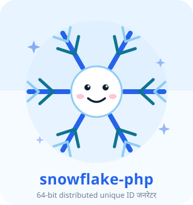
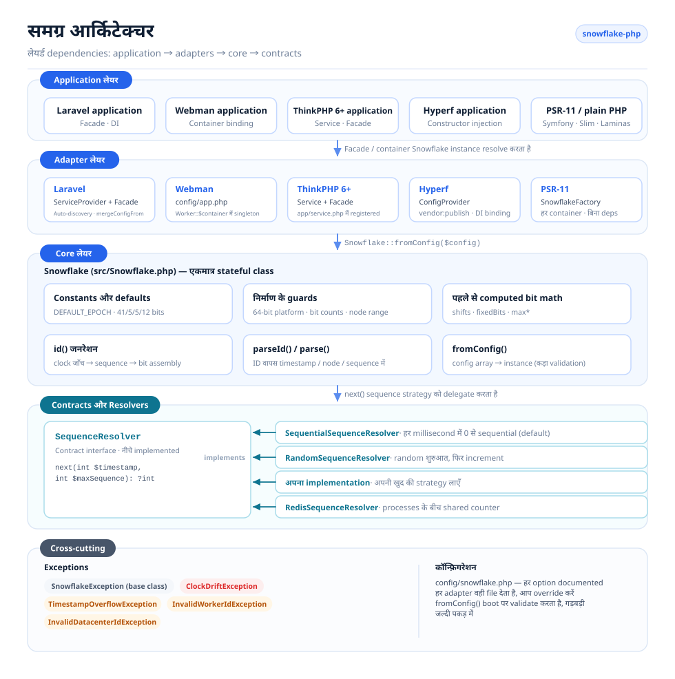
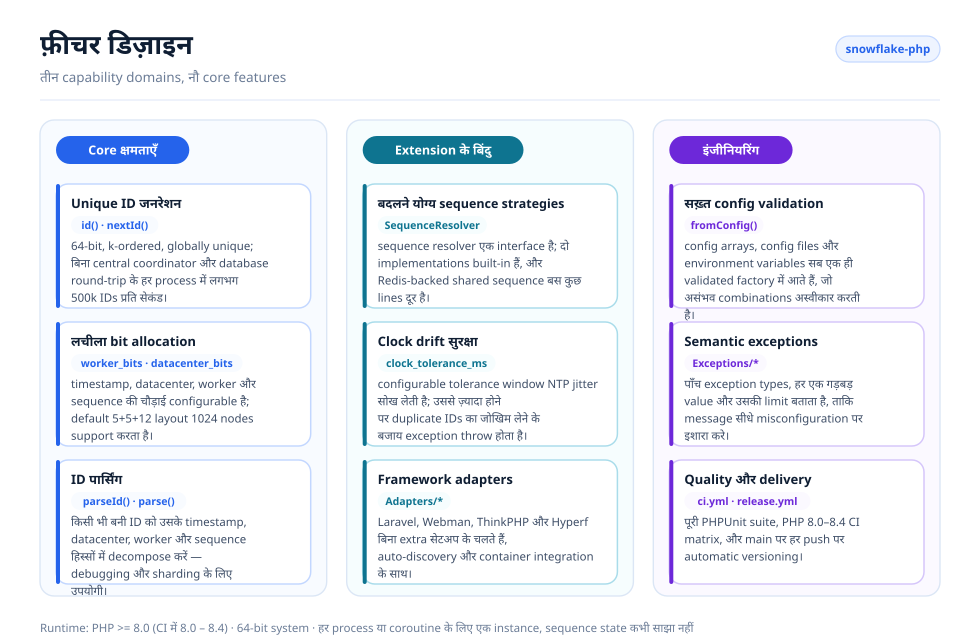
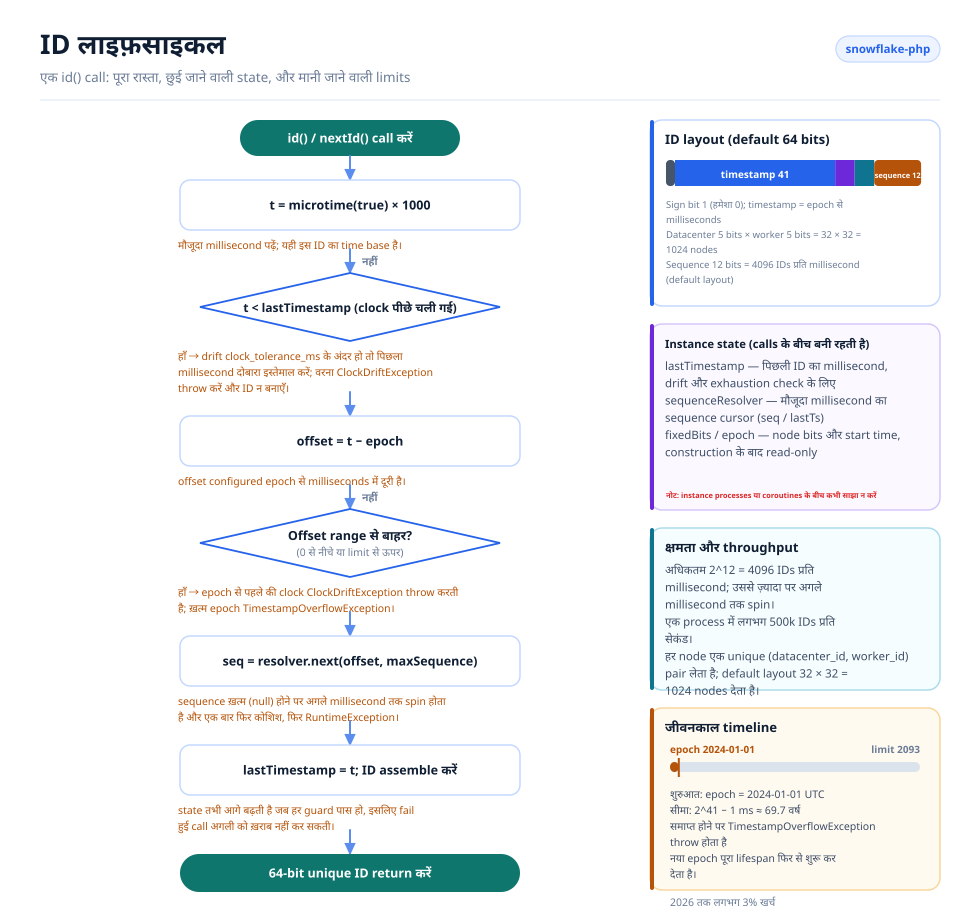

# Snowflake PHP

[English](../../../README.md) · [简体中文](../../../README.zh-CN.md) · [한국어](../ko/README.md) · [Русский](../ru/README.md) · [Deutsch](../de/README.md) · [Français](../fr/README.md) · [Español](../es/README.md) · [Português](../pt/README.md) · [हिन्दी](../hi/README.md) · [العربية](../ar/README.md) · [বাংলা](../bn/README.md) · [Bahasa Indonesia](../id/README.md) · [日本語](../ja/README.md)

<p align="center">
  
  <br />
  <sub>The mascot ships with the code too — <code>echo Snowflake::MASCOT;</code> prints it in any terminal.</sub>
</p>

Twitter के Snowflake algorithm पर आधारित एक distributed unique ID generator, जो Laravel, Webman, ThinkPHP और Hyperf के साथ compatible है।

## परिचय

Snowflake PHP बिना किसी central coordinator के 64-bit, k-ordered और globally unique IDs generate करता है। हर ID एक timestamp, datacenter ID, worker ID और sequence number से बनती है — जिससे हर node पर बिना किसी database round-trip के प्रति सेकंड लाखों IDs बनाई जा सकती हैं।

मुख्य विशेषताएँ:

- **Pure PHP, zero dependencies** — किसी extension या external service की ज़रूरत नहीं
- **Pluggable sequence resolvers** — built-in sequential और random strategies, या अपनी खुद की लाएँ
- **Flexible bit allocation** — अपने scale के हिसाब से timestamp/worker/datacenter/sequence bits समायोजित करें
- **Clock drift tolerance** — NTP adjustments के लिए configurable tolerance window
- **Framework agnostic** — Laravel, ThinkPHP, Webman और Hyperf के लिए first-class adapters
- **ID parsing** — बनी हुई ID को timestamp, node और sequence components में वापस decompose करें

## प्रोजेक्ट संरचना

```text
snowflake-php/
├── src/
│   ├── Snowflake.php                       # Core: config, bit layout, id(), parseId()
│   ├── Contracts/
│   │   └── SequenceResolver.php            # Sequence strategy interface
│   ├── Resolvers/
│   │   ├── SequentialSequenceResolver.php  # Default: 0..max per millisecond
│   │   └── RandomSequenceResolver.php      # Random start per millisecond
│   ├── Exceptions/
│   │   ├── SnowflakeException.php          # Base exception
│   │   ├── ClockDriftException.php
│   │   ├── TimestampOverflowException.php
│   │   ├── InvalidWorkerIdException.php
│   │   └── InvalidDatacenterIdException.php
│   └── Adapters/                           # Framework integrations
│       ├── Laravel/                        # ServiceProvider + Facade + config
│       ├── ThinkPHP/                       # Service + Facade + config
│       ├── Hyperf/                         # ConfigProvider + config
│       └── Webman/                         # config/app.php
├── config/snowflake.php                    # Reference configuration with comments
├── tests/
│   ├── bootstrap.php                       # Loads the autoloader, prints the mascot
│   └── *Test.php                           # PHPUnit test suite
├── docs/                                   # Design diagrams and sponsor images
└── .github/workflows/                      # ci.yml (PHP 8.0–8.4), release.yml
```

## आर्किटेक्चर



चार layers, जिनमें dependencies सिर्फ़ एक ही दिशा में जाती हैं:

- **Application layer** — आपका Laravel / Webman / ThinkPHP / Hyperf application; यह container से सिर्फ़ एक `Snowflake` instance माँगता है।
- **Adapter layer** — हर framework के लिए एक adapter। हर adapter framework container में एक ही shared instance register करता है और एक publish करने योग्य config file देता है।
- **Core layer** — `Snowflake` ही एकमात्र stateful class है: यह configuration validate करता है, bit shifts और fixed node bits पहले से compute करता है, IDs generate करता है और उन्हें वापस parse करता है।
- **Contracts & resolvers** — `SequenceResolver` ही extension point है। Core हर sequence allocation इसी को सौंपता है, इसलिए generator को छुए बिना sequence strategy बदली जा सकती है।
- **Cross-cutting** — एक semantic exception hierarchy और हर adapter द्वारा साझा की जाने वाली एक ही commented configuration file।

## फ़ीचर डिज़ाइन



Features तीन domains में बँटे हैं: **core** (generation, bit allocation, parsing), **extension** (pluggable resolvers, clock-drift handling, framework adapters) और **engineering** (सख़्त config validation, semantic exceptions, tests तथा release automation)।

## ID लाइफ़साइकल



हर `id()` call एक ही रास्ते से गुज़रता है:

1. clock पढ़ें और backward drift जाँचें — `clock_tolerance_ms` तक सहन किया जाता है, उससे ज़्यादा पर अस्वीकार।
2. epoch offset में बदलें और negative या timestamp limit से आगे के offsets अस्वीकार करें।
3. sequence resolver से इस millisecond का अगला slot माँगें; सभी 4096 slots इस्तेमाल हो जाने पर अगले millisecond तक spin करें और एक बार फिर कोशिश करें।
4. `(offset << timestampShift) | fixedBits | sequence` जोड़कर ID बनाएँ, `lastTimestamp` आगे बढ़ाएँ और ID return करें।

Instance state (`lastTimestamp` और resolver cursor) memory में रहती है और processes या coroutines के बीच कभी साझा नहीं की जाती।

## आवश्यकताएँ

- PHP >= 8.0 (CI में 8.0 – 8.4 verified)
- 64-bit system (native 64-bit integer operations के लिए ज़रूरी)
- हर process/coroutine के लिए एक instance — Snowflake instance अपनी sequence state memory में रखता है, इसलिए इसे processes या coroutines के बीच साझा नहीं करना चाहिए

## इंस्टॉलेशन

```bash
composer require erikwang2013/snowflake-php
```

## क्विक स्टार्ट

```php
use Erikwang2013\Snowflake\Snowflake;

$snowflake = new Snowflake();
$id = $snowflake->id();          // e.g. 508047278033704960
$id = $snowflake->nextId();      // alias for id()
```

custom worker और datacenter IDs के साथ:

```php
$snowflake = new Snowflake(workerId: 5, datacenterId: 3);
$id = $snowflake->id();
```

## कॉन्फ़िगरेशन संदर्भ

| Key | Type | Default | Description |
|-----|------|---------|-------------|
| `epoch` | int | `1704067200000` | ms में custom epoch (default: 2024-01-01 UTC) |
| `worker_id` | int | `0` | Worker/node का identifier |
| `datacenter_id` | int | `0` | Datacenter का identifier |
| `worker_bits` | int | `5` | worker ID के लिए bits |
| `datacenter_bits` | int | `5` | datacenter ID के लिए bits |
| `sequence_bits` | int | `12` | sequence number के लिए bits |
| `sequence_resolver` | string | `SequentialSequenceResolver` | SequenceResolver का FQCN |
| `clock_tolerance_ms` | int | `0` | अधिकतम backward clock drift (0 = strict) |

### Bit लेआउट

Default layout (63 data bits + 1 sign bit = कुल 64 bits):

```
| reserved(1) |  timestamp(41)   | datacenter(5) | worker(5) | sequence(12) |
```

Default epoch के साथ अधिकतम lifespan: ~69 वर्ष (लगभग 2093 तक)।

### Configuration Array का उपयोग

```php
$snowflake = Snowflake::fromConfig([
    'worker_id' => 1,
    'datacenter_id' => 2,
    'epoch' => 1704067200000,
]);
$id = $snowflake->id();
```

## Framework Integration

### Laravel

Package Laravel auto-discovery support करता है। इंस्टॉलेशन के बाद:

1. config publish करें (optional):
```bash
php artisan vendor:publish --tag=snowflake-config
```

2. `.env` में environment variables set करें:
```env
SNOWFLAKE_WORKER_ID=1
SNOWFLAKE_DATACENTER_ID=1
```

3. Facade या dependency injection इस्तेमाल करें:
```php
// Facade
use Snowflake;
$id = Snowflake::id();

// Dependency injection
use Erikwang2013\Snowflake\Snowflake;

class OrderController
{
    public function store(Snowflake $snowflake)
    {
        $orderId = $snowflake->id();
    }
}

// Container access
$id = app('snowflake')->id();
$id = app(Snowflake::class)->id();
```

### Webman

1. plugin config अपने project में copy करें:
```bash
cp vendor/erikwang2013/snowflake-php/src/Adapters/Webman/config/app.php \
   config/plugin/erikwang2013/snowflake-php/app.php
```

2. `process.php` या bootstrap में singleton register करें:
```php
use Erikwang2013\Snowflake\Snowflake;

Worker::$container->add(Snowflake::class, function () {
    return Snowflake::fromConfig(
        config('plugin.erikwang2013.snowflake-php.app.snowflake')
    );
});
```

3. इस्तेमाल:
```php
$id = Worker::$container->get(Snowflake::class)->id();
```

### ThinkPHP 6+

1. config file अपने project में copy करें:
```bash
cp vendor/erikwang2013/snowflake-php/src/Adapters/ThinkPHP/config/snowflake.php \
   config/snowflake.php
```

2. `app/service.php` में service register करें:
```php
return [
    \Erikwang2013\Snowflake\Adapters\ThinkPHP\Service::class,
];
```

3. इस्तेमाल:
```php
// Container
$id = app('snowflake')->id();

// Dependency injection
use Erikwang2013\Snowflake\Snowflake;

class IndexController
{
    public function index(Snowflake $snowflake)
    {
        $id = $snowflake->id();
    }
}

// Facade
use Erikwang2013\Snowflake\Adapters\ThinkPHP\Facade;
$id = Facade::id();
```

### Hyperf

1. config publish करें:
```bash
php bin/hyperf.php vendor:publish erikwang2013/snowflake-php
```

2. `config/autoload/dependencies.php` में DI binding register करें:
```php
use Erikwang2013\Snowflake\Snowflake;

return [
    Snowflake::class => function () {
        return Snowflake::fromConfig(config('snowflake'));
    },
];
```

3. constructor injection से इस्तेमाल:
```php
use Erikwang2013\Snowflake\Snowflake;

class OrderService
{
    public function __construct(private Snowflake $snowflake) {}

    public function create(): int
    {
        return $this->snowflake->id();
    }
}
```

## ID Parsing

Snowflake ID को उसके components में decompose करें:

```php
$id = $snowflake->id();

// Using the instance (respects custom bit layout)
$parsed = $snowflake->parseId($id);
// [
//     'timestamp_ms' => 1736380800123,
//     'datetime'     => '2025-01-09 00:00:00.123',
//     'worker_id'    => 5,
//     'datacenter_id' => 3,
//     'sequence'     => 42,
// ]

// Static method (uses default bit layout)
$parsed = Snowflake::parse($id, $epoch);
```

## Sequence Resolvers

दो built-in implementations:

### SequentialSequenceResolver (default)

Classic Snowflake व्यवहार। हर millisecond में sequence 0 से शुरू होता है और क्रम से बढ़ता है। एक ही node के अंदर IDs के monotonically बढ़ने की गारंटी देता है।

```php
use Erikwang2013\Snowflake\Resolvers\SequentialSequenceResolver;

$snowflake = new Snowflake(
    sequenceResolver: new SequentialSequenceResolver()
);
```

### RandomSequenceResolver

हर millisecond को एक random sequence number से शुरू करता है, फिर बढ़ाता है। sequential IDs से कम predictable, लेकिन एक millisecond की IDs monotonic बनी रहती हैं।

```php
use Erikwang2013\Snowflake\Resolvers\RandomSequenceResolver;

$snowflake = new Snowflake(
    sequenceResolver: new RandomSequenceResolver()
);
```

### Custom Resolver

`Erikwang2013\Snowflake\Contracts\SequenceResolver` implement करें:

```php
use Erikwang2013\Snowflake\Contracts\SequenceResolver;

class RedisSequenceResolver implements SequenceResolver
{
    public function next(int $timestamp, int $maxSequence): ?int
    {
        $key = "snowflake:seq:{$timestamp}";
        $seq = redis()->incr($key);
        redis()->expire($key, 1);

        if ($seq > $maxSequence) {
            return null;
        }

        return $seq - 1;
    }
}
```

## Exception Handling

| Exception | When |
|-----------|------|
| `InvalidWorkerIdException` | Worker ID `2^worker_bits - 1` से ज़्यादा हो जाए |
| `InvalidDatacenterIdException` | Datacenter ID `2^datacenter_bits - 1` से ज़्यादा हो जाए |
| `ClockDriftException` | System clock tolerance से ज़्यादा पीछे चला जाए |
| `TimestampOverflowException` | Epoch ख़त्म हो जाए (lifespan समाप्त) |
| `SnowflakeException` | package के सभी exceptions की base exception |

## Distributed Deployment

कई servers या processes पर चलाते समय ध्यान रखें कि हर instance एक अलग `(datacenter_id, worker_id)` pair इस्तेमाल करे:

```php
// Read from environment, hostname hash, or service discovery
$workerId = (int) getenv('WORKER_ID');
$datacenterId = (int) getenv('DC_ID');

$snowflake = new Snowflake(
    workerId: $workerId,
    datacenterId: $datacenterId
);
```

default 5+5 bit layout के साथ आप अधिकतम 32 datacenters × 32 workers = 1024 unique nodes support कर सकते हैं।

ज़्यादा workers support करने के लिए bit allocation बदलें:

```php
// 10 worker bits = 1024 workers, 0 datacenter bits = single DC
$snowflake = new Snowflake(
    workerId: $workerId,
    workerBits: 10,
    datacenterBits: 0
);
```

## Performance

आधुनिक hardware पर सामान्य throughput: **~500,000 IDs/second** (single process)।

IDs पूरी तरह in-process बनती हैं, कोई external dependency नहीं। मुख्य bottleneck PHP का `microtime()` call और integer bit operations हैं, और दोनों O(1) हैं।

## Support Welcome

| WeChat Pay | Alipay |
|:---:|:---:|
|  |  |

> अगर यह प्रोजेक्ट आपके काम आता है, तो support दिखाने में संकोच न करें~

---

## License

MIT — Copyright (c) 2026 erik <erik@erik.xyz> — https://erik.xyz
