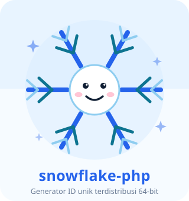
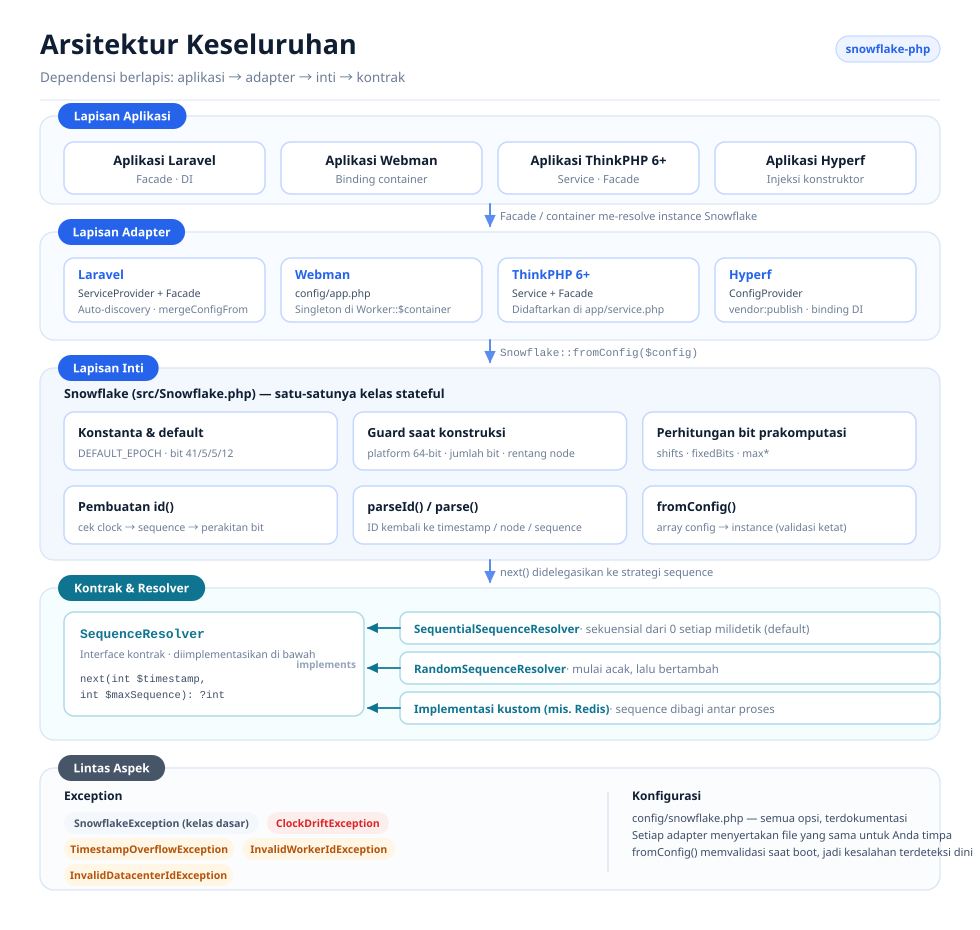
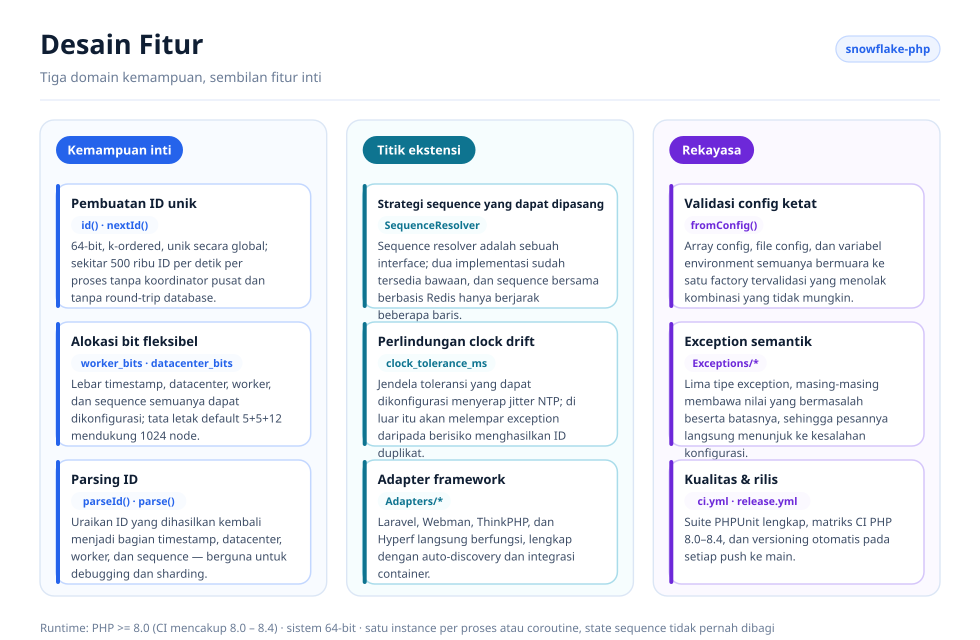
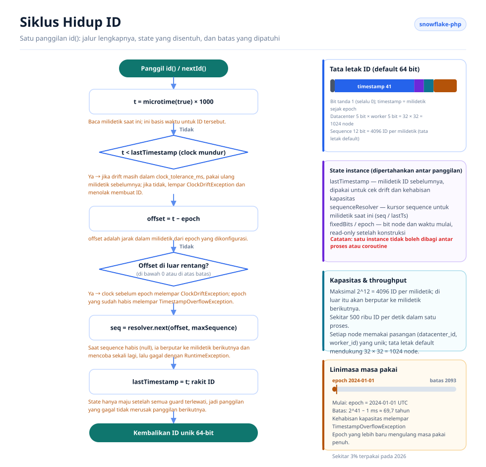

# Snowflake PHP

[English](../../../README.md) · [简体中文](../../../README.zh-CN.md) · [한국어](../ko/README.md) · [Русский](../ru/README.md) · [Deutsch](../de/README.md) · [Français](../fr/README.md) · [Español](../es/README.md) · [Português](../pt/README.md) · [हिन्दी](../hi/README.md) · [العربية](../ar/README.md) · [বাংলা](../bn/README.md) · [Bahasa Indonesia](../id/README.md) · [日本語](../ja/README.md)

<p align="center">
  
  <br />
  <sub>Maskotnya ikut dikirim bersama kodenya — <code>echo Snowflake::MASCOT;</code> akan mencetaknya di terminal mana pun.</sub>
</p>

Generator ID unik terdistribusi berdasarkan algoritma Snowflake milik Twitter, kompatibel dengan Laravel, Webman, ThinkPHP, dan Hyperf.

## Tentang

Snowflake PHP menghasilkan ID 64-bit yang k-ordered dan unik secara global tanpa memerlukan koordinator pusat. Setiap ID tersusun dari timestamp, ID datacenter, ID worker, dan nomor sequence — memungkinkan ratusan ribu ID per detik per node tanpa round-trip ke database.

Fitur utama:

- **PHP murni, tanpa dependensi** — tidak memerlukan ekstensi atau layanan eksternal
- **Sequence resolver yang dapat dipasang** — strategi sekuensial dan acak sudah tersedia bawaan, atau pakai milik Anda sendiri
- **Alokasi bit fleksibel** — sesuaikan bit timestamp/worker/datacenter/sequence dengan skala Anda
- **Toleransi clock drift** — jendela toleransi yang dapat dikonfigurasi untuk penyesuaian NTP
- **Agnostik framework** dengan adapter kelas satu untuk Laravel, ThinkPHP, Webman, dan Hyperf
- **Parsing ID** — uraikan ID yang dihasilkan kembali menjadi komponen timestamp, node, dan sequence

## Struktur Proyek

```text
snowflake-php/
├── src/
│   ├── Snowflake.php                       # Core: config, bit layout, id(), parseId()
│   ├── Contracts/
│   │   └── SequenceResolver.php            # Sequence strategy interface
│   ├── Resolvers/
│   │   ├── SequentialSequenceResolver.php  # Default: 0..max per millisecond
│   │   └── RandomSequenceResolver.php      # Random start per millisecond
│   ├── Exceptions/
│   │   ├── SnowflakeException.php          # Base exception
│   │   ├── ClockDriftException.php
│   │   ├── TimestampOverflowException.php
│   │   ├── InvalidWorkerIdException.php
│   │   └── InvalidDatacenterIdException.php
│   └── Adapters/                           # Framework integrations
│       ├── Laravel/                        # ServiceProvider + Facade + config
│       ├── ThinkPHP/                       # Service + Facade + config
│       ├── Hyperf/                         # ConfigProvider + config
│       └── Webman/                         # config/app.php
├── config/snowflake.php                    # Reference configuration with comments
├── tests/
│   ├── bootstrap.php                       # Loads the autoloader, prints the mascot
│   └── *Test.php                           # PHPUnit test suite
├── docs/                                   # Design diagrams and sponsor images
└── .github/workflows/                      # ci.yml (PHP 8.0–8.4), release.yml
```

## Arsitektur



Empat lapisan, dengan dependensi yang hanya mengarah ke satu arah:

- **Lapisan aplikasi** — aplikasi Laravel / Webman / ThinkPHP / Hyperf Anda; lapisan ini hanya meminta instance `Snowflake` ke container.
- **Lapisan adapter** — satu adapter untuk setiap framework. Masing-masing mendaftarkan satu instance bersama ke container framework dan menyertakan file config yang dapat dipublikasikan.
- **Lapisan inti** — `Snowflake` adalah satu-satunya kelas stateful: ia memvalidasi konfigurasi, menghitung bit shift dan bit node tetap di awal, membuat ID, lalu mengurainya kembali.
- **Kontrak & resolver** — `SequenceResolver` adalah titik ekstensinya. Inti mendelegasikan setiap alokasi sequence kepadanya, sehingga strategi sequence bisa ditukar tanpa menyentuh generator.
- **Lintas aspek** — hierarki exception yang semantik plus satu file konfigurasi berkomentar yang dipakai bersama oleh semua adapter.

## Desain Fitur



Fitur terbagi ke dalam tiga domain: **inti** (pembuatan ID, alokasi bit, parsing), **ekstensi** (resolver yang dapat dipasang, penanganan clock drift, adapter framework), dan **rekayasa** (validasi config yang ketat, exception semantik, pengujian dan otomasi rilis).

## Siklus Hidup ID



Setiap panggilan `id()` menempuh jalur yang sama:

1. Baca clock dan cek drift ke belakang — ditoleransi sampai `clock_tolerance_ms`, ditolak di luar itu.
2. Konversi ke offset epoch dan tolak offset yang negatif atau melewati batas timestamp.
3. Minta slot berikutnya di milidetik ini ke sequence resolver; saat seluruh 4096 slot terpakai, berputar ke milidetik berikutnya dan coba sekali lagi.
4. Rakit `(offset << timestampShift) | fixedBits | sequence`, majukan `lastTimestamp`, lalu kembalikan ID-nya.

State instance (`lastTimestamp` plus kursor resolver) hidup di memori dan tidak pernah dibagi antar proses maupun coroutine.

## Persyaratan

- PHP >= 8.0 (8.0 – 8.4 terverifikasi di CI)
- Sistem 64-bit (wajib untuk operasi integer 64-bit native)
- Satu instance per proses/coroutine — instance Snowflake menyimpan state sequence-nya di memori dan tidak boleh dibagi antar proses atau coroutine

## Instalasi

```bash
composer require erikwang2013/snowflake-php
```

## Mulai Cepat

```php
use Erikwang2013\Snowflake\Snowflake;

$snowflake = new Snowflake();
$id = $snowflake->id();          // e.g. 508047278033704960
$id = $snowflake->nextId();      // alias for id()
```

Dengan worker dan datacenter ID kustom:

```php
$snowflake = new Snowflake(workerId: 5, datacenterId: 3);
$id = $snowflake->id();
```

## Referensi Konfigurasi

| Key | Tipe | Default | Deskripsi |
|-----|------|---------|-------------|
| `epoch` | int | `1704067200000` | Epoch kustom dalam ms (default: 2024-01-01 UTC) |
| `worker_id` | int | `0` | Identitas worker/node |
| `datacenter_id` | int | `0` | Identitas datacenter |
| `worker_bits` | int | `5` | Jumlah bit untuk worker ID |
| `datacenter_bits` | int | `5` | Jumlah bit untuk datacenter ID |
| `sequence_bits` | int | `12` | Jumlah bit untuk nomor sequence |
| `sequence_resolver` | string | `SequentialSequenceResolver` | FQCN dari SequenceResolver |
| `clock_tolerance_ms` | int | `0` | Drift clock ke belakang maksimum (0 = ketat) |

### Tata Letak Bit

Tata letak default (63 bit data + 1 bit tanda = total 64 bit):

```
| reserved(1) |  timestamp(41)   | datacenter(5) | worker(5) | sequence(12) |
```

Masa pakai maksimum dengan epoch default: ~69 tahun (sampai ~2093).

### Menggunakan Array Konfigurasi

```php
$snowflake = Snowflake::fromConfig([
    'worker_id' => 1,
    'datacenter_id' => 2,
    'epoch' => 1704067200000,
]);
$id = $snowflake->id();
```

## Integrasi Framework

### Laravel

Paket ini mendukung auto-discovery Laravel. Setelah instalasi:

1. Publikasikan config (opsional):
```bash
php artisan vendor:publish --tag=snowflake-config
```

2. Konfigurasi variabel environment di `.env`:
```env
SNOWFLAKE_WORKER_ID=1
SNOWFLAKE_DATACENTER_ID=1
```

3. Gunakan Facade atau dependency injection:
```php
// Facade
use Snowflake;
$id = Snowflake::id();

// Dependency injection
use Erikwang2013\Snowflake\Snowflake;

class OrderController
{
    public function store(Snowflake $snowflake)
    {
        $orderId = $snowflake->id();
    }
}

// Container access
$id = app('snowflake')->id();
$id = app(Snowflake::class)->id();
```

### Webman

1. Salin config plugin ke proyek Anda:
```bash
cp vendor/erikwang2013/snowflake-php/src/Adapters/Webman/config/app.php \
   config/plugin/erikwang2013/snowflake-php/app.php
```

2. Daftarkan singleton di `process.php` atau bootstrap:
```php
use Erikwang2013\Snowflake\Snowflake;

Worker::$container->add(Snowflake::class, function () {
    return Snowflake::fromConfig(
        config('plugin.erikwang2013.snowflake-php.app.snowflake')
    );
});
```

3. Penggunaan:
```php
$id = Worker::$container->get(Snowflake::class)->id();
```

### ThinkPHP 6+

1. Salin file config ke proyek Anda:
```bash
cp vendor/erikwang2013/snowflake-php/src/Adapters/ThinkPHP/config/snowflake.php \
   config/snowflake.php
```

2. Daftarkan service di `app/service.php`:
```php
return [
    \Erikwang2013\Snowflake\Adapters\ThinkPHP\Service::class,
];
```

3. Penggunaan:
```php
// Container
$id = app('snowflake')->id();

// Dependency injection
use Erikwang2013\Snowflake\Snowflake;

class IndexController
{
    public function index(Snowflake $snowflake)
    {
        $id = $snowflake->id();
    }
}

// Facade
use Erikwang2013\Snowflake\Adapters\ThinkPHP\Facade;
$id = Facade::id();
```

### Hyperf

1. Publikasikan config:
```bash
php bin/hyperf.php vendor:publish erikwang2013/snowflake-php
```

2. Daftarkan binding DI di `config/autoload/dependencies.php`:
```php
use Erikwang2013\Snowflake\Snowflake;

return [
    Snowflake::class => function () {
        return Snowflake::fromConfig(config('snowflake'));
    },
];
```

3. Penggunaan lewat constructor injection:
```php
use Erikwang2013\Snowflake\Snowflake;

class OrderService
{
    public function __construct(private Snowflake $snowflake) {}

    public function create(): int
    {
        return $this->snowflake->id();
    }
}
```

## Parsing ID

Uraikan ID Snowflake menjadi komponen-komponennya:

```php
$id = $snowflake->id();

// Using the instance (respects custom bit layout)
$parsed = $snowflake->parseId($id);
// [
//     'timestamp_ms' => 1736380800123,
//     'datetime'     => '2025-01-09 00:00:00.123',
//     'worker_id'    => 5,
//     'datacenter_id' => 3,
//     'sequence'     => 42,
// ]

// Static method (uses default bit layout)
$parsed = Snowflake::parse($id, $epoch);
```

## Sequence Resolver

Dua implementasi bawaan:

### SequentialSequenceResolver (default)

Perilaku Snowflake klasik. Sequence dimulai dari 0 pada setiap milidetik dan bertambah secara sekuensial. Menjamin ID yang selalu naik secara monoton dalam satu node.

```php
use Erikwang2013\Snowflake\Resolvers\SequentialSequenceResolver;

$snowflake = new Snowflake(
    sequenceResolver: new SequentialSequenceResolver()
);
```

### RandomSequenceResolver

Memulai setiap milidetik pada nomor sequence acak, lalu bertambah. Lebih sulit diprediksi dibandingkan ID sekuensial, namun ID dalam satu milidetik tetap monotonik.

```php
use Erikwang2013\Snowflake\Resolvers\RandomSequenceResolver;

$snowflake = new Snowflake(
    sequenceResolver: new RandomSequenceResolver()
);
```

### Resolver Kustom

Implementasikan `Erikwang2013\Snowflake\Contracts\SequenceResolver`:

```php
use Erikwang2013\Snowflake\Contracts\SequenceResolver;

class RedisSequenceResolver implements SequenceResolver
{
    public function next(int $timestamp, int $maxSequence): ?int
    {
        $key = "snowflake:seq:{$timestamp}";
        $seq = redis()->incr($key);
        redis()->expire($key, 1);

        if ($seq > $maxSequence) {
            return null;
        }

        return $seq - 1;
    }
}
```

## Penanganan Exception

| Exception | Kapan |
|-----------|------|
| `InvalidWorkerIdException` | Worker ID melebihi `2^worker_bits - 1` |
| `InvalidDatacenterIdException` | Datacenter ID melebihi `2^datacenter_bits - 1` |
| `ClockDriftException` | Clock sistem mundur melewati batas toleransi |
| `TimestampOverflowException` | Epoch sudah habis terpakai (masa pakai berakhir) |
| `SnowflakeException` | Exception dasar untuk semua exception paket ini |

## Deployment Terdistribusi

Saat berjalan di banyak server atau proses, pastikan setiap instance memakai pasangan `(datacenter_id, worker_id)` yang unik:

```php
// Read from environment, hostname hash, or service discovery
$workerId = (int) getenv('WORKER_ID');
$datacenterId = (int) getenv('DC_ID');

$snowflake = new Snowflake(
    workerId: $workerId,
    datacenterId: $datacenterId
);
```

Dengan tata letak default 5+5 bit, Anda dapat mendukung hingga 32 datacenter × 32 worker = 1024 node unik.

Untuk mendukung lebih banyak worker, sesuaikan alokasi bit:

```php
// 10 worker bits = 1024 workers, 0 datacenter bits = single DC
$snowflake = new Snowflake(
    workerId: $workerId,
    workerBits: 10,
    datacenterBits: 0
);
```

## Performa

Throughput tipikal pada perangkat keras modern: **~500.000 ID/detik** (satu proses).

ID dibuat sepenuhnya di dalam proses tanpa dependensi eksternal. Hambatan utamanya adalah pemanggilan `microtime()` milik PHP dan operasi bit integer, yang keduanya O(1).

## Dukungan

| WeChat Pay | Alipay |
|:---:|:---:|
|  |  |

> Jika proyek ini membantu Anda, silakan tunjukkan dukungan Anda~

---

## Lisensi

MIT — Copyright (c) 2026 erik <erik@erik.xyz> — https://erik.xyz
