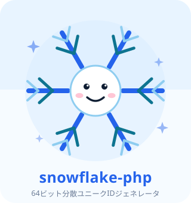
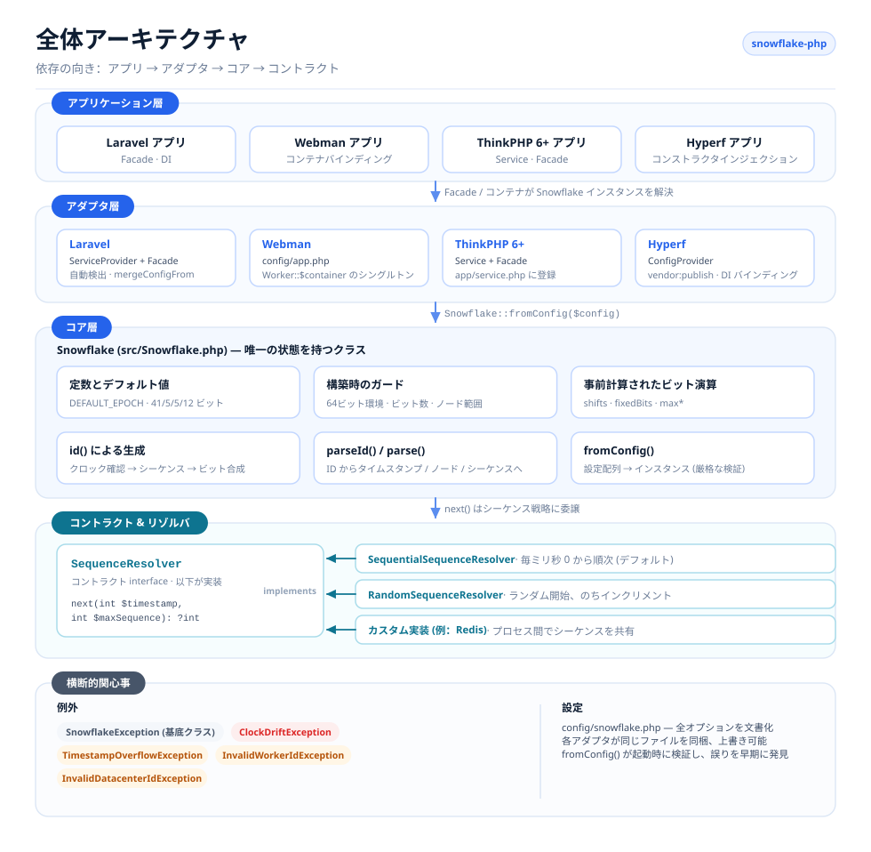
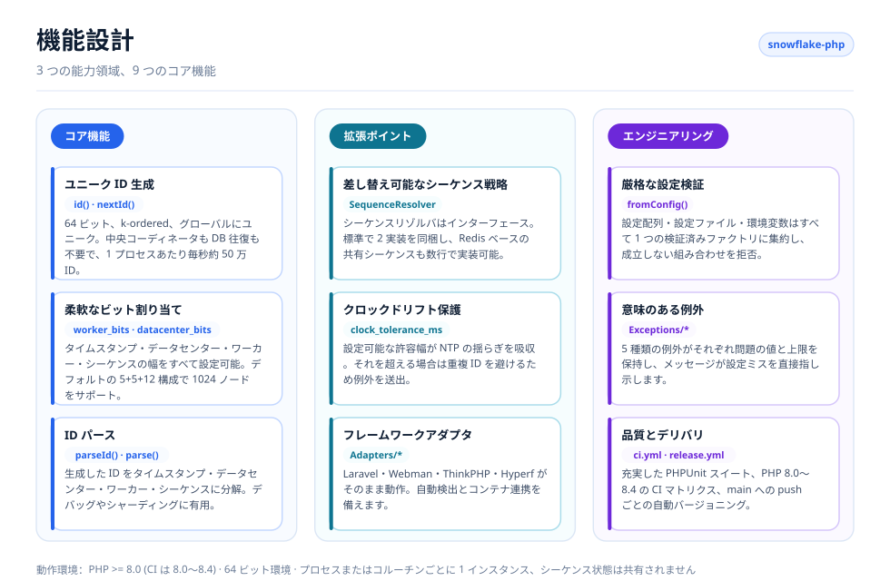
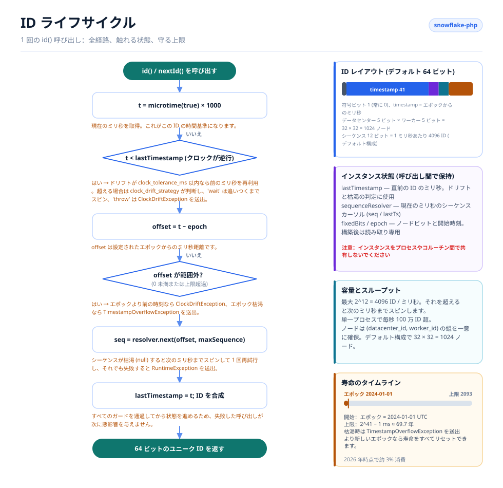

# Snowflake PHP

[English](../../../README.md) · [简体中文](../../../README.zh-CN.md) · [한국어](../ko/README.md) · [Русский](../ru/README.md) · [Deutsch](../de/README.md) · [Français](../fr/README.md) · [Español](../es/README.md) · [Português](../pt/README.md) · [हिन्दी](../hi/README.md) · [العربية](../ar/README.md) · [বাংলা](../bn/README.md) · [Bahasa Indonesia](../id/README.md) · [日本語](../ja/README.md)

<p align="center">
  
  <br />
  <sub>マスコットはコードにも同梱されています — <code>echo Snowflake::MASCOT;</code> でどのターミナルでも表示できます。</sub>
</p>

Twitter の Snowflake アルゴリズムをベースにした分散ユニーク ID ジェネレータで、Laravel、Webman、ThinkPHP、Hyperf に対応しています。

## 概要

Snowflake PHP は、中央コーディネータを必要とせずに、64 ビットで k-ordered なグローバルユニーク ID を生成します。各 ID はタイムスタンプ、データセンター ID、ワーカー ID、シーケンス番号で構成されており、データベースへの問い合わせなしに、1 ノードあたり毎秒 100 万件を優に超える ID を生成できます。

主な特徴：

- **Pure PHP、依存ゼロ** — 拡張モジュールも外部サービスも不要
- **差し替え可能なシーケンスリゾルバ** — 標準で順次方式、ランダム方式、Redis 方式を同梱、自作も可能
- **柔軟なビット割り当て** — タイムスタンプ／ワーカー／データセンター／シーケンスの各ビット数を規模に合わせて調整可能
- **クロックドリフト耐性** — NTP 補正のための許容幅を設定可能
- **フレームワーク非依存** — Laravel、ThinkPHP、Webman、Hyperf 向けの第一級アダプタ、あるいはコンテナを一切使わない素の PHP
- **ID パース** — 生成した ID をタイムスタンプ、ノード、シーケンスの各要素に分解

## プロジェクト構成

```text
snowflake-php/
├── src/
│   ├── Snowflake.php                       # Core: config, bit layout, id(), parseId()
│   ├── Contracts/
│   │   └── SequenceResolver.php            # Sequence strategy interface
│   ├── Resolvers/
│   │   ├── SequentialSequenceResolver.php  # Default: 0..max per millisecond
│   │   ├── RandomSequenceResolver.php      # Random start per millisecond
│   │   └── RedisSequenceResolver.php       # Shared counter for multi-process nodes
│   ├── Exceptions/
│   │   ├── SnowflakeException.php          # Base exception
│   │   ├── ClockDriftException.php
│   │   ├── TimestampOverflowException.php
│   │   ├── InvalidWorkerIdException.php
│   │   └── InvalidDatacenterIdException.php
│   └── Adapters/                           # Framework integrations
│       ├── Laravel/                        # ServiceProvider + Facade + config
│       ├── ThinkPHP/                       # Service + Facade + config
│       ├── Hyperf/                         # ConfigProvider + config
│       ├── Webman/                         # config/app.php
│       └── Psr11/SnowflakeFactory.php      # Any PSR-11 container, no interface dependency
├── config/snowflake.php                    # Reference configuration with comments
├── tests/
│   ├── bootstrap.php                       # Loads the autoloader, prints the mascot
│   └── *Test.php                           # PHPUnit test suite
├── docs/
│   ├── i18n/                               # Translated READMEs + localized diagrams
│   │   ├── README.md                       # Language index
│   │   ├── img/<lang>/                     # Generated SVGs (13 languages)
│   │   └── <lang>/README.md                # One translated README per language
│   ├── examples/plain-php.php              # Runnable no-framework example
│   └── *.png                               # Sponsor images
├── scripts/
│   ├── generate-diagrams.py                # Builds docs/i18n/img/<lang>/*.svg
│   ├── benchmark.php                       # Reproducible throughput benchmark
│   ├── phpstan/stubs/                      # Framework stubs for static analysis
│   └── i18n/labels.<lang>.json             # Diagram strings, one file per language
├── phpstan.neon.dist                       # Level 8 static analysis config
└── .github/workflows/                      # ci.yml (PHP 8.0–8.5), release.yml
```

## アーキテクチャ



4 つの層からなり、依存の向きは常に一方向だけです：

- **アプリケーション層** — お使いの Laravel / Webman / ThinkPHP / Hyperf アプリケーション、任意の PSR-11 コンテナ、あるいは素の PHP。`Snowflake` インスタンスを要求するだけです。
- **アダプタ層** — フレームワークごとに 1 つのアダプタに加え、コンテナに依存しない PSR-11 ファクトリ。それぞれが共有インスタンスを 1 つ登録し、公開可能な設定ファイルを同梱します。
- **コア層** — `Snowflake` は唯一の状態を持つクラスです。設定を検証し、ビットシフトと固定ノードビットを事前計算し、ID を生成して元に戻します。
- **コントラクトとリゾルバ** — `SequenceResolver` が拡張ポイントです。コアはすべてのシーケンス確保をこれに委譲するため、ジェネレータに手を触れずにシーケンス戦略を差し替えられます。
- **横断的関心事** — 意味のある例外階層と、全アダプタで共有されるコメント付き設定ファイル 1 つ。

## 機能設計



機能は 3 つの領域に分類されます：**コア**（生成、ビット割り当て、パース）、**拡張**（差し替え可能なリゾルバ、クロックドリフト処理、フレームワークアダプタ）、**エンジニアリング**（厳格な設定検証、意味のある例外、テストとリリース自動化）。

## ID ライフサイクル



すべての `id()` 呼び出しは同じ経路をたどります：

1. クロックを読み取り、後方へのドリフトを確認します — `clock_tolerance_ms` の範囲内なら許容し、それを超える場合は `clock_drift_strategy` が、クロックが追いつくまで待つ（`'wait'`）か生成を拒否する（`'throw'`）かを決めます。
2. エポックからのオフセットに変換し、負のオフセットやタイムスタンプ上限を超えたオフセットを拒否します。
3. シーケンスリゾルバにこのミリ秒の次のスロットを要求します。4096 スロットをすべて使い切った場合は、次のミリ秒までスピンして 1 回だけ再試行します。
4. `(offset << timestampShift) | fixedBits | sequence` を組み立て、`lastTimestamp` を進めて ID を返します。

インスタンスの状態（`lastTimestamp` とリゾルバのカーソル）はメモリ上にのみ存在し、プロセスやコルーチンをまたいで共有されることはありません。

## 動作要件

- PHP >= 8.0（CI で 8.0 – 8.5 を検証済み。あわせて `src/` に PHPStan レベル 8 を適用）
- 64 ビット環境（ネイティブの 64 ビット整数演算に必要）
- プロセス／コルーチンごとに 1 インスタンス — Snowflake インスタンスはシーケンス状態をメモリに保持するため、プロセスやコルーチンをまたいで共有しないでください

## インストール

```bash
composer require erikwang2013/snowflake-php
```

## クイックスタート

```php
use Erikwang2013\Snowflake\Snowflake;

$snowflake = new Snowflake();
$id = $snowflake->id();          // e.g. 508047278033704960
$id = $snowflake->nextId();      // alias for id()
```

ワーカー ID とデータセンター ID を指定する場合：

```php
$snowflake = new Snowflake(workerId: 5, datacenterId: 3);
$id = $snowflake->id();
```

## 設定リファレンス

| キー | 型 | デフォルト | 説明 |
|-----|------|---------|-------------|
| `epoch` | int | `1704067200000` | カスタムエポック（ミリ秒、デフォルト：2024-01-01 UTC） |
| `worker_id` | int | `0` | ワーカー／ノードの識別子 |
| `datacenter_id` | int | `0` | データセンターの識別子 |
| `worker_bits` | int | `5` | ワーカー ID に割り当てるビット数 |
| `datacenter_bits` | int | `5` | データセンター ID に割り当てるビット数 |
| `sequence_bits` | int | `12` | シーケンス番号に割り当てるビット数 |
| `sequence_resolver` | string | `SequentialSequenceResolver` | SequenceResolver の FQCN |
| `clock_tolerance_ms` | int | `0` | クロック後方ドリフトの最大許容量（0 = 厳格） |
| `clock_drift_strategy` | string | `'throw'` | クロックが許容範囲を超えて後方に動いたとき、`'throw'` は生成を拒否します。`'wait'` は実時刻が追いつくまでスピンし、`clock_drift_wait_ms` を過ぎると諦めて `ClockDriftException` を送出します |
| `clock_drift_wait_ms` | int | `1000` | `'wait'` 戦略が諦めるまでに待つ時間 |

### ビットレイアウト

デフォルトのレイアウト（データ 63 ビット + 符号 1 ビット = 合計 64 ビット）：

```
| reserved(1) |  timestamp(41)   | datacenter(5) | worker(5) | sequence(12) |
```

デフォルトエポックでの最大寿命：約 69 年（約 2093 年まで）。

ノード ID やシーケンスに渡すビットはすべてタイムスタンプから削られるため、シーケンスを広く取るとジェネレータの寿命は黙って短くなります：

| ワーカー + データセンター + シーケンスのビット数 | タイムスタンプのビット数 | 使用可能な寿命 |
|---|---|---|
| 5 + 5 + 12（デフォルト） | 41 | 約 69.7 年 |
| 7 + 7 + 10 | 39 | 約 17.4 年 |
| 5 + 5 + 16 | 37 | 約 4.4 年 |
| 5 + 5 + 20 | 33 | 約 99 日 |

任意のレイアウトの上限を取得できます：

```php
Snowflake::lifespanMs();                                                     // default layout, ~69.7 years in ms
Snowflake::lifespanMs(workerBits: 7, datacenterBits: 7, sequenceBits: 10);   // ~17.4 years in ms
```

`Snowflake::lifespanMs(int $workerBits = 5, int $datacenterBits = 5, int $sequenceBits = 12): int` は、そのレイアウトにおけるタイムスタンプオフセットの最大値をミリ秒で返します（引数はデフォルトのレイアウトが既定値です）。オフセットがこの上限に達するとエポックは枯渇します — 有効期限がすでに切れた古いエポックを指定すると、最初の `id()` 呼び出しで `TimestampOverflowException` が送出されます。

### 設定配列を使う場合

```php
$snowflake = Snowflake::fromConfig([
    'worker_id' => 1,
    'datacenter_id' => 2,
    'epoch' => 1704067200000,
]);
$id = $snowflake->id();
```

## フレームワーク連携

### Laravel

このパッケージは Laravel の自動検出に対応しています。インストール後：

1. 設定ファイルを公開します（任意）：
```bash
php artisan vendor:publish --tag=snowflake-config
```

2. `.env` に環境変数を設定します：
```env
SNOWFLAKE_WORKER_ID=1
SNOWFLAKE_DATACENTER_ID=1
```

3. Facade または依存性注入を使って呼び出します：
```php
// Facade
use Snowflake;
$id = Snowflake::id();

// Dependency injection
use Erikwang2013\Snowflake\Snowflake;

class OrderController
{
    public function store(Snowflake $snowflake)
    {
        $orderId = $snowflake->id();
    }
}

// Container access
$id = app('snowflake')->id();
$id = app(Snowflake::class)->id();
```

### Webman

1. プラグインの設定をプロジェクトにコピーします：
```bash
cp vendor/erikwang2013/snowflake-php/src/Adapters/Webman/config/app.php \
   config/plugin/erikwang2013/snowflake-php/app.php
```

2. `process.php` または bootstrap でシングルトンを登録します：
```php
use Erikwang2013\Snowflake\Snowflake;

Worker::$container->add(Snowflake::class, function () {
    return Snowflake::fromConfig(
        config('plugin.erikwang2013.snowflake-php.app.snowflake')
    );
});
```

3. 使い方：
```php
$id = Worker::$container->get(Snowflake::class)->id();
```

### ThinkPHP 6+

1. 設定ファイルをプロジェクトにコピーします：
```bash
cp vendor/erikwang2013/snowflake-php/src/Adapters/ThinkPHP/config/snowflake.php \
   config/snowflake.php
```

2. `app/service.php` でサービスを登録します：
```php
return [
    \Erikwang2013\Snowflake\Adapters\ThinkPHP\Service::class,
];
```

3. 使い方：
```php
// Container
$id = app('snowflake')->id();

// Dependency injection
use Erikwang2013\Snowflake\Snowflake;

class IndexController
{
    public function index(Snowflake $snowflake)
    {
        $id = $snowflake->id();
    }
}

// Facade
use Erikwang2013\Snowflake\Adapters\ThinkPHP\Facade;
$id = Facade::id();
```

### Hyperf

1. 設定ファイルを公開します：
```bash
php bin/hyperf.php vendor:publish erikwang2013/snowflake-php
```

2. `config/autoload/dependencies.php` に DI バインディングを登録します：
```php
use Erikwang2013\Snowflake\Snowflake;

return [
    Snowflake::class => function () {
        return Snowflake::fromConfig(config('snowflake'));
    },
];
```

3. コンストラクタインジェクションで使います：
```php
use Erikwang2013\Snowflake\Snowflake;

class OrderService
{
    public function __construct(private Snowflake $snowflake) {}

    public function create(): int
    {
        return $this->snowflake->id();
    }
}
```

### PSR-11 コンテナ

Symfony、Slim、Laminas などの各種コンテナでは、ファクトリを登録します。これは何にも依存しないためどんなコンテナでも動作し、`psr/container` も必要ありません：

```php
use Erikwang2013\Snowflake\Adapters\Psr11\SnowflakeFactory;

$container->set(\Erikwang2013\Snowflake\Snowflake::class, new SnowflakeFactory($config));
// or build the config from the environment:
$container->set(\Erikwang2013\Snowflake\Snowflake::class, SnowflakeFactory::fromEnvironment());
```

`SnowflakeFactory::fromEnvironment()` は、Laravel アダプタが使うのと同じ `SNOWFLAKE_*` 変数を読み取ります。PSR-11 コンテナはファクトリオブジェクト自体を呼び出すため、Symfony のサービス定義は 1 行で済みます：

```yaml
services:
  Erikwang2013\Snowflake\Snowflake:
    factory: ['@Erikwang2013\Snowflake\Adapters\Psr11\SnowflakeFactory', '__invoke']
```

## ネイティブ PHP（フレームワークなし）

このパッケージにフレームワークが必要な箇所はありません — 上記 4 つのアダプタは、`Snowflake` をコンテナに接続してくれるだけです。コンテナがなければ自分で組み立てます：

```php
require __DIR__ . '/vendor/autoload.php';

use Erikwang2013\Snowflake\Snowflake;

// Same variable names the Laravel adapter uses, so one .env-style setup
// works whether or not a framework is present.
$snowflake = Snowflake::fromConfig([
    'worker_id'          => (int) (getenv('SNOWFLAKE_WORKER_ID') ?: 0),
    'datacenter_id'      => (int) (getenv('SNOWFLAKE_DATACENTER_ID') ?: 0),
    'clock_tolerance_ms' => 5,
]);

$id = $snowflake->id();
```

これを実行できる形にしたもの — フレームワークなしの遅延シングルトンと、それが検査する不変条件を含みます — が [`docs/examples/plain-php.php`](../../examples/plain-php.php) にあります：

```bash
php docs/examples/plain-php.php
```

### 寿命の選び方

インスタンスは `lastTimestamp` とシーケンスカーソルをメモリに保持するため、これをどれだけ長く生かすかが唯一の要点です：

| ランタイム | インスタンスの生成 |
|---------|--------------------|
| PHP-FPM、mod_php、CLI | リクエストまたはコマンドごとにインラインで — 互いに共有されるものはありません。 |
| Swoole、ReactPHP、RoadRunner、FrankenPHP | **ワーカープロセス**ごとに 1 つ、ワーカー起動コールバックから、一意の `(datacenter_id, worker_id)` の組で生成します。 |

コルーチンやスレッド間で 1 つのインスタンスを共有しないでください。`id()` は自身の状態を読み書きするため、2 つの並行呼び出しが交互に実行されて同じシーケンス番号を払い出す可能性があります。コルーチンごとに 1 インスタンスを生成するか、共有インスタンスをミューテックスで保護してください。

## ID パース

Snowflake ID を構成要素に分解します：

```php
$id = $snowflake->id();

// Using the instance (respects custom bit layout)
$parsed = $snowflake->parseId($id);
// [
//     'timestamp_ms' => 1736380800123,
//     'datetime'     => '2025-01-09 00:00:00.123',
//     'worker_id'    => 5,
//     'datacenter_id' => 3,
//     'sequence'     => 42,
// ]

// Static method (uses default bit layout)
$parsed = Snowflake::parse($id, $epoch);
```

`datetime` メンバは PHP の `date()` によって**サーバーのデフォルトタイムゾーン**で整形されるため、タイムゾーンが異なる 2 台のホストは同じ ID を別々に表示します。`timestamp_ms` はタイムゾーンに依存しない絶対値です — マシン間で ID を突き合わせるときはこちらを比較してください。

## シーケンスリゾルバ

標準で 3 つの実装を同梱しています：

### SequentialSequenceResolver（デフォルト）

古典的な Snowflake の挙動です。シーケンスは毎ミリ秒 0 から始まり、順に増加します。単一ノード内で ID が単調増加することを保証します。

```php
use Erikwang2013\Snowflake\Resolvers\SequentialSequenceResolver;

$snowflake = new Snowflake(
    sequenceResolver: new SequentialSequenceResolver()
);
```

### RandomSequenceResolver

毎ミリ秒、ランダムなシーケンス番号から始めてから増加させます。同一ミリ秒内の単調性は保ちつつ、シーケンシャル ID よりも予測しにくくなります。

```php
use Erikwang2013\Snowflake\Resolvers\RandomSequenceResolver;

$snowflake = new Snowflake(
    sequenceResolver: new RandomSequenceResolver()
);
```

### カスタムリゾルバ

`Erikwang2013\Snowflake\Contracts\SequenceResolver` を実装します：

```php
use Erikwang2013\Snowflake\Contracts\SequenceResolver;

class SharedCounterSequenceResolver implements SequenceResolver
{
    public function next(int $timestamp, int $maxSequence): ?int
    {
        $key = "snowflake:seq:{$timestamp}";
        $seq = redis()->incr($key);
        redis()->expire($key, 1);

        if ($seq > $maxSequence) {
            return null;
        }

        return $seq - 1;
    }
}
```

### RedisSequenceResolver

プロセス内リゾルバはシーケンスをメモリに保持するため、ノード ID を共有するプロセス同士が同じシーケンス番号を払い出すことがあります。`RedisSequenceResolver` はカウンタを代わりに Redis に置きます — 複数のプロセスが `(datacenter_id, worker_id)` の組を共有するときに使うものです：

```php
use Erikwang2013\Snowflake\Resolvers\RedisSequenceResolver;

// Any client exposing incr(string $key): int and expire(string $key, int $seconds): bool
$resolver = new RedisSequenceResolver($redis, 'snowflake:seq:', 1);
$snowflake = new Snowflake(sequenceResolver: $resolver);
```

`__construct(object $client, string $keyPrefix = 'snowflake:seq:', int $ttlSeconds = 1)` — クライアントは注入するため、`redis` 拡張も Predis も必要ありません。長い TTL を指定しても安全です。その場合カウンタは同じミリ秒内で増え続け、次のミリ秒が始まるまで正しく `null` を返します。

## 例外処理

| 例外 | 発生条件 |
|-----------|------|
| `InvalidWorkerIdException` | ワーカー ID が `2^worker_bits - 1` を超えた場合 |
| `InvalidDatacenterIdException` | データセンター ID が `2^datacenter_bits - 1` を超えた場合 |
| `ClockDriftException` | システムクロックが許容範囲を超えて後方に移動した場合 |
| `TimestampOverflowException` | エポックを使い切った場合（寿命の終了） |
| `SnowflakeException` | このパッケージのすべての例外の基底クラス |

## 分散デプロイ

複数のサーバーやプロセスで動作させる場合は、各インスタンスが一意の `(datacenter_id, worker_id)` の組を使うようにしてください：

```php
// Read from environment, hostname hash, or service discovery
$workerId = (int) getenv('WORKER_ID');
$datacenterId = (int) getenv('DC_ID');

$snowflake = new Snowflake(
    workerId: $workerId,
    datacenterId: $datacenterId
);
```

デフォルトの 5+5 ビット構成では、最大 32 データセンター × 32 ワーカー = 1024 ノードをサポートできます。

より多くのワーカーをサポートするには、ビット割り当てを調整します：

```php
// 10 worker bits = 1024 workers, 0 datacenter bits = single DC
$snowflake = new Snowflake(
    workerId: $workerId,
    workerBits: 10,
    datacenterBits: 0
);
```

## パフォーマンス

ID は外部依存なしで完全にプロセス内で生成されるため、スループットは PHP 自身の `microtime()` 呼び出しとわずかな整数演算だけで決まります。

開発マシンの 1 コアで計測（PHP 8.3.7、**Xdebug 無効**、30 万回反復、5 回のうち最良）：

| 操作 | スループット | 1 回あたり |
|-----------|-----------:|---------:|
| `microtime(true)` 単体 — 下限 | 10.3M/s | 97 ns |
| `id()` — デフォルトの 5+5+12 構成 | **1.6M/s** | 633 ns |
| `id()` + `parseId()` | 282k/s | 3.5 µs |
| `Snowflake::fromConfig()` | 167k/s | 6.0 µs |

生成コストはクロック呼び出し単体の約 6 倍で、ノードのシーケンス上限（4096 ID/ms = 4.1M/s）は PHP プロセス 1 つが消費できる量を優に上回ったままです。パースと構築は診断用の操作でありホットパスではありません — インスタンスはプロセスごとに 1 度だけ生成し、`parseId()` をタイトなループから外してください。

手元で再現するには：

```bash
php scripts/benchmark.php
```

`microtime()` 単体のベースラインに対する ops/sec と ns/op を、最良値とばらつきとともに出力します。絶対値に意味があるかどうかを決める要素は 2 つあります：**Xdebug**（桁違いのコストになり得ます — 読み込まれている場合はヘッダに表示されます）と、負荷の高いホストや仮想化されたホスト（そのホスト自身のクロック呼び出しが計測を支配することがあります）。単一の数値を約束として読むのではなく、ベースラインと比較してください。

## ご支援のお願い

| WeChat Pay | Alipay |
|:---:|:---:|
|  |  |

> このプロジェクトがお役に立てば、ぜひご支援いただけると嬉しいです〜

---

## ライセンス

MIT — Copyright (c) 2026 erik <erik@erik.xyz> — https://erik.xyz
