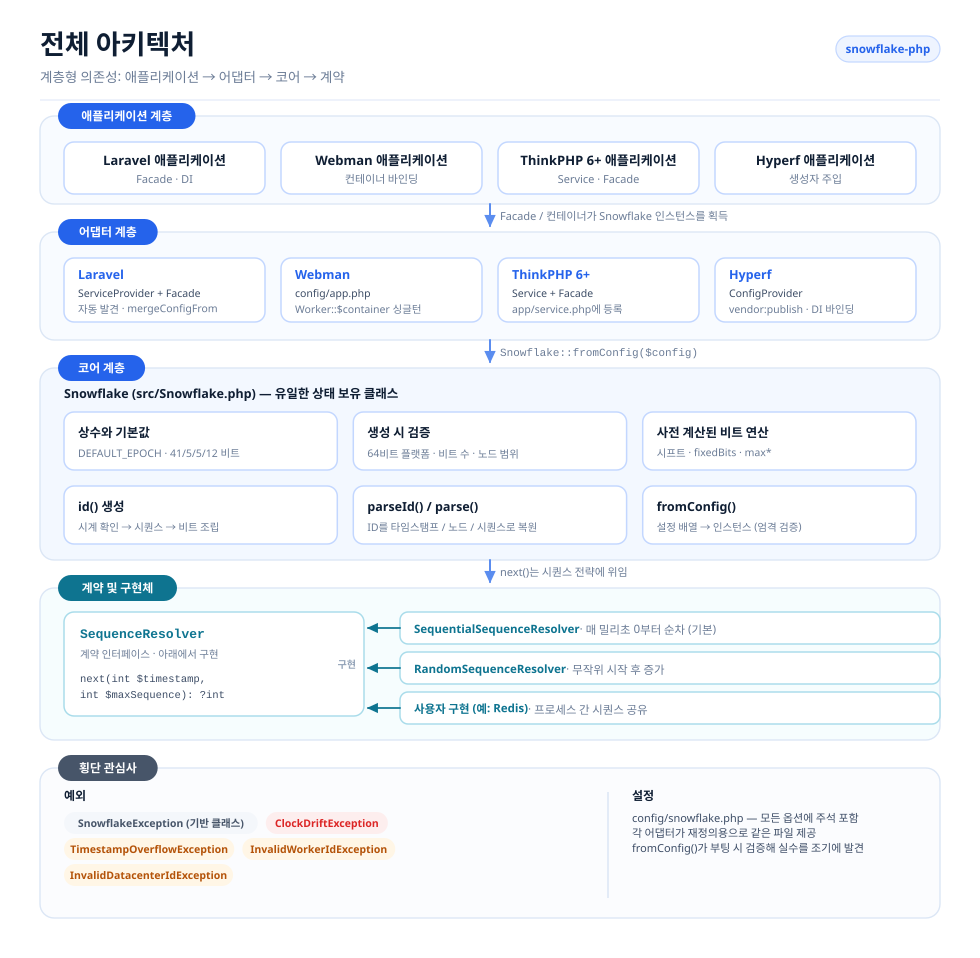
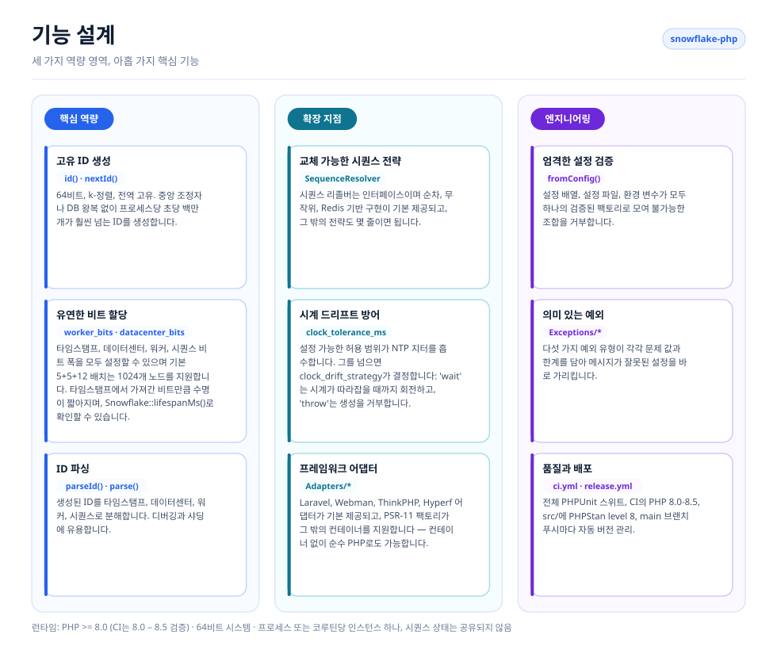
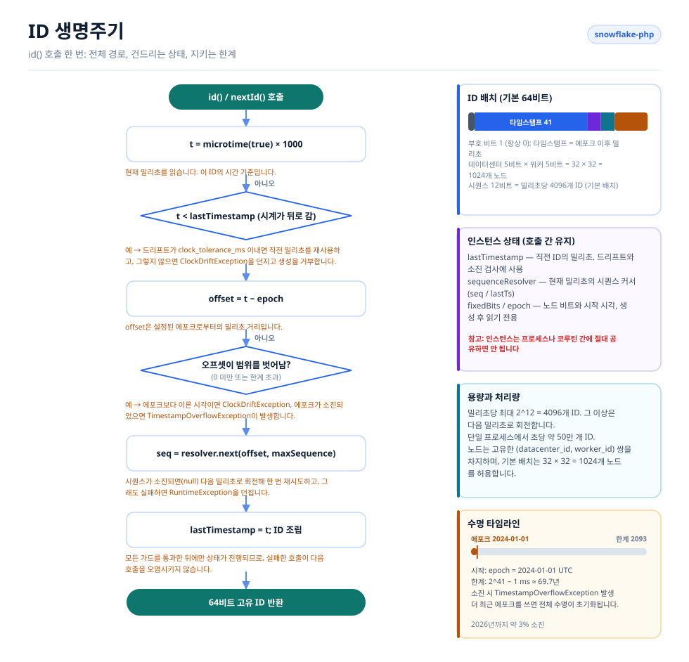

# Snowflake PHP

[English](../../../README.md) · [简体中文](../../../README.zh-CN.md) · [한국어](../ko/README.md) · [Русский](../ru/README.md) · [Deutsch](../de/README.md) · [Français](../fr/README.md) · [Español](../es/README.md) · [Português](../pt/README.md) · [हिन्दी](../hi/README.md) · [العربية](../ar/README.md) · [বাংলা](../bn/README.md) · [Bahasa Indonesia](../id/README.md) · [日本語](../ja/README.md)

<p align="center">
  
  <br />
  <sub>마스코트는 코드와 함께 배포됩니다 — <code>echo Snowflake::MASCOT;</code> 를 실행하면 어떤 터미널에서든 출력됩니다.</sub>
</p>

트위터 Snowflake 알고리즘에 기반한 분산 고유 ID 생성기로, Laravel, Webman, ThinkPHP, Hyperf와 호환됩니다.

## 개요

Snowflake PHP는 중앙 조정자 없이 64비트, k-정렬된 전역 고유 ID를 생성합니다. 각 ID는 타임스탬프, 데이터센터 ID, 워커 ID, 시퀀스 번호로 구성되며, 데이터베이스 왕복 없이 노드당 초당 수십만 개의 ID를 만들 수 있습니다.

주요 기능:

- **순수 PHP, 의존성 제로** — 확장 모듈이나 외부 서비스가 필요하지 않습니다
- **교체 가능한 시퀀스 리졸버** — 순차 및 무작위 전략이 기본 제공되며, 직접 구현할 수도 있습니다
- **유연한 비트 할당** — 타임스탬프/워커/데이터센터/시퀀스 비트를 규모에 맞게 조정할 수 있습니다
- **시계 드리프트 허용** — NTP 보정을 위한 허용 범위를 설정할 수 있습니다
- **프레임워크 비종속** — Laravel, ThinkPHP, Webman, Hyperf용 어댑터를 기본 제공합니다
- **ID 파싱** — 생성된 ID를 타임스탬프, 노드, 시퀀스 구성 요소로 다시 분해합니다

## 프로젝트 구조

```text
snowflake-php/
├── src/
│   ├── Snowflake.php                       # Core: config, bit layout, id(), parseId()
│   ├── Contracts/
│   │   └── SequenceResolver.php            # Sequence strategy interface
│   ├── Resolvers/
│   │   ├── SequentialSequenceResolver.php  # Default: 0..max per millisecond
│   │   └── RandomSequenceResolver.php      # Random start per millisecond
│   ├── Exceptions/
│   │   ├── SnowflakeException.php          # Base exception
│   │   ├── ClockDriftException.php
│   │   ├── TimestampOverflowException.php
│   │   ├── InvalidWorkerIdException.php
│   │   └── InvalidDatacenterIdException.php
│   └── Adapters/                           # Framework integrations
│       ├── Laravel/                        # ServiceProvider + Facade + config
│       ├── ThinkPHP/                       # Service + Facade + config
│       ├── Hyperf/                         # ConfigProvider + config
│       └── Webman/                         # config/app.php
├── config/snowflake.php                    # Reference configuration with comments
├── tests/
│   ├── bootstrap.php                       # Loads the autoloader, prints the mascot
│   └── *Test.php                           # PHPUnit test suite
├── docs/                                   # Design diagrams and sponsor images
└── .github/workflows/                      # ci.yml (PHP 8.0–8.4), release.yml
```

## 아키텍처



네 개의 계층으로 이루어져 있고, 의존성은 한 방향으로만 향합니다:

- **애플리케이션 계층** — 여러분의 Laravel / Webman / ThinkPHP / Hyperf 애플리케이션으로, 컨테이너에 `Snowflake` 인스턴스만 요청합니다.
- **어댑터 계층** — 프레임워크마다 어댑터가 하나씩 있습니다. 각 어댑터는 프레임워크 컨테이너에 공유 인스턴스 하나를 등록하고, 배포 가능한 설정 파일을 함께 제공합니다.
- **코어 계층** — `Snowflake`가 유일한 상태 보유 클래스입니다. 설정을 검증하고, 비트 시프트와 고정 노드 비트를 미리 계산하며, ID를 생성하고 다시 파싱합니다.
- **계약과 리졸버** — `SequenceResolver`가 확장 지점입니다. 코어는 모든 시퀀스 할당을 여기에 위임하므로, 생성기를 건드리지 않고도 시퀀스 전략을 교체할 수 있습니다.
- **횡단 관심사** — 의미 있는 예외 계층과 모든 어댑터가 공유하는 주석 포함 설정 파일 하나입니다.

## 기능 설계



기능은 세 영역으로 묶입니다. **코어**(생성, 비트 할당, 파싱), **확장**(교체 가능한 리졸버, 시계 드리프트 처리, 프레임워크 어댑터), **엔지니어링**(엄격한 설정 검증, 의미 있는 예외, 테스트와 릴리스 자동화)입니다.

## ID 생명주기



모든 `id()` 호출은 같은 경로를 따릅니다:

1. 시계를 읽고 역행 여부를 확인합니다 — `clock_tolerance_ms`까지는 허용하고, 그 이상은 거부합니다.
2. 에포크 오프셋으로 변환하고, 음수이거나 타임스탬프 한계를 넘은 오프셋은 거부합니다.
3. 이 밀리초의 다음 슬롯을 시퀀스 리졸버에 요청합니다. 4096개 슬롯이 모두 사용되면 다음 밀리초로 회전해 한 번 재시도합니다.
4. `(offset << timestampShift) | fixedBits | sequence`를 조립하고, `lastTimestamp`를 진행시킨 뒤 ID를 반환합니다.

인스턴스 상태(`lastTimestamp`와 리졸버 커서)는 메모리에 존재하며 프로세스나 코루틴 간에 절대 공유되지 않습니다.

## 요구 사항

- PHP >= 8.0 (CI에서 8.0 – 8.4 검증)
- 64비트 시스템 (네이티브 64비트 정수 연산에 필요)
- 프로세스/코루틴당 인스턴스 하나 — Snowflake 인스턴스는 시퀀스 상태를 메모리에 보관하므로 프로세스나 코루틴 간에 공유해서는 안 됩니다

## 설치

```bash
composer require erikwang2013/snowflake-php
```

## 빠른 시작

```php
use Erikwang2013\Snowflake\Snowflake;

$snowflake = new Snowflake();
$id = $snowflake->id();          // e.g. 508047278033704960
$id = $snowflake->nextId();      // alias for id()
```

사용자 정의 워커 및 데이터센터 ID를 지정하는 경우:

```php
$snowflake = new Snowflake(workerId: 5, datacenterId: 3);
$id = $snowflake->id();
```

## 설정 레퍼런스

| 키 | 타입 | 기본값 | 설명 |
|-----|------|---------|-------------|
| `epoch` | int | `1704067200000` | 사용자 정의 에포크 (ms) (기본값: 2024-01-01 UTC) |
| `worker_id` | int | `0` | 워커/노드 식별자 |
| `datacenter_id` | int | `0` | 데이터센터 식별자 |
| `worker_bits` | int | `5` | 워커 ID용 비트 수 |
| `datacenter_bits` | int | `5` | 데이터센터 ID용 비트 수 |
| `sequence_bits` | int | `12` | 시퀀스 번호용 비트 수 |
| `sequence_resolver` | string | `SequentialSequenceResolver` | SequenceResolver의 FQCN |
| `clock_tolerance_ms` | int | `0` | 최대 시계 역행 허용치 (0 = 엄격) |

### 비트 배치

기본 배치 (데이터 63비트 + 부호 1비트 = 총 64비트):

```
| reserved(1) |  timestamp(41)   | datacenter(5) | worker(5) | sequence(12) |
```

기본 에포크 기준 최대 수명: 약 69년 (약 2093년까지).

### 설정 배열 사용

```php
$snowflake = Snowflake::fromConfig([
    'worker_id' => 1,
    'datacenter_id' => 2,
    'epoch' => 1704067200000,
]);
$id = $snowflake->id();
```

## 프레임워크 통합

### Laravel

이 패키지는 Laravel 자동 발견을 지원합니다. 설치 후:

1. 설정을 배포합니다 (선택 사항):
```bash
php artisan vendor:publish --tag=snowflake-config
```

2. `.env`에 환경 변수를 설정합니다:
```env
SNOWFLAKE_WORKER_ID=1
SNOWFLAKE_DATACENTER_ID=1
```

3. Facade 또는 의존성 주입을 사용합니다:
```php
// Facade
use Snowflake;
$id = Snowflake::id();

// Dependency injection
use Erikwang2013\Snowflake\Snowflake;

class OrderController
{
    public function store(Snowflake $snowflake)
    {
        $orderId = $snowflake->id();
    }
}

// Container access
$id = app('snowflake')->id();
$id = app(Snowflake::class)->id();
```

### Webman

1. 플러그인 설정을 프로젝트로 복사합니다:
```bash
cp vendor/erikwang2013/snowflake-php/src/Adapters/Webman/config/app.php \
   config/plugin/erikwang2013/snowflake-php/app.php
```

2. `process.php` 또는 부트스트랩에 싱글턴을 등록합니다:
```php
use Erikwang2013\Snowflake\Snowflake;

Worker::$container->add(Snowflake::class, function () {
    return Snowflake::fromConfig(
        config('plugin.erikwang2013.snowflake-php.app.snowflake')
    );
});
```

3. 사용법:
```php
$id = Worker::$container->get(Snowflake::class)->id();
```

### ThinkPHP 6+

1. 설정 파일을 프로젝트로 복사합니다:
```bash
cp vendor/erikwang2013/snowflake-php/src/Adapters/ThinkPHP/config/snowflake.php \
   config/snowflake.php
```

2. `app/service.php`에 서비스를 등록합니다:
```php
return [
    \Erikwang2013\Snowflake\Adapters\ThinkPHP\Service::class,
];
```

3. 사용법:
```php
// Container
$id = app('snowflake')->id();

// Dependency injection
use Erikwang2013\Snowflake\Snowflake;

class IndexController
{
    public function index(Snowflake $snowflake)
    {
        $id = $snowflake->id();
    }
}

// Facade
use Erikwang2013\Snowflake\Adapters\ThinkPHP\Facade;
$id = Facade::id();
```

### Hyperf

1. 설정을 배포합니다:
```bash
php bin/hyperf.php vendor:publish erikwang2013/snowflake-php
```

2. `config/autoload/dependencies.php`에 DI 바인딩을 등록합니다:
```php
use Erikwang2013\Snowflake\Snowflake;

return [
    Snowflake::class => function () {
        return Snowflake::fromConfig(config('snowflake'));
    },
];
```

3. 생성자 주입으로 사용합니다:
```php
use Erikwang2013\Snowflake\Snowflake;

class OrderService
{
    public function __construct(private Snowflake $snowflake) {}

    public function create(): int
    {
        return $this->snowflake->id();
    }
}
```

## ID 파싱

Snowflake ID를 구성 요소로 분해합니다:

```php
$id = $snowflake->id();

// Using the instance (respects custom bit layout)
$parsed = $snowflake->parseId($id);
// [
//     'timestamp_ms' => 1736380800123,
//     'datetime'     => '2025-01-09 00:00:00.123',
//     'worker_id'    => 5,
//     'datacenter_id' => 3,
//     'sequence'     => 42,
// ]

// Static method (uses default bit layout)
$parsed = Snowflake::parse($id, $epoch);
```

## 시퀀스 리졸버

두 가지 기본 구현이 제공됩니다:

### SequentialSequenceResolver (기본)

고전적인 Snowflake 동작입니다. 시퀀스는 매 밀리초 0에서 시작해 순차적으로 증가합니다. 단일 노드 내에서 단조 증가하는 ID를 보장합니다.

```php
use Erikwang2013\Snowflake\Resolvers\SequentialSequenceResolver;

$snowflake = new Snowflake(
    sequenceResolver: new SequentialSequenceResolver()
);
```

### RandomSequenceResolver

매 밀리초를 임의의 시퀀스 번호에서 시작해 이후 증가시킵니다. 순차 ID보다 예측하기 어렵지만, 밀리초 안에서는 ID가 단조 증가합니다.

```php
use Erikwang2013\Snowflake\Resolvers\RandomSequenceResolver;

$snowflake = new Snowflake(
    sequenceResolver: new RandomSequenceResolver()
);
```

### 사용자 정의 리졸버

`Erikwang2013\Snowflake\Contracts\SequenceResolver`를 구현합니다:

```php
use Erikwang2013\Snowflake\Contracts\SequenceResolver;

class RedisSequenceResolver implements SequenceResolver
{
    public function next(int $timestamp, int $maxSequence): ?int
    {
        $key = "snowflake:seq:{$timestamp}";
        $seq = redis()->incr($key);
        redis()->expire($key, 1);

        if ($seq > $maxSequence) {
            return null;
        }

        return $seq - 1;
    }
}
```

## 예외 처리

| 예외 | 발생 시점 |
|-----------|------|
| `InvalidWorkerIdException` | 워커 ID가 `2^worker_bits - 1`을 초과 |
| `InvalidDatacenterIdException` | 데이터센터 ID가 `2^datacenter_bits - 1`을 초과 |
| `ClockDriftException` | 시스템 시계가 허용 범위를 넘어 뒤로 이동 |
| `TimestampOverflowException` | 에포크가 소진됨 (수명 종료) |
| `SnowflakeException` | 모든 패키지 예외의 기반 예외 |

## 분산 배포

여러 서버나 프로세스에서 실행할 때는 각 인스턴스가 고유한 `(datacenter_id, worker_id)` 쌍을 사용하도록 하십시오:

```php
// Read from environment, hostname hash, or service discovery
$workerId = (int) getenv('WORKER_ID');
$datacenterId = (int) getenv('DC_ID');

$snowflake = new Snowflake(
    workerId: $workerId,
    datacenterId: $datacenterId
);
```

기본 5+5 비트 배치에서는 최대 32개 데이터센터 × 32개 워커 = 1024개 고유 노드를 지원할 수 있습니다.

더 많은 워커를 지원하려면 비트 할당을 조정하십시오:

```php
// 10 worker bits = 1024 workers, 0 datacenter bits = single DC
$snowflake = new Snowflake(
    workerId: $workerId,
    workerBits: 10,
    datacenterBits: 0
);
```

## 성능

최신 하드웨어에서의 일반적인 처리량: **초당 약 500,000개 ID** (단일 프로세스).

ID는 외부 의존성 없이 순수하게 프로세스 안에서 생성됩니다. 주요 병목은 PHP의 `microtime()` 호출과 정수 비트 연산이며, 둘 다 O(1)입니다.

## 후원 환영

| 위챗 페이 | 알리페이 |
|:---:|:---:|
|  |  |

> 이 프로젝트가 도움이 되셨다면, 따뜻한 후원 부탁드립니다~

---

## 라이선스

MIT — Copyright (c) 2026 erik <erik@erik.xyz> — https://erik.xyz
