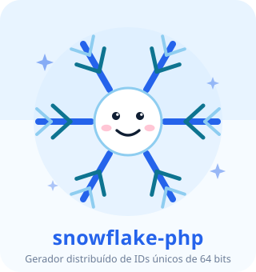
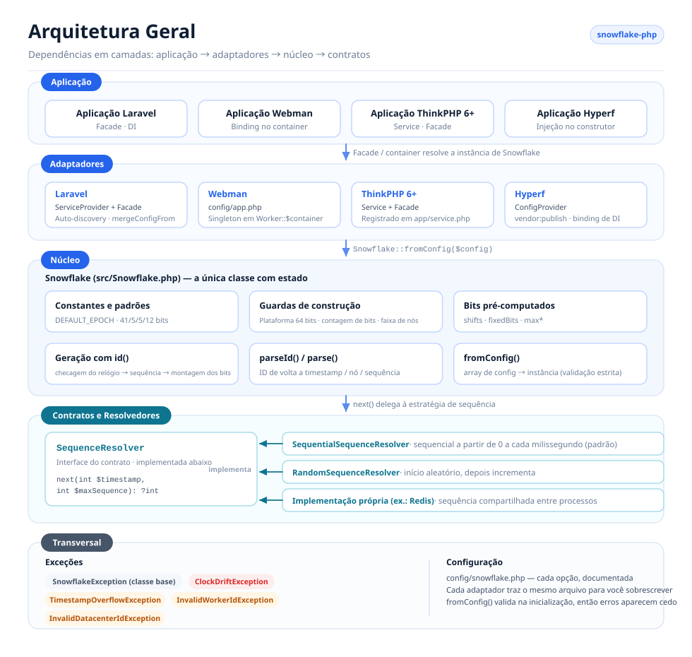
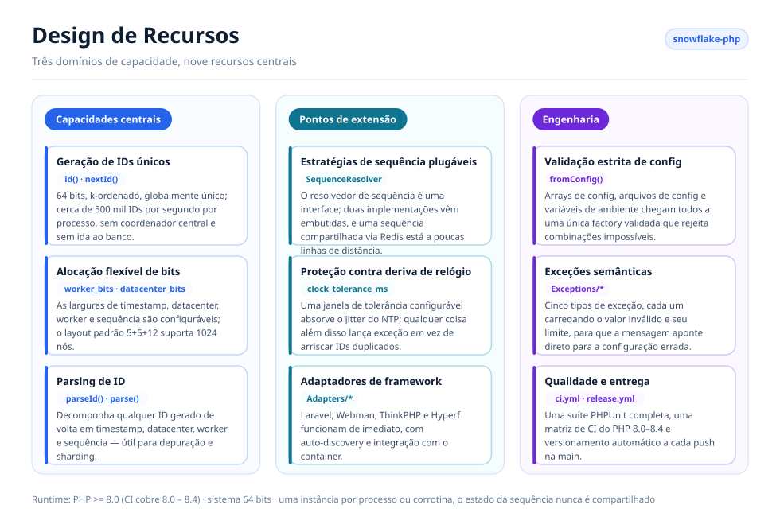
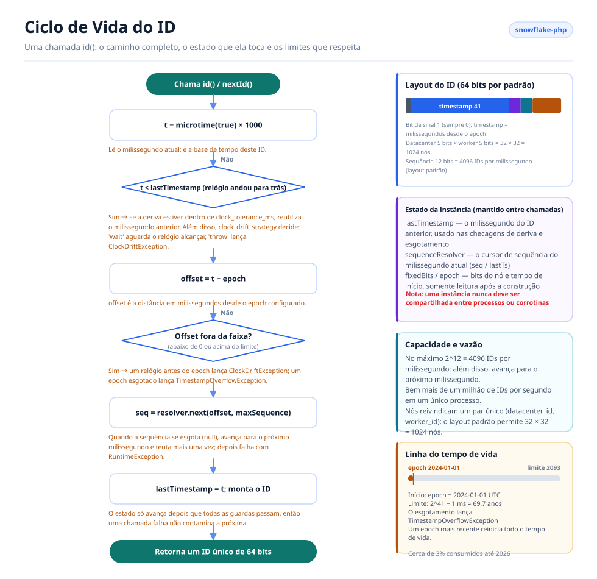

# Snowflake PHP

[English](../../../README.md) · [简体中文](../../../README.zh-CN.md) · [한국어](../ko/README.md) · [Русский](../ru/README.md) · [Deutsch](../de/README.md) · [Français](../fr/README.md) · [Español](../es/README.md) · [Português](../pt/README.md) · [हिन्दी](../hi/README.md) · [العربية](../ar/README.md) · [বাংলা](../bn/README.md) · [Bahasa Indonesia](../id/README.md) · [日本語](../ja/README.md)

<p align="center">
  
  <br />
  <sub>O mascote também acompanha o código — <code>echo Snowflake::MASCOT;</code> o imprime em qualquer terminal.</sub>
</p>

Um gerador distribuído de IDs únicos baseado no algoritmo Snowflake do Twitter, compatível com Laravel, Webman, ThinkPHP e Hyperf.

## Sobre

O Snowflake PHP gera IDs de 64 bits, k-ordenados e globalmente únicos sem precisar de um coordenador central. Cada ID é composto por um timestamp, um ID de datacenter, um ID de worker e um número de sequência — o que permite centenas de milhares de IDs por segundo por nó, sem idas e voltas ao banco de dados.

Principais recursos:

- **PHP puro, zero dependências** — não exige extensões nem serviços externos
- **Resolvedores de sequência plugáveis** — estratégias sequencial e aleatória embutidas, ou traga a sua
- **Alocação flexível de bits** — ajuste os bits de timestamp/worker/datacenter/sequência conforme a sua escala
- **Tolerância a deriva de relógio** — janela de tolerância configurável para ajustes de NTP
- **Agnóstico de framework**, com adaptadores de primeira linha para Laravel, ThinkPHP, Webman e Hyperf
- **Parsing de ID** — decomponha os IDs gerados de volta em timestamp, nó e sequência

## Estrutura do Projeto

```text
snowflake-php/
├── src/
│   ├── Snowflake.php                       # Core: config, bit layout, id(), parseId()
│   ├── Contracts/
│   │   └── SequenceResolver.php            # Sequence strategy interface
│   ├── Resolvers/
│   │   ├── SequentialSequenceResolver.php  # Default: 0..max per millisecond
│   │   └── RandomSequenceResolver.php      # Random start per millisecond
│   ├── Exceptions/
│   │   ├── SnowflakeException.php          # Base exception
│   │   ├── ClockDriftException.php
│   │   ├── TimestampOverflowException.php
│   │   ├── InvalidWorkerIdException.php
│   │   └── InvalidDatacenterIdException.php
│   └── Adapters/                           # Framework integrations
│       ├── Laravel/                        # ServiceProvider + Facade + config
│       ├── ThinkPHP/                       # Service + Facade + config
│       ├── Hyperf/                         # ConfigProvider + config
│       └── Webman/                         # config/app.php
├── config/snowflake.php                    # Reference configuration with comments
├── tests/
│   ├── bootstrap.php                       # Loads the autoloader, prints the mascot
│   └── *Test.php                           # PHPUnit test suite
├── docs/
│   ├── i18n/                               # Translated READMEs + localized diagrams
│   │   ├── README.md                       # Language index
│   │   ├── img/<lang>/                     # Generated SVGs (13 languages)
│   │   └── <lang>/README.md                # One translated README per language
│   └── *.png                               # Sponsor images
├── scripts/
│   ├── generate-diagrams.py                # Builds docs/i18n/img/<lang>/*.svg
│   └── i18n/labels.<lang>.json             # Diagram strings, one file per language
└── .github/workflows/                      # ci.yml (PHP 8.0–8.4), release.yml
```

## Arquitetura



Quatro camadas, com as dependências apontando em uma única direção:

- **Camada de aplicação** — sua aplicação Laravel / Webman / ThinkPHP / Hyperf; ela apenas pede ao container uma instância de `Snowflake`.
- **Camada de adaptadores** — um adaptador por framework. Cada um registra uma única instância compartilhada no container do framework e fornece um arquivo de configuração publicável.
- **Camada de núcleo** — `Snowflake` é a única classe com estado: valida a configuração, pré-calcula os deslocamentos de bits e os bits fixos do nó, gera IDs e os decodifica de volta.
- **Contratos e resolvedores** — `SequenceResolver` é o ponto de extensão. O núcleo delega a ele toda alocação de sequência, então a estratégia de sequência pode ser trocada sem tocar no gerador.
- **Transversal** — uma hierarquia semântica de exceções mais um único arquivo de configuração comentado, compartilhado por todos os adaptadores.

## Design de Recursos



As funcionalidades se agrupam em três domínios: **núcleo** (geração, alocação de bits, decodificação), **extensão** (resolvedores plugáveis, tratamento de deriva de relógio, adaptadores de framework) e **engenharia** (validação estrita de configuração, exceções semânticas, testes e automação de release).

## Ciclo de Vida do ID



Toda chamada a `id()` percorre o mesmo caminho:

1. Lê o relógio e verifica deriva para trás — tolerada até `clock_tolerance_ms`, rejeitada além disso.
2. Converte para um offset de epoch e rejeita offsets negativos ou acima do limite de timestamp.
3. Pede ao resolvedor de sequência o próximo slot neste milissegundo; quando todos os 4096 slots são usados, avança para o próximo milissegundo e tenta mais uma vez.
4. Monta `(offset << timestampShift) | fixedBits | sequence`, avança `lastTimestamp` e retorna o ID.

O estado da instância (`lastTimestamp` mais o cursor do resolvedor) vive em memória e nunca é compartilhado entre processos ou corrotinas.

## Requisitos

- PHP >= 8.0 (8.0 – 8.4 verificados na CI)
- Sistema de 64 bits (necessário para operações nativas com inteiros de 64 bits)
- Uma instância por processo/corrotina — uma instância de Snowflake mantém seu estado de sequência em memória e não deve ser compartilhada entre processos ou corrotinas

## Instalação

```bash
composer require erikwang2013/snowflake-php
```

## Início Rápido

```php
use Erikwang2013\Snowflake\Snowflake;

$snowflake = new Snowflake();
$id = $snowflake->id();          // e.g. 508047278033704960
$id = $snowflake->nextId();      // alias for id()
```

Com IDs de worker e datacenter personalizados:

```php
$snowflake = new Snowflake(workerId: 5, datacenterId: 3);
$id = $snowflake->id();
```

## Referência de Configuração

| Chave | Tipo | Padrão | Descrição |
|-----|------|---------|-------------|
| `epoch` | int | `1704067200000` | Epoch personalizado em ms (padrão: 2024-01-01 UTC) |
| `worker_id` | int | `0` | Identificador do worker/nó |
| `datacenter_id` | int | `0` | Identificador do datacenter |
| `worker_bits` | int | `5` | Bits para o ID do worker |
| `datacenter_bits` | int | `5` | Bits para o ID do datacenter |
| `sequence_bits` | int | `12` | Bits para o número de sequência |
| `sequence_resolver` | string | `SequentialSequenceResolver` | FQCN do SequenceResolver |
| `clock_tolerance_ms` | int | `0` | Deriva máxima do relógio para trás (0 = estrito) |

### Layout de Bits

Layout padrão (63 bits de dados + 1 bit de sinal = 64 bits no total):

```
| reserved(1) |  timestamp(41)   | datacenter(5) | worker(5) | sequence(12) |
```

Tempo de vida máximo com o epoch padrão: ~69 anos (até ~2093).

### Usando um Array de Configuração

```php
$snowflake = Snowflake::fromConfig([
    'worker_id' => 1,
    'datacenter_id' => 2,
    'epoch' => 1704067200000,
]);
$id = $snowflake->id();
```

## Integração com Frameworks

### Laravel

O pacote suporta o auto-discovery do Laravel. Após a instalação:

1. Publique a configuração (opcional):
```bash
php artisan vendor:publish --tag=snowflake-config
```

2. Configure as variáveis de ambiente no `.env`:
```env
SNOWFLAKE_WORKER_ID=1
SNOWFLAKE_DATACENTER_ID=1
```

3. Use a Facade ou a injeção de dependência:
```php
// Facade
use Snowflake;
$id = Snowflake::id();

// Dependency injection
use Erikwang2013\Snowflake\Snowflake;

class OrderController
{
    public function store(Snowflake $snowflake)
    {
        $orderId = $snowflake->id();
    }
}

// Container access
$id = app('snowflake')->id();
$id = app(Snowflake::class)->id();
```

### Webman

1. Copie a configuração do plugin para o seu projeto:
```bash
cp vendor/erikwang2013/snowflake-php/src/Adapters/Webman/config/app.php \
   config/plugin/erikwang2013/snowflake-php/app.php
```

2. Registre um singleton no `process.php` ou no bootstrap:
```php
use Erikwang2013\Snowflake\Snowflake;

Worker::$container->add(Snowflake::class, function () {
    return Snowflake::fromConfig(
        config('plugin.erikwang2013.snowflake-php.app.snowflake')
    );
});
```

3. Uso:
```php
$id = Worker::$container->get(Snowflake::class)->id();
```

### ThinkPHP 6+

1. Copie o arquivo de configuração para o seu projeto:
```bash
cp vendor/erikwang2013/snowflake-php/src/Adapters/ThinkPHP/config/snowflake.php \
   config/snowflake.php
```

2. Registre o serviço em `app/service.php`:
```php
return [
    \Erikwang2013\Snowflake\Adapters\ThinkPHP\Service::class,
];
```

3. Uso:
```php
// Container
$id = app('snowflake')->id();

// Dependency injection
use Erikwang2013\Snowflake\Snowflake;

class IndexController
{
    public function index(Snowflake $snowflake)
    {
        $id = $snowflake->id();
    }
}

// Facade
use Erikwang2013\Snowflake\Adapters\ThinkPHP\Facade;
$id = Facade::id();
```

### Hyperf

1. Publique a configuração:
```bash
php bin/hyperf.php vendor:publish erikwang2013/snowflake-php
```

2. Registre o binding de DI em `config/autoload/dependencies.php`:
```php
use Erikwang2013\Snowflake\Snowflake;

return [
    Snowflake::class => function () {
        return Snowflake::fromConfig(config('snowflake'));
    },
];
```

3. Uso via injeção no construtor:
```php
use Erikwang2013\Snowflake\Snowflake;

class OrderService
{
    public function __construct(private Snowflake $snowflake) {}

    public function create(): int
    {
        return $this->snowflake->id();
    }
}
```

## Parsing de ID

Decomponha um ID Snowflake em seus componentes:

```php
$id = $snowflake->id();

// Using the instance (respects custom bit layout)
$parsed = $snowflake->parseId($id);
// [
//     'timestamp_ms' => 1736380800123,
//     'datetime'     => '2025-01-09 00:00:00.123',
//     'worker_id'    => 5,
//     'datacenter_id' => 3,
//     'sequence'     => 42,
// ]

// Static method (uses default bit layout)
$parsed = Snowflake::parse($id, $epoch);
```

## Resolvedores de Sequência

Duas implementações embutidas:

### SequentialSequenceResolver (padrão)

Comportamento clássico do Snowflake. A sequência começa em 0 a cada milissegundo e incrementa de forma sequencial. Garante IDs monotonicamente crescentes dentro de um único nó.

```php
use Erikwang2013\Snowflake\Resolvers\SequentialSequenceResolver;

$snowflake = new Snowflake(
    sequenceResolver: new SequentialSequenceResolver()
);
```

### RandomSequenceResolver

Começa cada milissegundo em um número de sequência aleatório e depois incrementa. Menos previsível que os IDs sequenciais, mantendo os IDs monotônicos dentro de um milissegundo.

```php
use Erikwang2013\Snowflake\Resolvers\RandomSequenceResolver;

$snowflake = new Snowflake(
    sequenceResolver: new RandomSequenceResolver()
);
```

### Resolvedor Personalizado

Implemente `Erikwang2013\Snowflake\Contracts\SequenceResolver`:

```php
use Erikwang2013\Snowflake\Contracts\SequenceResolver;

class RedisSequenceResolver implements SequenceResolver
{
    public function next(int $timestamp, int $maxSequence): ?int
    {
        $key = "snowflake:seq:{$timestamp}";
        $seq = redis()->incr($key);
        redis()->expire($key, 1);

        if ($seq > $maxSequence) {
            return null;
        }

        return $seq - 1;
    }
}
```

## Tratamento de Exceções

| Exceção | Quando |
|-----------|------|
| `InvalidWorkerIdException` | O ID do worker excede `2^worker_bits - 1` |
| `InvalidDatacenterIdException` | O ID do datacenter excede `2^datacenter_bits - 1` |
| `ClockDriftException` | O relógio do sistema andou para trás além da tolerância |
| `TimestampOverflowException` | O epoch se esgotou (fim do tempo de vida) |
| `SnowflakeException` | Exceção base para todas as exceções do pacote |

## Implantação Distribuída

Ao executar em vários servidores ou processos, garanta que cada instância use um par `(datacenter_id, worker_id)` único:

```php
// Read from environment, hostname hash, or service discovery
$workerId = (int) getenv('WORKER_ID');
$datacenterId = (int) getenv('DC_ID');

$snowflake = new Snowflake(
    workerId: $workerId,
    datacenterId: $datacenterId
);
```

Com o layout padrão de 5+5 bits, você pode suportar até 32 datacenters × 32 workers = 1024 nós únicos.

Para suportar mais workers, ajuste a alocação de bits:

```php
// 10 worker bits = 1024 workers, 0 datacenter bits = single DC
$snowflake = new Snowflake(
    workerId: $workerId,
    workerBits: 10,
    datacenterBits: 0
);
```

## Desempenho

Vazão típica em hardware moderno: **~500.000 IDs/segundo** (processo único).

Os IDs são gerados inteiramente em processo, sem dependências externas. O principal gargalo é a chamada `microtime()` do PHP e as operações de bits com inteiros, ambas O(1).

## Apoie o Projeto

| WeChat Pay | Alipay |
|:---:|:---:|
|  |  |

> Se este projeto te ajudou, sinta-se à vontade para demonstrar seu apoio~

---

## Licença

MIT — Copyright (c) 2026 erik <erik@erik.xyz> — https://erik.xyz
