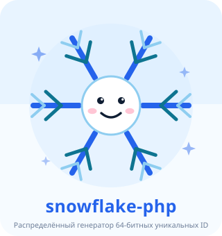
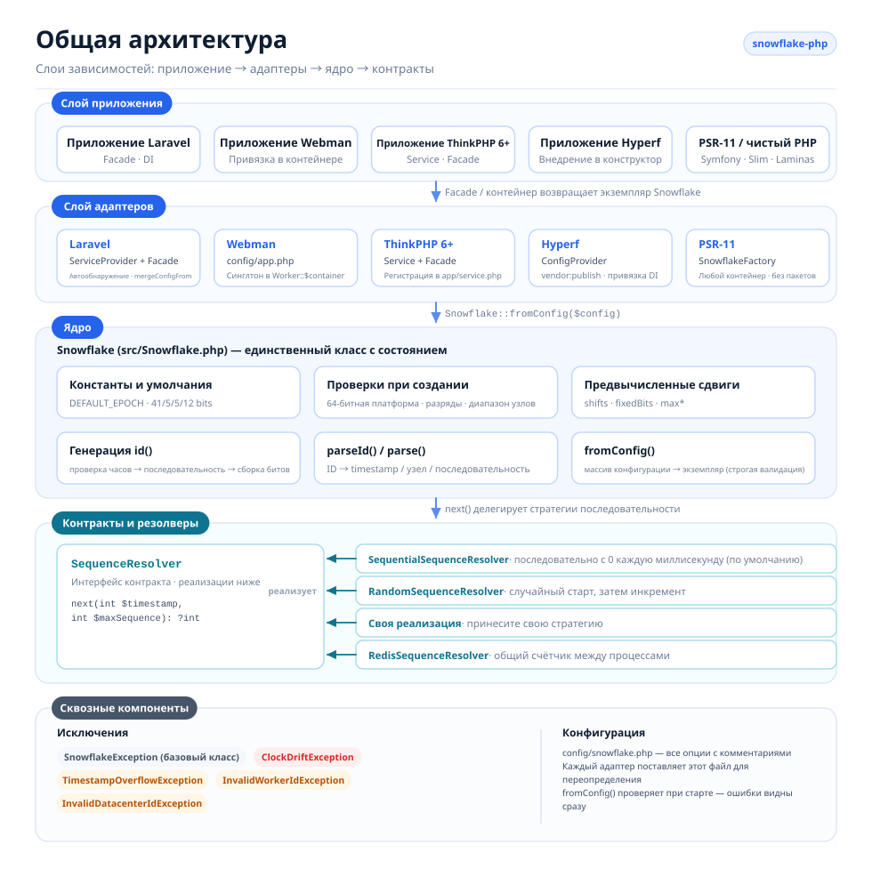
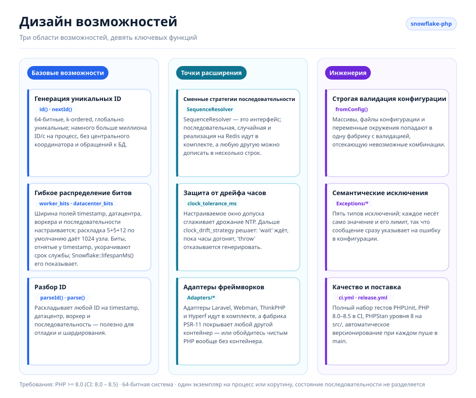
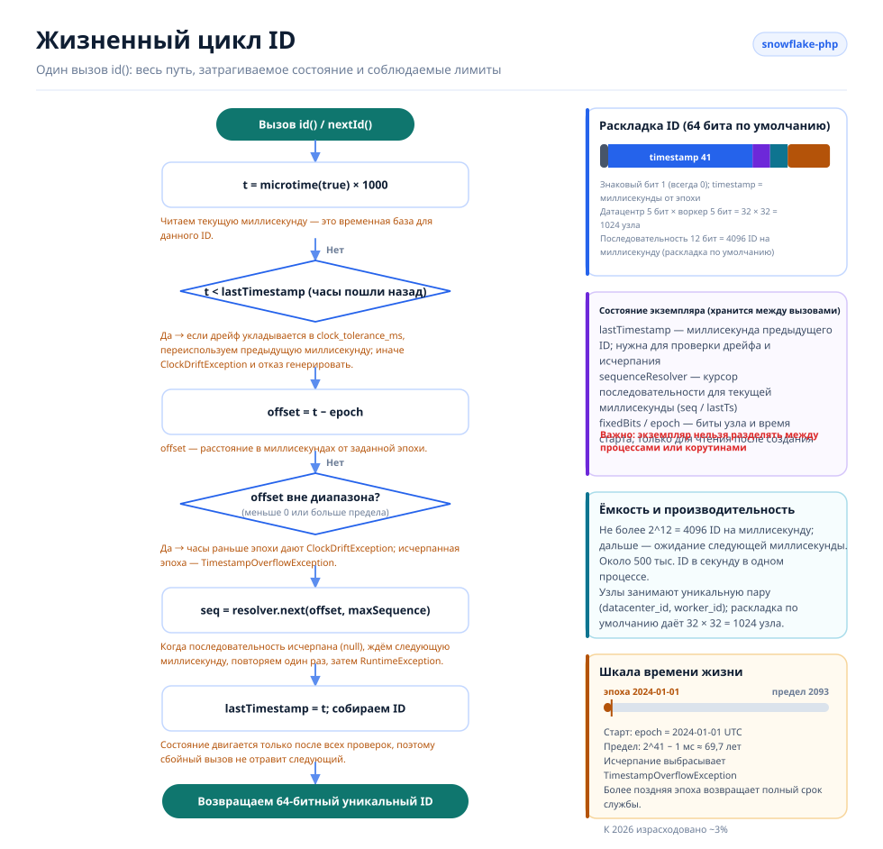

# Snowflake PHP

[English](../../../README.md) · [简体中文](../../../README.zh-CN.md) · [한국어](../ko/README.md) · [Русский](../ru/README.md) · [Deutsch](../de/README.md) · [Français](../fr/README.md) · [Español](../es/README.md) · [Português](../pt/README.md) · [हिन्दी](../hi/README.md) · [العربية](../ar/README.md) · [বাংলা](../bn/README.md) · [Bahasa Indonesia](../id/README.md) · [日本語](../ja/README.md)

<p align="center">
  
  <br />
  <sub>Талисман поставляется вместе с кодом — <code>echo Snowflake::MASCOT;</code> выведет его в любом терминале.</sub>
</p>

Генератор распределённых уникальных ID на основе алгоритма Snowflake от Twitter, совместимый с Laravel, Webman, ThinkPHP и Hyperf.

## О проекте

Snowflake PHP генерирует 64-битные, k-ordered, глобально уникальные ID без центрального координатора. Каждый ID состоит из метки времени, идентификатора датацентра, идентификатора воркера и номера последовательности — это позволяет выдавать намного больше миллиона ID в секунду на узел без обращений к базе данных.

Ключевые возможности:

- **Чистый PHP, ноль зависимостей** — не требуются ни расширения, ни внешние сервисы
- **Сменные резолверы последовательности** — встроенные последовательная, случайная и на Redis стратегии, или своя собственная
- **Гибкое распределение битов** — настраивайте биты timestamp/воркера/датацентра/последовательности под свой масштаб
- **Устойчивость к дрейфу часов** — настраиваемое окно допуска для корректировок NTP
- **Не привязан к фреймворку** — готовые адаптеры для Laravel, ThinkPHP, Webman и Hyperf или чистый PHP вообще без контейнера
- **Разбор ID** — раскладывает сгенерированный ID обратно на метку времени, узел и последовательность

## Структура проекта

```text
snowflake-php/
├── src/
│   ├── Snowflake.php                       # Core: config, bit layout, id(), parseId()
│   ├── Contracts/
│   │   └── SequenceResolver.php            # Sequence strategy interface
│   ├── Resolvers/
│   │   ├── SequentialSequenceResolver.php  # Default: 0..max per millisecond
│   │   ├── RandomSequenceResolver.php      # Random start per millisecond
│   │   └── RedisSequenceResolver.php       # Shared counter for multi-process nodes
│   ├── Exceptions/
│   │   ├── SnowflakeException.php          # Base exception
│   │   ├── ClockDriftException.php
│   │   ├── TimestampOverflowException.php
│   │   ├── InvalidWorkerIdException.php
│   │   └── InvalidDatacenterIdException.php
│   └── Adapters/                           # Framework integrations
│       ├── Laravel/                        # ServiceProvider + Facade + config
│       ├── ThinkPHP/                       # Service + Facade + config
│       ├── Hyperf/                         # ConfigProvider + config
│       ├── Webman/                         # config/app.php
│       └── Psr11/SnowflakeFactory.php      # Any PSR-11 container, no interface dependency
├── config/snowflake.php                    # Reference configuration with comments
├── tests/
│   ├── bootstrap.php                       # Loads the autoloader, prints the mascot
│   └── *Test.php                           # PHPUnit test suite
├── docs/
│   ├── i18n/                               # Translated READMEs + localized diagrams
│   │   ├── README.md                       # Language index
│   │   ├── img/<lang>/                     # Generated SVGs (13 languages)
│   │   └── <lang>/README.md                # One translated README per language
│   ├── examples/plain-php.php              # Runnable no-framework example
│   └── *.png                               # Sponsor images
├── scripts/
│   ├── generate-diagrams.py                # Builds docs/i18n/img/<lang>/*.svg
│   ├── benchmark.php                       # Reproducible throughput benchmark
│   ├── phpstan/stubs/                      # Framework stubs for static analysis
│   └── i18n/labels.<lang>.json             # Diagram strings, one file per language
├── phpstan.neon.dist                       # Level 8 static analysis config
└── .github/workflows/                      # ci.yml (PHP 8.0–8.5), release.yml
```

## Архитектура



Четыре слоя, зависимости направлены только в одну сторону:

- **Слой приложения** — ваше приложение на Laravel / Webman / ThinkPHP / Hyperf, любой контейнер PSR-11 или чистый PHP; он лишь запрашивает экземпляр `Snowflake`.
- **Слой адаптеров** — по одному адаптеру на фреймворк плюс не зависящая от контейнера фабрика PSR-11. Каждый регистрирует единственный общий экземпляр и поставляет публикуемый файл конфигурации.
- **Слой ядра** — `Snowflake` — единственный класс с состоянием: он проверяет конфигурацию, предвычисляет битовые сдвиги и фиксированные биты узла, генерирует ID и разбирает их обратно.
- **Контракты и резолверы** — `SequenceResolver` — точка расширения. Ядро делегирует ему выдачу каждой последовательности, поэтому стратегию можно заменить, не трогая генератор.
- **Сквозные компоненты** — иерархия семантических исключений и единый прокомментированный файл конфигурации, общий для всех адаптеров.

## Дизайн возможностей



Возможности делятся на три области: **ядро** (генерация, распределение битов, разбор), **расширение** (сменные резолверы, работа с дрейфом часов, адаптеры фреймворков) и **инженерия** (строгая валидация конфигурации, семантические исключения, тесты и автоматизация релизов).

## Жизненный цикл ID



Каждый вызов `id()` проходит один и тот же путь:

1. Считываем часы и проверяем обратный дрейф — допустим до `clock_tolerance_ms`; дальше `clock_drift_strategy` решает, ждать ли, пока часы догонят (`'wait'`), или отказаться от генерации (`'throw'`).
2. Переводим в смещение от эпохи и отбрасываем смещения, которые отрицательны или выходят за предел метки времени.
3. Запрашиваем у резолвера последовательности следующий слот в этой миллисекунде; когда все 4096 слотов заняты, ждём следующую миллисекунду и повторяем один раз.
4. Собираем `(offset << timestampShift) | fixedBits | sequence`, сдвигаем `lastTimestamp` и возвращаем ID.

Состояние экземпляра (`lastTimestamp` и курсор резолвера) хранится в памяти и никогда не разделяется между процессами или корутинами.

## Требования

- PHP >= 8.0 (8.0 – 8.5 проверено в CI, плюс PHPStan уровня 8 на `src/`)
- 64-битная система (нужна для нативных 64-битных целочисленных операций)
- Один экземпляр на процесс/корутину — экземпляр Snowflake хранит состояние последовательности в памяти и не должен разделяться между процессами или корутинами

## Установка

```bash
composer require erikwang2013/snowflake-php
```

## Быстрый старт

```php
use Erikwang2013\Snowflake\Snowflake;

$snowflake = new Snowflake();
$id = $snowflake->id();          // e.g. 508047278033704960
$id = $snowflake->nextId();      // alias for id()
```

С пользовательскими идентификаторами воркера и датацентра:

```php
$snowflake = new Snowflake(workerId: 5, datacenterId: 3);
$id = $snowflake->id();
```

## Справочник по конфигурации

| Ключ | Тип | По умолчанию | Описание |
|-----|------|---------|-------------|
| `epoch` | int | `1704067200000` | Пользовательская эпоха в мс (по умолчанию: 2024-01-01 UTC) |
| `worker_id` | int | `0` | Идентификатор воркера/узла |
| `datacenter_id` | int | `0` | Идентификатор датацентра |
| `worker_bits` | int | `5` | Биты для идентификатора воркера |
| `datacenter_bits` | int | `5` | Биты для идентификатора датацентра |
| `sequence_bits` | int | `12` | Биты для номера последовательности |
| `sequence_resolver` | string | `SequentialSequenceResolver` | FQCN класса SequenceResolver |
| `clock_tolerance_ms` | int | `0` | Максимальный обратный дрейф часов (0 = строго) |
| `clock_drift_strategy` | string | `'throw'` | `'throw'` отказывается генерировать, когда часы ушли назад дальше допуска; `'wait'` ждёт, пока системные часы догонят, сдаётся после `clock_drift_wait_ms` и затем выбрасывает `ClockDriftException` |
| `clock_drift_wait_ms` | int | `1000` | Сколько стратегия `'wait'` ждёт, прежде чем сдаться |

### Раскладка битов

Раскладка по умолчанию (63 информационных бита + 1 знаковый = 64 бита всего):

```
| reserved(1) |  timestamp(41)   | datacenter(5) | worker(5) | sequence(12) |
```

Максимальный срок службы с эпохой по умолчанию: ~69 лет (примерно до 2093 года).

Каждый бит, отданный идентификатору узла или последовательности, отнимается у метки времени, поэтому широкая последовательность незаметно укорачивает жизнь генератора:

| биты worker + datacenter + sequence | биты timestamp | срок службы |
|---|---|---|
| 5 + 5 + 12 (по умолчанию) | 41 | ~69,7 лет |
| 7 + 7 + 10 | 39 | ~17,4 лет |
| 5 + 5 + 16 | 37 | ~4,4 года |
| 5 + 5 + 20 | 33 | ~99 дней |

Запросите предел для любой раскладки:

```php
Snowflake::lifespanMs();                                                     // default layout, ~69.7 years in ms
Snowflake::lifespanMs(workerBits: 7, datacenterBits: 7, sequenceBits: 10);   // ~17.4 years in ms
```

`Snowflake::lifespanMs(int $workerBits = 5, int $datacenterBits = 5, int $sequenceBits = 12): int` возвращает максимальное смещение метки времени в миллисекундах для раскладки; аргументы по умолчанию соответствуют раскладке по умолчанию. Как только смещение достигает этого предела, эпоха исчерпана — устаревшая эпоха, окно которой уже закрылось, заставляет самый первый вызов `id()` выбросить `TimestampOverflowException`.

### Использование массива конфигурации

```php
$snowflake = Snowflake::fromConfig([
    'worker_id' => 1,
    'datacenter_id' => 2,
    'epoch' => 1704067200000,
]);
$id = $snowflake->id();
```

## Интеграция с фреймворками

### Laravel

Пакет поддерживает автообнаружение в Laravel. После установки:

1. Опубликуйте конфигурацию (необязательно):
```bash
php artisan vendor:publish --tag=snowflake-config
```

2. Настройте переменные окружения в `.env`:
```env
SNOWFLAKE_WORKER_ID=1
SNOWFLAKE_DATACENTER_ID=1
```

3. Используйте Facade или внедрение зависимостей:
```php
// Facade
use Snowflake;
$id = Snowflake::id();

// Dependency injection
use Erikwang2013\Snowflake\Snowflake;

class OrderController
{
    public function store(Snowflake $snowflake)
    {
        $orderId = $snowflake->id();
    }
}

// Container access
$id = app('snowflake')->id();
$id = app(Snowflake::class)->id();
```

### Webman

1. Скопируйте конфигурацию плагина в свой проект:
```bash
cp vendor/erikwang2013/snowflake-php/src/Adapters/Webman/config/app.php \
   config/plugin/erikwang2013/snowflake-php/app.php
```

2. Зарегистрируйте синглтон в `process.php` или в бутстрапе:
```php
use Erikwang2013\Snowflake\Snowflake;

Worker::$container->add(Snowflake::class, function () {
    return Snowflake::fromConfig(
        config('plugin.erikwang2013.snowflake-php.app.snowflake')
    );
});
```

3. Использование:
```php
$id = Worker::$container->get(Snowflake::class)->id();
```

### ThinkPHP 6+

1. Скопируйте файл конфигурации в свой проект:
```bash
cp vendor/erikwang2013/snowflake-php/src/Adapters/ThinkPHP/config/snowflake.php \
   config/snowflake.php
```

2. Зарегистрируйте сервис в `app/service.php`:
```php
return [
    \Erikwang2013\Snowflake\Adapters\ThinkPHP\Service::class,
];
```

3. Использование:
```php
// Container
$id = app('snowflake')->id();

// Dependency injection
use Erikwang2013\Snowflake\Snowflake;

class IndexController
{
    public function index(Snowflake $snowflake)
    {
        $id = $snowflake->id();
    }
}

// Facade
use Erikwang2013\Snowflake\Adapters\ThinkPHP\Facade;
$id = Facade::id();
```

### Hyperf

1. Опубликуйте конфигурацию:
```bash
php bin/hyperf.php vendor:publish erikwang2013/snowflake-php
```

2. Зарегистрируйте привязку DI в `config/autoload/dependencies.php`:
```php
use Erikwang2013\Snowflake\Snowflake;

return [
    Snowflake::class => function () {
        return Snowflake::fromConfig(config('snowflake'));
    },
];
```

3. Использование через внедрение в конструктор:
```php
use Erikwang2013\Snowflake\Snowflake;

class OrderService
{
    public function __construct(private Snowflake $snowflake) {}

    public function create(): int
    {
        return $this->snowflake->id();
    }
}
```

### Контейнеры PSR-11

Symfony, Slim, Laminas и любой другой контейнер: зарегистрируйте фабрику. Она ни от чего не зависит, поэтому подойдёт любой контейнер — `psr/container` не требуется:

```php
use Erikwang2013\Snowflake\Adapters\Psr11\SnowflakeFactory;

$container->set(\Erikwang2013\Snowflake\Snowflake::class, new SnowflakeFactory($config));
// or build the config from the environment:
$container->set(\Erikwang2013\Snowflake\Snowflake::class, SnowflakeFactory::fromEnvironment());
```

`SnowflakeFactory::fromEnvironment()` читает те же переменные `SNOWFLAKE_*`, что и адаптер Laravel. Контейнер PSR-11 вызывает сам объект фабрики, поэтому определение сервиса для Symfony — одна строка:

```yaml
services:
  Erikwang2013\Snowflake\Snowflake:
    factory: ['@Erikwang2013\Snowflake\Adapters\Psr11\SnowflakeFactory', '__invoke']
```

## Нативный PHP (без фреймворка)

Ничего в этом пакете не требует фреймворка — четыре адаптера выше лишь
регистрируют `Snowflake` в контейнере за вас. Без контейнера соберите всё сами:

```php
require __DIR__ . '/vendor/autoload.php';

use Erikwang2013\Snowflake\Snowflake;

// Same variable names the Laravel adapter uses, so one .env-style setup
// works whether or not a framework is present.
$snowflake = Snowflake::fromConfig([
    'worker_id'          => (int) (getenv('SNOWFLAKE_WORKER_ID') ?: 0),
    'datacenter_id'      => (int) (getenv('SNOWFLAKE_DATACENTER_ID') ?: 0),
    'clock_tolerance_ms' => 5,
]);

$id = $snowflake->id();
```

Работающая версия этого примера — включая ленивый синглтон без фреймворка и
проверяемые им инварианты — лежит в [`docs/examples/plain-php.php`](../../../docs/examples/plain-php.php):

```bash
php docs/examples/plain-php.php
```

### Выбор времени жизни

Экземпляр хранит `lastTimestamp` и курсор последовательности в памяти, поэтому как долго он живёт — единственное, что важно не перепутать:

| Среда выполнения | Когда создавать экземпляр |
|---------|--------------------|
| PHP-FPM, mod_php, CLI | На месте, на каждый запрос или команду — между ними ничего не разделяется. |
| Swoole, ReactPHP, RoadRunner, FrankenPHP | Один раз на **рабочий процесс**, из колбэка старта воркера, с уникальной парой `(datacenter_id, worker_id)`. |

Никогда не делите один экземпляр между корутинами или потоками: `id()` читает и пишет собственное состояние, поэтому два параллельных вызова могут перемешаться и выдать один и тот же номер последовательности. Создавайте экземпляр на каждую корутину или защитите общий мьютексом.

## Разбор ID

Разложите Snowflake ID на составляющие:

```php
$id = $snowflake->id();

// Using the instance (respects custom bit layout)
$parsed = $snowflake->parseId($id);
// [
//     'timestamp_ms' => 1736380800123,
//     'datetime'     => '2025-01-09 00:00:00.123',
//     'worker_id'    => 5,
//     'datacenter_id' => 3,
//     'sequence'     => 42,
// ]

// Static method (uses default bit layout)
$parsed = Snowflake::parse($id, $epoch);
```

Элемент `datetime` формируется функцией PHP `date()` в **часовом поясе сервера по умолчанию**, поэтому два хоста в разных часовых поясах отобразят один и тот же ID по-разному. `timestamp_ms` — абсолютное значение, не зависящее от часового пояса; именно его сравнивайте при сверке ID между машинами.

## Резолверы последовательности

Три встроенные реализации:

### SequentialSequenceResolver (по умолчанию)

Классическое поведение Snowflake. Последовательность начинается с 0 каждую миллисекунду и увеличивается последовательно. Гарантирует монотонно возрастающие ID в пределах одного узла.

```php
use Erikwang2013\Snowflake\Resolvers\SequentialSequenceResolver;

$snowflake = new Snowflake(
    sequenceResolver: new SequentialSequenceResolver()
);
```

### RandomSequenceResolver

Начинает каждую миллисекунду со случайного номера последовательности, а затем увеличивает его. Менее предсказуемо, чем последовательные ID, но ID внутри миллисекунды остаются монотонными.

```php
use Erikwang2013\Snowflake\Resolvers\RandomSequenceResolver;

$snowflake = new Snowflake(
    sequenceResolver: new RandomSequenceResolver()
);
```

### Пользовательский резолвер

Реализуйте `Erikwang2013\Snowflake\Contracts\SequenceResolver`:

```php
use Erikwang2013\Snowflake\Contracts\SequenceResolver;

class SharedCounterSequenceResolver implements SequenceResolver
{
    public function next(int $timestamp, int $maxSequence): ?int
    {
        $key = "snowflake:seq:{$timestamp}";
        $seq = redis()->incr($key);
        redis()->expire($key, 1);

        if ($seq > $maxSequence) {
            return null;
        }

        return $seq - 1;
    }
}
```

### RedisSequenceResolver

Внутрипроцессные резолверы держат последовательность в памяти, поэтому процессы с общим идентификатором узла могут выдать один и тот же номер последовательности. `RedisSequenceResolver` хранит счётчик в Redis — именно он нужен, когда несколько процессов делят пару `(datacenter_id, worker_id)`:

```php
use Erikwang2013\Snowflake\Resolvers\RedisSequenceResolver;

// Any client exposing incr(string $key): int and expire(string $key, int $seconds): bool
$resolver = new RedisSequenceResolver($redis, 'snowflake:seq:', 1);
$snowflake = new Snowflake(sequenceResolver: $resolver);
```

`__construct(object $client, string $keyPrefix = 'snowflake:seq:', int $ttlSeconds = 1)` — клиент внедряется, поэтому ни расширение `redis`, ни Predis не нужны. Большой TTL безопасен: счётчик тогда продолжает расти внутри той же миллисекунды, что корректно даёт `null` до начала следующей.

## Обработка исключений

| Исключение | Когда |
|-----------|------|
| `InvalidWorkerIdException` | Идентификатор воркера превышает `2^worker_bits - 1` |
| `InvalidDatacenterIdException` | Идентификатор датацентра превышает `2^datacenter_bits - 1` |
| `ClockDriftException` | Системные часы ушли назад больше допустимого |
| `TimestampOverflowException` | Эпоха исчерпана (срок службы закончился) |
| `SnowflakeException` | Базовое исключение для всех исключений пакета |

## Распределённое развёртывание

При работе на нескольких серверах или в нескольких процессах следите за тем, чтобы каждый экземпляр использовал уникальную пару `(datacenter_id, worker_id)`:

```php
// Read from environment, hostname hash, or service discovery
$workerId = (int) getenv('WORKER_ID');
$datacenterId = (int) getenv('DC_ID');

$snowflake = new Snowflake(
    workerId: $workerId,
    datacenterId: $datacenterId
);
```

С раскладкой 5+5 по умолчанию поддерживается до 32 датацентров × 32 воркеров = 1024 уникальных узла.

Чтобы поддержать больше воркеров, измените распределение битов:

```php
// 10 worker bits = 1024 workers, 0 datacenter bits = single DC
$snowflake = new Snowflake(
    workerId: $workerId,
    workerBits: 10,
    datacenterBits: 0
);
```

## Производительность

ID генерируются полностью внутри процесса, без внешних зависимостей, поэтому пропускная способность ограничена лишь собственным вызовом `microtime()` в PHP и парой целочисленных операций.

Замер на одном ядре машины разработчика (PHP 8.3.7, **Xdebug отключён**, 300 тыс. итераций, лучшее из 5):

| Операция | Пропускная способность | На вызов |
|-----------|-----------:|---------:|
| только `microtime(true)` — нижняя граница | 10,3 млн/с | 97 нс |
| `id()` — раскладка 5+5+12 по умолчанию | **1,6 млн/с** | 633 нс |
| `id()` + `parseId()` | 282 тыс/с | 3,5 мкс |
| `Snowflake::fromConfig()` | 167 тыс/с | 6,0 мкс |

Генерация стоит примерно шесть голых вызовов часов, а потолок последовательности узла (4096 ID/мс = 4,1 млн/с) остаётся куда выше того, что способен потребить один процесс PHP. Разбор и создание — диагностические операции, а не горячий путь: создавайте экземпляр один раз на процесс и не держите `parseId()` в тесных циклах.

Воспроизведите замер на своей машине:

```bash
php scripts/benchmark.php
```

Скрипт печатает ops/sec и ns/op относительно голого `microtime()` как базовой линии, лучшее из N с разбросом. Значимость абсолютных чисел решают две вещи: **Xdebug** (он может стоить порядка величины — заголовок сообщает, когда он загружен) и загруженный или виртуализированный хост, у которого собственный вызов часов может доминировать в замере. Сравнивайте с базовой линией, а не читайте какое-то одно число как обещание.

## Поддержка проекта

| WeChat Pay | Alipay |
|:---:|:---:|
|  |  |

> Если проект оказался полезен, буду рад поддержке~

---

## Лицензия

MIT — Copyright (c) 2026 erik <erik@erik.xyz> — https://erik.xyz
